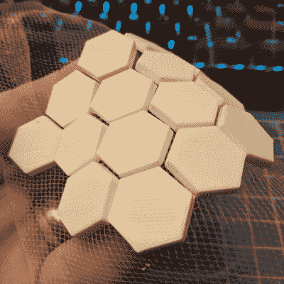

# 最新的 3D 打印时尚:柔性盔甲和穿山甲角色扮演

> 原文：<https://hackaday.com/2018/02/09/the-latest-3d-printed-fad-flexible-armor-and-pangolin-cosplay/>

上周，[大卫·肖里]来到帕萨迪纳每月一次的黑客聚会。这些聚会以演讲者和饮料、项目和闲聊为特色，有时还会有一些当地 Hackaday 社区正在做的演示。[大卫]的即兴演示[是在](https://twitter.com/QueerEngineer/status/958539601232056321)之前没有人见过的。这是嵌入织物的 3D 打印瓷砖。这是 3D 打印柔性装甲的开始，是一种很好的 cosplay 构建方法，也是一种非常酷的方式来为你的 3D 打印工具包添加另一个技巧。

Hexagons tesselate. Image credit: [DrainSmith](https://imgur.com/a/3L2vD)

重现这个项目的步骤实际上非常简单。最重要的是布料本身。这只是一块薄纱，一种通常用于新娘面纱的精细网状织物。根据 3D 打印社区成员的说法，你可以在任何沃尔玛的面料部买到薄纱。复制这种技术的步骤很简单，打印三层，暂停打印并移开头部，将薄纱放在打印上，然后点击继续。

从围绕这项新技术的评论来看，有一些技巧和窍门可以最大限度地利用这种 3D 可打印织物。织物应该拉紧，并用胶带或夹子固定住。熔化或燃烧似乎不是问题，但尼龙制成的薄纱相当常见，用需要高温的奇异细丝打印 3D 面板可能会导致混乱。

虽然非常酷，但这项技术也有一些限制。举例来说，如果你用可弯曲的可折叠的拼板制作一套防弹衣，你将不得不用和你的印花床一样大的拼板组装一床被子。这可以通过将纱/秤组件缝合(或胶粘)到一片较大的织物上而变得更容易。或者，该过程可以被修改为与[无限构建卷打印机](https://hackaday.com/2017/03/25/mrrf-17-the-infinite-build-volume-printer/)一起使用。这会给你一码又一码的 3D 打印秤，随时可以做成一套服装。

这是我们见过的将 3D 打印带入“软”黑客和时尚领域的最有趣的技术之一。如果你想了解这一切的可能性，一定要在推特上关注[【大卫】](https://twitter.com/shoreydesigns/)和[的 Instagram](https://www.instagram.com/shoreydesigns/) 。那里有很多非常棒的想法。

正如大多数 3D 打印的想法一样，这是一个以前已经完成的想法，尽管不是那么高的水平。[Drato]又名[RobotMama] [几个月前做了几乎相同的事情](https://hackaday.com/2018/01/06/3d-printing-wearables-with-a-net/)，我们感谢她对社区的贡献。