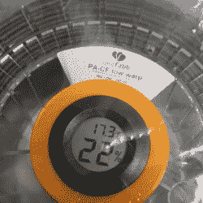

# 加热干燥箱驱逐灯丝水分不到 20 美元

> 原文：<https://hackaday.com/2018/02/10/heated-drybox-banishes-filament-moisture-for-under-20/>

最近,[Richard Horne]有很多关于 3D 打印细丝的活动；最近，他分享了两个有用的设计，一个用于增加灯丝存储，另一个用于监控游戏。第一个是用于 3D 打印灯丝的 [DIY 加热干燥箱。它不仅通过将灯丝密封在一个装有干燥剂的塑料盒中来保持干燥，还通过在里面加入一个温和而经济的加热器来保持干燥。干燥剂是很好的，但是在合适的环境下，一个温和加热的外壳可以神奇地驱除湿气。DryBox 设计还结合了一个方便的小型温度和湿度传感器，以显示事物的工作情况。](https://richrap.blogspot.ca/2018/02/diy-heated-drybox-for-3d-printing.html)

Spool-mounted adapter for temperature and humidity sensor (and desiccant) to monitor storage bag conditions.

第二个设计是我们特别喜欢的一个简单的副产品:一个 3D 打印适配器，它提供了一种方便地将简单的温度和湿度传感器安装到带有干燥剂包的灯丝线轴上的方法。这允许像往常一样将灯丝线轴存储在透明塑料袋中，但提供了一种整洁的方式来快速监控袋内的情况。所有东西的设计都在 [Thingiverse](https://www.thingiverse.com/thing:2778707) 上，还有加热干燥箱本身的部件。

【Richard】好心分享一下在易贝上搜索到的神奇词汇，供那些寻求建筑廉价关键部件的人参考:*“15 * 28cm 可调温度爬行动物取暖加热垫”*、*“迷你液晶摄氏度数字温度计湿度计温湿计”*。有许多供应商出售基本相同的零件，只是略有不同。

由于干燥箱用于分配和储存灯丝，因此需要一个良好的线轴安装系统，但是[Richard]发现线轴缺乏标准化使得设计一个可靠的系统变得困难。他指出，让线轴边缘在轴承上滚动是一个很好的解决方案，但前提是不打算使用纸板边的线轴，否则会产生麻烦的纸板绒毛。最终，[Richard]为线轴本身配备了一个固定支架和 3D 打印适配器。他在下面嵌入的视频中解释了这一切。

 [https://www.youtube.com/embed/RvTTQqqWIWA?version=3&rel=1&showsearch=0&showinfo=1&iv_load_policy=1&fs=1&hl=en-US&autohide=2&start=282&wmode=transparent](https://www.youtube.com/embed/RvTTQqqWIWA?version=3&rel=1&showsearch=0&showinfo=1&iv_load_policy=1&fs=1&hl=en-US&autohide=2&start=282&wmode=transparent)

不久前，我们看到[Richard]分享了他关于[让 3D 打印机灯丝包装更合理的想法](https://hackaday.com/2018/02/03/towards-sensible-packaging-for-3d-printer-filament/)，这是一个很好的话题，引发了很多有益的讨论。几个小时之内，至少有一家德国长丝公司已经开始发货了。真快。