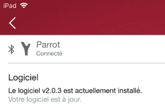

# 用漂白剂治愈鹦鹉的健忘症

> 原文：<https://hackaday.com/2018/02/09/curing-a-parrots-amnesia-with-bleah/>

[杜丹]最近来信告诉我们，在制造商告诉他无法修复之后，他是如何设法恢复他的鹦鹉花能力的。为了省去你在另一个标签页打开谷歌的麻烦，鹦鹉花电源是一个为你的花盆准备的蓝牙低能耗(ble)“智能”设备。因为*当然*那是个东西。

A healthy Flower Power connected

当[杜丹]注意到他的 iOS 设备不再检测到他的 Flower Power 时，他联系了支持人员，他们告诉他，很遗憾，这是一个硬件故障，他应该扔掉它。但他对这一诊断有所怀疑，因为其他设备，如他的 Raspberry Pi 仍然可以与之通信。仔细一看，他才知道，花电没有名字，只能通过它的 MAC 地址直接联系。考虑到没有名字可能会扰乱他的 iGadget“它只是工作”的敏感性，[杜丹]开始研究是否有某种方法可以让设备远程取一个新名字。

对我们的英雄来说幸运的是，BLE 有点崩溃了。在寻找问题的解决方案时，他看到了 BLEAH 的创始人写的一篇[博文，这篇博文展示了【杜丹】正在寻找的解决方案。接下来，只需要一个简单的命令就可以将新的名字添加到 Flower Power 的 BLE 配置中。就这样，他的“坏掉的”装置复活了。为什么这个设备失去了它的名字，或者如何防止它在未来发生，这些都是以后的问题。[杜丹]将获得胜利。](https://www.evilsocket.net/2017/09/23/This-is-not-a-post-about-BLE-introducing-BLEAH/)

如果你对以方便和延长电池寿命的名义危害我们安全的流行新技术感兴趣，[兔子洞从这里开始](https://hackaday.com/2015/12/02/hackaday-dictionary-bluetooth-low-energy/)。