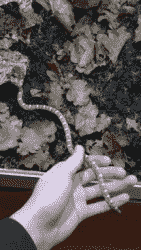

# 利用宜家货架打造生物活性动物馆

> 原文：<https://hackaday.com/2018/03/05/building-a-bioactive-vivarium-from-an-ikea-shelf/>

宠物通常是值得爱的劳动。[left the gan]——想要一条玉米蛇——发现瑞典关于玻璃容器大小的法律使得所有的商业选择对一条完全成年的蛇来说都太小了。所以他们自己动手，为他们的宠物建造了一个生物活性动物馆。

[leftthegan]以合理的价格找到了一款 IKEA Kallax 4×4 搁架单元，经过几次设计迭代(有些是由于上述规定),对其进行了修改，在前面增加了一个搁架延伸部分，并切割了内部布线通道。对于动物馆的窗户，他们选择了有机玻璃，但强烈建议其他人建造自己的窗户，因为前者容易划伤和弯曲——如果他们的[蛇](https://hackaday.com/2017/01/15/alexa-keeps-pet-snake-thermoregulated/)变成了逃跑艺术家，那就不好了！在此期间，3D 打印手柄可以保持窗户关闭和锁定。

在整个建造过程中，【leftthegan】考虑到了未来拆卸的可能性，因此所有内部  表面都单独涂上了一层乙烯树脂，以防止湿气进入中密度纤维板，加热灯和 LED 照明都有连接器，便于分离。

在用池塘衬垫和大量硅酮覆盖动物饲养室的底部后，他们添加了 leca 鹅卵石作为排水层，顶部覆盖了昆虫网，以保持土壤基质的定制混合分离。他们还添加了橡树叶——这对爬行动物来说是安全的——以及一些各种各样的植物，旁边是蛇以前栖息地的树枝和岩石，让它有家的感觉。这个动物饲养场的废物清理人员是两种跳虫和一批热带等足类动物，以最大限度地减少围栏的维护。动物馆的各种电子设备放在架子的一个小隔间里，而其余的则放满了储物箱。

[leftthegan]的蛇现在看起来很开心，所以下一个合乎逻辑的步骤是将所有的事情自动化。

[通过 [/r/DIY](https://www.reddit.com/r/DIY/comments/7wtlah/i_made_a_bioactive_terrarium_from_an_ikea_shelf/)