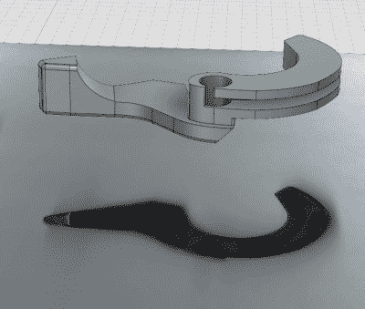

# 印刷摩托车阻气门杆走远

> 原文：<https://hackaday.com/2018/02/15/printed-motorcycle-choke-lever-goes-the-distance/>

我们都害怕有一天我们最喜欢的硬件变得如此陈旧，以至于不再有备件可用，面对这种机械死亡会让黑客感到有点不寒而栗。但另一方面，你得不到替换硬件的那一天，也是你有正当理由自己制造零件的那一天。

3D rendering above the 2D scan

当他的铃木摩托车的刹车杆坏了的时候，[乔纳森]发现自己就是这种情况。新零件不再为他的自行车制造，这给了他机会启动 Fusion 360 和[看看他是否能使用原始零件剩余部分的 2D 扫描设计一个替代品](https://hackaday.io/project/34267-3d-printed-motorcycle-choke)。

[Jonathan]将原始零件放在他的平板扫描仪上，并将他的一张信用卡用作参考点，以便在他将图像导入 Fusion 360 时缩放图像。在更换零件时，使用 2D 扫描仪快速启动 3D 模型是一个巧妙的技巧，我们并不像你想象的那样经常看到。一个合适的 3D 扫描仪很酷，但肯定不是像这样复制硬件时需要的。

阻风门杠杆是一种相当复杂的形状，这种几何形状没有真正的*良好的*印刷方向，因为到处都有突出物。再加上[Jonathan]为了速度而以 0.3 毫米的图层高度印刷，最终的部分看起来确实粗糙，但它确实有效。在他以更高的分辨率重印之前，该部件应该是一个原型，并且可能使用更强的材料，如 PETG，但两年后，原型仍然安装并正常工作。这不是我们第一次看到“临时”3D 打印部件[成为长期解决方案](https://hackaday.com/2017/10/20/3d-printed-gear-serves-seven-months-hard-labor/)。

* * *

 **这是 Hackaday 的**里的一个词条

### [修理你可以打印竞赛](https://hackaday.io/contest/32812-repairs-you-can-print-contest)

20 个最佳项目将获得 100 美元的 Tindie 信用，对于学生或组织的最佳项目，我们有两台全新的 Prusa i3 MK3 打印机。有了这样一台打印机，你就可以在家里到处破坏东西，只是为了有一个借口来制造替换零件。