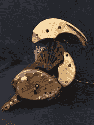

# 白兔谢妮钟

> 原文：<https://hackaday.com/2018/02/19/the-white-rabbit-nixie-clock/>

Instructables 用户[hellboy]——最近皈依了激光切割机——是谢妮电子管的长期崇拜者。在融合这两种快乐的过程中，他设计并建造了这件华丽的艺术品:[白兔谢妮钟](http://www.instructables.com/id/The-White-Rabbit-Nixie-Clock/)。

进入这个版本时，[地狱男爵]担心电子管的寿命，所以需要能够在不需要的时候关闭  。抛弃了他们最初用伺服系统打开时钟的想法，[地狱男爵]的时钟通过按下一个杆来打开，通过啪的一声关上盖子来关闭——尽管比你的普通[时钟](https://hackaday.com/2014/07/08/go-vintage-learn-to-repair-and-restore-mechanical-pocket-and-wrist-watches/)稍微复杂一些。鉴于这种机制的复杂性，他不得不经历无数的原型——一路上测试、调整和废弃零件。

凭借蒸汽的力量- [弯曲](https://hackaday.com/2017/08/01/be-the-firebender-you-want-to-see-in-the-world/) , [hellboy]精心塑造的胡桃木板材和各种其他类型的木材来定义机械装置的“兔子”外观，以及表壳的其他部分。再一次，围绕一排六个旋转的谢妮电子管设计时钟不是一件容易的事——特别是，正如[hellboy]指出的，当大约二十根电线需要和它们一起旋转的时候！经过几次尝试，谢妮管，它们的 3 毫米蓝色发光二极管和相关的电线都正确就位。

 [https://www.youtube.com/embed/QtDXSSb7rnM?version=3&rel=1&showsearch=0&showinfo=1&iv_load_policy=1&fs=1&hl=en-US&autohide=2&wmode=transparent](https://www.youtube.com/embed/QtDXSSb7rnM?version=3&rel=1&showsearch=0&showinfo=1&iv_load_policy=1&fs=1&hl=en-US&autohide=2&wmode=transparent)

[hellboy]强烈要求在使用这些谢妮电子管的电源时要格外小心，因为他需要修改电路来处理关闭，同时仍然保持时间。为了正确定位电子设备，需要进行一些反复试验，但他已经将背板设计成在需要接近内部部件时可以轻松拆卸。

小心组装开启装置和反复测试以确保一切正常似乎很乏味，但他在一些严格的公差下操作。一旦最终组装完成，[地狱男爵]发现他需要添加一对黄铜旋钮来帮助启动时钟，因为它没有足够的质量来抵消杠杆上的力。这一增加仅仅意味着这座钟有更多值得欣赏的地方。请原谅我们观看时间流逝。

【谢谢提示，爱尔兰人！]