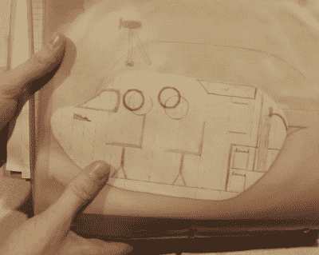
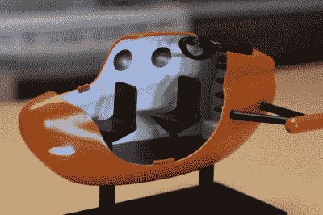

# 3D 打印让孩子的想象力栩栩如生

> 原文：<https://hackaday.com/2018/02/23/3d-printing-brings-a-childs-imagination-to-life/>

告诉别人你会让他们的梦想成真是一种大胆的、可能有点令人毛骨悚然的说法。但这是不应该照字面理解的事情之一；这并不意味着你*真的*要窥视他们的记忆，提取一个想法，然后将它变成现实。那只是疯话，是一种比喻。

Original sketch of the CURV II

事实证明，至少有一个人没有收到备忘录。想起父亲总是告诉他小时候画的潜艇和火箭的精美图纸，[【罗纳德】决定 3D 打印其中一个作为礼物](https://imgur.com/a/ZDDZe)。他拿起父亲的旧画板，翻来翻去，直到他发现了一个特别成熟的想法，那就是名为“CURV 二号”的个人潜艇。

最终的结果看起来如此不可思议，以至于我们听说在揭幕式上有人流下了男子汉的眼泪。一般来说，你应该避免让你的父母哭，但如果你要这样做，你也可以体面地做。

考虑到他的父亲在他十几岁的时候就提出了潜艇的详细示意图，所以[罗纳德]自己成为一名相当有成就的制造商可能就不足为奇了。他采用了最初的设计，并开始在 SolidWorks 中设计一个稍微精致一点的 CURV II 版本。他不仅忠实地再现了他父亲的设计，甚至还添加了内饰和功能性细节，如后舱门。

 一旦潜艇的零件打印出来，就该开始最后的工序了。这个项目的大部分文档涵盖了[Ronald]如何获得原始打印部件并完成它们，这肯定会让那些希望他们的[打印项目实际上*看起来不像是*打印出来的](http://hackaday.com/2017/11/15/visual-3d-print-finishing-guide/)的人感兴趣。秘密是填料底漆、砂纸和惊人的耐心的混合物。

相比之下，好像他还没有让我们看起来像可怕的孩子一样，[罗纳德]用 LED 照明(由潜艇控制面板上的一个小开关控制)和木制底座完成了 CURV II 模型。最终的结果是一个高质量的模型，肯定会坐在一个荣誉的地方在未来几年。

我们[在 Hackaday 这里看到的 3D 打印模型往往是工程品种](https://hackaday.com/2017/12/18/small-jet-engine-model-from-students-who-think-big/)，所以很高兴看到一些不太严重的东西。我们喜欢模型中的所有改进，整体外观仍然保留了卡通线条和比例，提醒您这是儿童思维的产物。

 [https://www.youtube.com/embed/yMLVi3kmZ7o?version=3&rel=1&showsearch=0&showinfo=1&iv_load_policy=1&fs=1&hl=en-US&autohide=2&wmode=transparent](https://www.youtube.com/embed/yMLVi3kmZ7o?version=3&rel=1&showsearch=0&showinfo=1&iv_load_policy=1&fs=1&hl=en-US&autohide=2&wmode=transparent)

