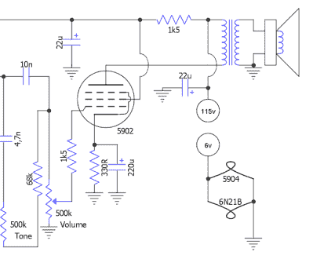

# 用小管重建的微型吉他放大器

> 原文：<https://hackaday.com/2018/02/19/tiny-guitar-amp-rebuilt-with-tiny-tubes/>

[Blackcorvo]来信告诉我们他是如何拿了一个便宜的“复古”吉他放大器，并用超微型真空管重新组装的。最终的结果是一个微小的便携式放大器，不仅看起来像，而且听起来也像。他很有帮助地提供了布线示意图、构建图像，甚至是放大器工作的视频。

Detail from the circuit diagram

最初的 Honeytone 放大器售价约为 26 美元，虽然它看起来很老派，但内部却一点也不。[Blackcorvo]太绅士了，无法提供内部的“之前”图片，但我们查了一下，只能说它并不完全是高质量的音频。网上的评论似乎表明，它的工作效果和预期的成本不到 30 美元的放大器一样好，但这绝对不是高保真设备。

给微型真空管供电需要一些现代的支持电子设备，包括一个降压转换器为电子管提供高电压以及一个 6V 调节器。有利的一面是，新电路可以从 12 到 30 伏的输入电压为电子管供电，这意味着如果你想随身携带，放大器仍然可以由电池供电。

这些年来我们已经看到了一些[神奇的电子管放大器](https://hackaday.com/2016/06/19/simple-vacuum-tube-preamp-results-in-a-beautiful-build/)，证明有些东西永远不会过时。如果你想了解更多关于让这些小试管热精灵制造美妙音乐的魔法，[美国军队已经为你报道了](https://hackaday.com/2014/01/07/retrotechtacular-tube-amplifiers/)。

 [https://www.youtube.com/embed/B79d7bydqr0?version=3&rel=1&showsearch=0&showinfo=1&iv_load_policy=1&fs=1&hl=en-US&autohide=2&wmode=transparent](https://www.youtube.com/embed/B79d7bydqr0?version=3&rel=1&showsearch=0&showinfo=1&iv_load_policy=1&fs=1&hl=en-US&autohide=2&wmode=transparent)

