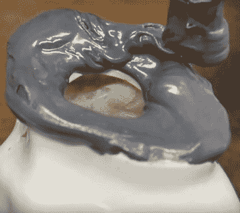

# 骷髅手杖证明了邦多不仅仅是为了凹痕

> 原文：<https://hackaday.com/2018/02/22/skull-cane-proves-bondo-isnt-just-for-dents/>

[Eric Strebel]很快成为 Hackaday 的宠儿。他有一个神奇的诀窍，可以把日常物品变成很棒的东西，而且他足以记录他的构建，以供各地的黑客和制作者观看。他的声音和叙述风格给了我们一种真正的鲍勃·罗斯氛围，这也没有什么坏处。

 他工作室的最新“意外收获”是一根整洁的发光手杖，由当地一家商店里的陶瓷头骨制成。虽然成品手杖本身可能不太令人兴奋，但[Eric]展示的建造方法非常值得一试。他展示了如何使用 Bondo 来快速构建自由形式的结构和组件，而不是像我们都习惯的填充物一样使用 Bondo。

在构建多层 Bondo 后，他用奶酪刨丝器磨平粗糙的表面，并用业余爱好刀清理边缘。根据[Eric]的说法，像这样与 Bondo 一起工作的一个好处是，在它完全硬化之前，它非常容易成型和操纵；让你可以边走边编故事。

[Eric]还分享了一个关于他如何制作灰色邦多的小秘密:他将激光打印机墨盒中的一些墨粉混合到其中。这可以让你非常便宜地增加填充物的颜色，并且绝对是可以存档以备将来参考的东西。

如果下面的视频让你对更多[埃里克·斯特雷贝尔]如饥似渴，看看他的关于泡沫芯工作的[精彩系列](https://hackaday.com/2018/02/10/zen-and-the-art-of-foam-core/)，这将带你进入[的 DIY 泡沫芯喷漆室](https://hackaday.com/2018/01/19/diy-spray-booth-is-both-light-and-lit/)。

 [https://www.youtube.com/embed/biTvrDavv_g?version=3&rel=1&showsearch=0&showinfo=1&iv_load_policy=1&fs=1&hl=en-US&autohide=2&wmode=transparent](https://www.youtube.com/embed/biTvrDavv_g?version=3&rel=1&showsearch=0&showinfo=1&iv_load_policy=1&fs=1&hl=en-US&autohide=2&wmode=transparent)

