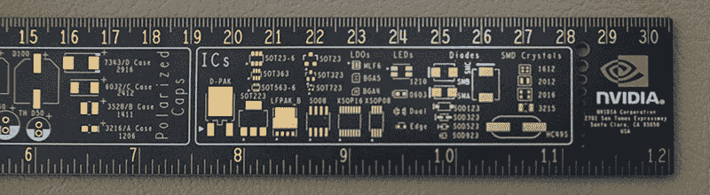
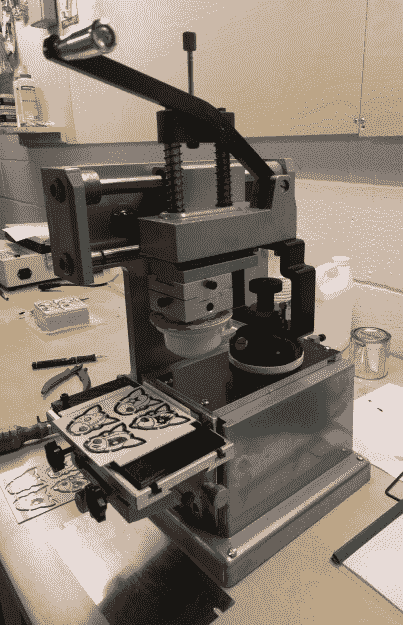
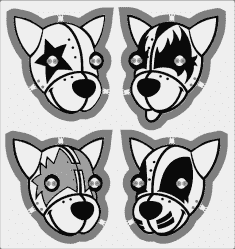
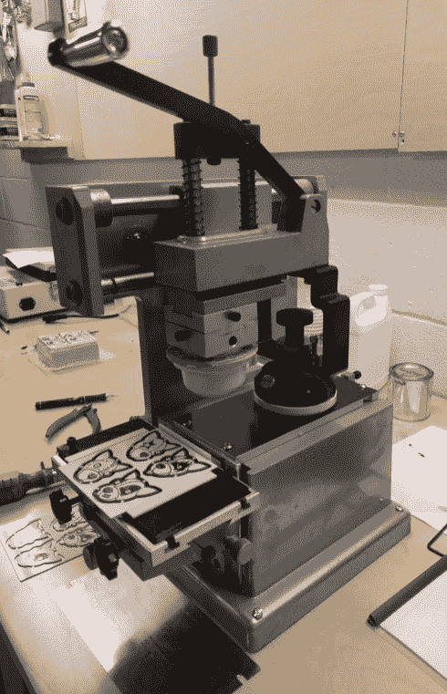
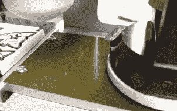
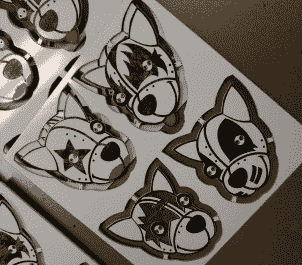

# 多色电路板的成功实验

> 原文：<https://hackaday.com/2018/02/26/successful-experiments-in-multicolor-circuit-boards/>

印刷电路板从未如此便宜或容易制造。我们还没有远离这样一个时代，如果你想要一个印刷电路板，你最好和最便宜的选择是从电路板公司下载一些专有软件，使用他们糟糕的工具，然后把你的电路板送去生产。几份 5x5cm 的板子要 200 美元。现在，任何人都可以使用免费软件(如啤酒，如果不是语音的话)，快速制作一块电路板，花五美元就可以得到一个印刷精美的电路板。制作印刷电路板从未如此简单，随之而来的是一种新的艺术表达方式。现在，我们可以在印刷电路板上制作艺术品。

### 作为艺术的 PCB

在过去一年左右的时间里，Hackaday 一直在深入研究艺术印刷电路板的状况。到目前为止，我们最大的胜利是 Tindie Blinky 徽章，这是一只具有闪烁 LED 眼睛的机器狗的艺术代表。[【安德鲁·索瓦】把一些白痴变成了 PCB 硬币](https://hackaday.com/2017/03/22/making-more-of-me-money/)，同样的白痴[在去年的 DEF CON](https://hackaday.io/project/18508-mr-robot-badge) 上试验了多色丝网印刷。

其他人已经远远超过了我们自己所能想到的任何东西；[Trammel Hudson] [使用标准的 OSHPark 颜色制作了一个令人惊叹的 blinky 板](https://trmm.net/PCB_art)，而[Blake Ramsdell][正在制作 PCB 艺术的完整面板](https://hackaday.io/page/3353-full-panel-pcb-painting-fabricated)。博尔德波特和【萨尔·德瑞默】[的作品已经在*嘉人*](https://www.boldport.com/blog/2015/11/25/haute-circuits) 中出现。印刷电路板上的艺术世界从未如此活跃，从未如此有潜力，而这个群体的艺术产出简直令人惊叹。我们正在见证一种新的艺术媒介的演变。

印刷电路板是一种有限的媒介。除非你想花大价钱购买更多颜色的丝印、奇怪颜色的阻焊膜，甚至是多种颜色的阻焊膜，否则你将被限制在每个板房都有的标准堆叠。一种颜色，玻璃纤维基板，将是浅黄色。铜层将是银或金，取决于完成。阻焊膜将会是绿色、红色、黄色、蓝色、黑色、白色，当然如果你经过奥什公园，还会是紫色。丝网印刷将是白色的(或黑色，如果你用白色阻焊)。我想说的是，可用于 PCB 艺术的调色板是有限的…或者至少曾经是。

几个月来，Hackaday 一直在试验一种为印刷电路板添加颜色的新工艺。这是一个可以转化为大规模生产的制造过程。从理论上讲，这一过程可以为任何小型 PCB 增加数十种颜色。现在这只是一个实验，但我们很高兴地报告一些有限的成功。现在，向任何印刷电路板添加少量颜色都很容易，也很便宜。

### 定义问题空间

The full-color Aladdin Sane Tindie badge, manufactured by Makernet

全彩 PCB 是一个已经解决的问题。几个月前，Hackaday 开始与由刘凯文在深圳创办的 Makernet 公司洽谈。他们的*存在的理由*显然是多色印刷电路板。他们已经为深圳创客大会、西安创客大会、杭州迷你创客大会以及一个以每个人最喜欢的机器狗为特色的一次性项目制作了全彩 PCB。至少在我们这边，生产这些多色印刷电路板的过程出奇的简单:我们所需要做的就是发送一些 Gerbers 和一个 Illustrator 文件；Makernet 负责生产这些多色印刷电路板的所有工作。

不幸的是，这就是我们所知道的这些多色印刷电路板是如何制造的。我们怀疑这是一种紫外线喷墨工艺，可以在我们指定的几台机器上完成。如果你有大约 25，000 美元，你也可以得到设备来复制这个过程。

肯定有更好的选择，这就是我们开始考虑多色 PCB *实际上意味着什么*的地方。整个 PCB 需要全彩印刷吗，或者小的颜色就足够了吗？

The Nvidia PCB ruler. Note the lime-green logo. Credit: [Nvidia](https://blogs.nvidia.com/blog/2017/12/22/nvidia-ruler/)

在过去的几年里，公司已经注意到 PCB 生产和小批量电子产品价格的下降。PCB 现在是会议和聚会的装饰品。Nvidia 注意到他们市场的很大一部分是软件工程师，他们从未听说过 [Digikey 的 PCB](https://hackaday.com/2016/10/10/the-people-talks-and-swag-of-open-hardware-summit/#rulers) swag，[决定设计一个 PCB 标尺](https://blogs.nvidia.com/blog/2017/12/22/nvidia-ruler/)。这款 PCB 标尺的测量单位为英寸和毫米，具有 IC 封装的通用尺寸，背面有几个换算表。从艺术角度来说，这款尺子最有趣的部分是灰绿色的 Nvidia“眼睛”标志。与其他 PCB 标尺形成鲜明对比的是，Nvidia 的标识光彩夺目，是 PCB 艺术的光辉典范。

成功的 PCB 艺术不需要全彩、全面板的 PCB，Nvidia PCB 尺子证明了这一点。那么，我们试图解决的问题是应用于 PCB 的小专色。印刷面积可以很小；无论如何，小的闪光徽章通常不超过 50 平方毫米。一两种颜色应该足够了。这应该是一个制造过程，并且希望是一个任何人都可以用合适的设备外包给商店的过程。有这样一种制造工艺，非常适合多色 PCB。这叫做移印，很可能你现在被十几个上面有移印的物体包围着。

### 移印入门

A manual pad printer. Total cost – about $600.

那么，什么是移印呢？这是在制造过程中使用硅胶垫拾取非常仔细成形的墨水区域并将其应用到物品上的过程。

它首先制作一个印刷版。在移印行话中，这被称为“陈词滥调”。它们通常是用光刻工艺制作的，尽管你也可以得到激光蚀刻版。然后在印版上涂上油墨，用油墨填充铅版，完全按照你想要的设计。然后将一个硅橡胶垫压入铅版，吸收墨水，然后将其转移到物体上。你现在有一支笔，一个杯子，或者一个印有你的商标的 PCB。就这么简单。

你可能没有意识到这一点，但你可能正在接触移印的东西。移印擅长在曲面上印刷，所以如果你的电脑鼠标上有一些印刷，它很可能是移印的。移印几乎出现在每一个消费电子设备上，如果你曾经在会议上从桌子上拿起一支品牌钢笔或马克杯，它肯定是移印的。这是给风火轮汽车、保龄球瓶上的红色条纹以及一百万种其他消费品添加火焰的过程。

用于移印的墨水和用于丝网印刷的墨水没有太大的不同。它非常有弹性，而且有彩虹般的颜色。如果你需要一个印刷过程，规模制造，并能够适用于任何小面积的颜色，移印是一条路要走。在某些方面，它优于丝网印刷；铅版可以用激光切割机制作，而不是传统丝网印刷设备的照相工艺。

### Tindie 徽章向 KISS 致敬

为了拓展艺术印刷电路板的界限，Hackaday 决定尝试将移印技术应用于印刷电路板。这并不多，第一个实验只是另一个 [Tindie Blinky 徽章](https://hackaday.io/project/26056-tindie-blinky-led-badge)，但它确实是一个很好的例子，可以用移印和 PCB 做什么。具体来说，这是一个 Tindie 徽章面板，以 KISS 乐队成员为特色。白色、黑色和银色(用于 Ace 的面部彩绘)很容易，但这真的不是亲吻，除非我们可以给 Paul 红色的口红和 Gene 红色的舌头。

The Tindie KISS panel

Tindie Paul Stanley

Tindie Gene Simmons

创建 Tindie PCBs 面板的过程正如您所料。像其他 Tindie blinky 徽章一样，这是由 Hackaday 的常驻艺术家[Joe Kim]首先在 Illustrator 中设计的。然后被导入 Eagle。[这里是我们的演练](https://hackaday.com/2017/08/30/how-to-do-pcb-art-in-eagle/)如何将这种艺术转化为玻璃纤维、铜、阻焊和丝网印刷。这些 KISS Tindies 与我们早期徽章的唯一显著区别是另一层 Gerbers。这一层是只有在红色应该适用于移印过程。

在收到来自[dirty CBS](http://dirtypcbs.com)的 KISS Tindie 面板后，我们只需将 Gerbers 的“红色”层打印在透明胶片上，创建移印铅版，并在 PCB 上涂上一些墨水。

  The pad printing machine itself  Ink in the cliche  PCB in the machine. Note the 3D printed table.  The inked PCB

### 成功的实验

实验是成功的，尽管有一些问题。它花了一些努力来找出墨水的正确温度，使用多少稀释剂，以及如何处理稍微有点脏的硅胶垫。但有了这种分类，我们可以将专色应用于一堆 PCB，极大地增加 PCB 艺术的调色板。

这个实验的总成本约为 1500 美元，包括紫外线板曝光机、耗材和移印机本身。这是一种非常便宜的移印设备——最简单的自动移印机起价约 4000 美元，能够印刷更大面积和多种颜色的机器价格高达 20，000 美元。当然，移印机在制造环境中无处不在，二手设备始终是一种选择。

此外，由于移印是一个常见的制造过程，这是一些可以外包出去。想想你在会议上买的那些品牌钢笔。他们都是从移印机出来的，你附近最有可能有一家移印机的店在找生意。

这是多色 PCB 的解决方案吗？嗯，这是一个解决方案。创造艺术印刷电路板的问题没有灵丹妙药。然而，如果你只需要 PCB 上的少量颜色，移印是一种有效且廉价的方法，可以拓展 PCB 艺术的可能性。