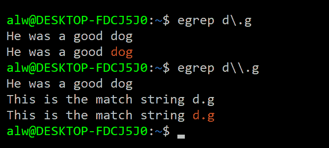
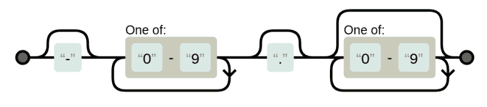
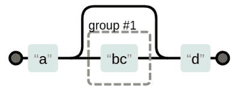

# Linux Fu:正则表达式

> 原文：<https://hackaday.com/2018/03/09/linux-fu-regular-expressions/>

如果你认为自己是个好厨师，你可能知道也可能不知道如何做蛋奶酥或果仁蜜饼。但是有些事情你可能知道怎么做，这是许多食谱的基础。例如，你可以烧开水，打个鸡蛋，把肉烤成褐色。对于 Linux 或 Unix 系统，您可以进行同样的观察。你可能不知道如何设置 Wayland 服务器或编写内核模块。但是有一些核心技能，比如文件操作和编辑，无论你做什么都会对你有用。经常给人们带来麻烦的普遍技能之一是正则表达式。许多程序使用这些作为指定搜索模式的方式，通常是在文本字符串中，如文件。

如果你不习惯正则表达式，这很容易解决。它们并不难学，而且有一些很棒的工具可以帮助你。许多工具使用正则表达式，核心语法是相同的。混乱的根源在于核心语法之外的细节有变化。

我们来看看你要很好的理解正则表达式需要的基础。

## 利用正则表达式的程序

也许最明显的使用正则表达式的程序是 grep。这是一个简单的程序，接受一个正则表达式和一个或多个文件名(除非您想从标准输入中读取)。默认情况下，它打印任何匹配正则表达式的行。就像我说的，简单，但功能强大，是最常用的命令行工具之一，这也是我在本文中使用它作为例子的原因。

但是 grep 并不是唯一使用正则表达式的程序。Awk、sed、Perl、VIM 和 emacs 等编辑器以及许多其他程序都可以使用正则表达式进行模式匹配。因为 regexp 如此普遍，你会看到它在用户设置甚至 web 应用程序中弹出，作为扩展应用程序效用的一种方式。

根据您的系统，您可能有类似 egrep 的程序。在我的系统上，egrep 只是 grep 的一个包装器，它传递-E 选项来改变 grep 解析的正则表达式的种类。出于本文的目的，我将默认谈论 egrep。

## 字符匹配和类别

考虑这个命令行:

```
egrep dog somefile.txt
```

这将搜索 somefile.txt 并匹配以下行:

```
I am a dog.
There is a special dogma involved. 
---dog---
```

### 句点作为通配符

它与“Dog”不匹配，因为默认情况下，正则表达式区分大小写。如果只是这样，正则表达式就不是一个非常有趣的话题了。您可以使用句点作为一种通配符来匹配任何字符。所以模式`"d.g"`将匹配“dog”和“dig”(或者“d$g”)。

### 转义字符

如果你想匹配一个周期，会发生什么呢？可以用反斜杠对任何特殊字符进行转义。所以`"d\.g"`将匹配“d.g”而不匹配其他。但是，请记住，您用来输入正则表达式的工具也可能使用反斜杠。例如，考虑此会话:



这里有一个陷阱。shell 将`\.`解释为单个句点。它不认为反斜杠是搜索的一部分，而是作为 shell 本身的转义字符。要正确地将`\.`传递给 grep，必须像第二个例子一样对反斜杠(`\\`)进行转义。引用特殊字符可能会很棘手，这取决于您使用的 shell。如果您使用 bash，您可能只想用引号或双引号将表达式括起来。即使这样，关于反斜杠的规则仍然适用。

### 字符类别

有时你不想要一个单一的字符，但你也不只是想要任何字符。这就是角色类出现的原因。例如:

```
egrep [XYZ][0-9][0-9][0-9]V afile.txt
```

这将选择类似“X000V”或“Z123V”的字符串。通常使用这些来允许不区分大小写(例如，`[aA]`或`[a-zA-Z]`)。

您还可以使用^字符创建一个负字符类。例如，`[^XYZ]`将匹配除 X、Y 或 z 之外的任何字符。如果您需要匹配破折号(-)，它应该在前面。如果你需要匹配一个插入符号(^)，它不应该出现在最前面。因为一个类中字符的顺序并不重要，所以这不会引起问题。例如，如果您想要匹配任何数字、破折号或插入符号，您可以编写:

```
egrep [-0-9^]
```

## 重复

找到 dog、dig、dug 和 d$g 很好，但我们需要能够做得更多。正则表达式的一个非常强大的部分是，您可以指定一个字符重复。您也可以使一个字符可选。例如，下面是 bar 或 bear 的匹配:`"be?ar"`

一个非常常见的需求是一个模式出现零次或一次(也就是说，让它可选)。您可能还希望零个或多个字符重复，或者有时一个或多个字符重复。假设您想将数据记录器中的一个文件中的数字与一个可选的负号和一个小数点匹配。你可以使用`"-?[0-9]+\.?[0-9]*"`。如果您在图表中以图形方式浏览该语法，可能会有助于理解该语法。



Diagram via [Regexper](https://regexper.com/#-%3F%5B0-9%5D%2B%5C.%3F%5B0-9%5D*) CC-BY 3.0

这种模式将匹配-25.2 或 33。或者 17.125。加号表示必须有一个数字，但也可以有更多。*允许任何数量的数字，包括零个数字(即零个或多个匹配)。注意小数点需要换码。有趣的是，没有它也能工作，因为句点将匹配“任何字符”不好的一面是，它还会匹配 14X2 这样格式不正确的数字。

### 通过重复获得高级

更高级的正则表达式重复是使用花括号来指定一个模式可以重复多少次。有些工具要求你转义花括号，但是 grep 不需要。因此，要准确匹配一行中的 4 个小写字母，可以使用模式`"[a-z]{4}"`

当然，这和说`[a-z][a-z][a-z][a-z]`是一样的，但是更容易输入。您还可以设置一个下限和上限，如:`[a-z]{2,4}`所示，它将匹配两到四个字母。这和`[a-z][a-z][a-z]?[a-z]?`是一样的

### 多重匹配行为因程序而异

对于 grep，匹配发生的事实就足够了。对于其他一些工具，匹配最多的字符还是最少的字符很重要。例如，`"abc*"`应用于包含“abccccc”的字符串可以匹配 ab，也可以匹配整个东西。这取决于工具(有时还取决于工具或命令的选项)，但最好记住这一点。不同的工具处理多个匹配的方式也不同。例如，用一个字符串匹配模式“X”:“XyyX”可以匹配第一个 X，也可以两个都匹配，这取决于具体情况。还是那句话，对于 grep 来说，无所谓。如果这一行至少匹配一次，这就是最重要的。

## 锚

您可能注意到模式匹配可以出现在字符串中的任何地方。您可以使用^字符将匹配锚定到字符串的开头，使用＄字符锚定到字符串的结尾。例如，这匹配空白行:`"^ *$"`或者如果您想要包括制表符:`"^[ \t]*$"`

与 C #中一样，\t 字符是一个制表符。根据工具的不同，也可能有其他可用的转义字符。您可以匹配以百分号作为第一个非空白字符的行，就像这样`"^[ \t]*%"`

## 分组

有几种方法可以对正则表达式进行分组。您可以使用括号，尽管有些工具要求您在分组时转义它们。例如:

```
egrep a(bc)?d
```



Image via [Regexper](https://regexper.com/#a%28bc%29%3Fd) CC-BY 3.0

这将寻找以“a”开始的匹配，然后它将匹配“d”或“bcd”。这与`"ab?c?d"`不同，因为它与“acd”匹配。您也可以使用管道字符作为“或”运算符。例如，`"a|b"`将匹配 a 或 b，这与`"[ab]"`没有太大区别

然而，结合分组这是有用的。例如，`"(dog)|(cat)"`将匹配任何一种动物。在一些工具中，分组会将您想要读取的部分标记为其他代码的一部分，或者在替换中可用。例如，在一些工具中，您可以搜索`"id=([0-9])+"`，然后在替换字符串中，您可以使用\1 来引用与括号中的表达式匹配的任何数字。具体细节因工具而异。例如，有些人可能会使用& 1 或其他语法。

## 动机:正则表达式有什么用？

还有更多，但让我们休息一下，看看这一切有什么好处。为此，假设您有一个来自记录器的完整数据文件，其中有以摄氏度为单位的温度数据，也有其他数据。但是，所有的温度都是数字格式，后跟一个空格和一个大写字母 C。因此，举例来说，温度可能是“-22°C”或“13.5°C”。

使用 awk 这样的程序来转换这些数字会很容易。我不想谈论太多关于 awk 的细节，但是它有一个`match`函数和一个`gensub`函数，分别用于查找和替换正则表达式。它还允许您使用两个斜杠之间的正则表达式来过滤行。考虑一下这个:

```

/ C$/ {

if (match($0,/([-0-9.]+) C/,matchres)) # . inside [] doesn't need escape
    print gensub(/[-0-9.]+ C/,matchres[1]*9.0/5.0+32 &quot; F&quot;,&quot;g&quot;)
  else
    print
next; # start over with next line
}

{ print } # print other lines
```

第一行匹配行尾有空格和 C 的文本。`match`子程序获取`matchres[1]`中的数字。当然，它可以解析像“-…C”这样的无意义的东西，但是你可以假设那里没有这样的东西。也许你可以用`"-?[0-9]\.?[0-9]*"`做得更好(但是请注意，如果你用 grep 尝试这个，前导破折号将需要一个-e 选项)。`gensub`函数执行转换。大量的正则表达式使这个工作。

## 变化

不幸的是，不同工具之间有细微的差别。唐纳德·克努特曾经说过:

> 我把 UNIX 定义为“生活在一个屋檐下的正则表达式的 30 种定义”。

我已经提到了其中的一些。例如，一些实现将括号视为分组，除非它们被转义，而其他实现则要求您在希望它们分组而不是常规字符时对它们进行转义。

常见的是数字和空格等事物的速记表达式。这很好，因为它也应该了解系统的定位。例如`[:digit:]`是`[0-9]`的替身。出于同样的目的，一些工具使用特殊的转义字符，如\d。我不会试图描述全部，我将简单地引导你到[维基百科](https://en.wikipedia.org/wiki/Regular_expression#Character_classes)中的一个表格，它描述了一些常见的系统。

## 用于调试 Regexp 的工具

这就是你真正需要知道的。如果希望交互式调试正则表达式。网上有很多工具可以做这件事。你也可以得到一个正则表达式的[可视化图表来帮助你理解它们。](https://regexper.com/#-%3F%5B0-9%5D%2B%5C.%3F%5B0-9%5D*%0A)

你可能也喜欢[一个正则表达式库](http://www.regexlib.com/?AspxAutoDetectCookieSupport=1)你可以——嗯——借用。如果你想边玩边学，你可以试试[字谜](https://hackaday.com/2016/01/31/crosswords-help-you-learn-regular-expressions/)甚至[高尔夫](https://alf.nu/RegexGolf)。