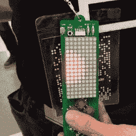

# 贝尔格莱德的提议只剩下一个星期了

> 原文：<https://hackaday.com/2018/02/27/one-week-left-for-hackaday-belgrade-proposals/>

你有贝尔格莱德的票吗？我们的首次欧洲会议将于 5 月 26 日举行，门票很快就会销售一空。

那些正在考虑发表演讲的人，你们现在有不到一周的时间向我们提交你们的建议。虽然我们已经接受了几个示范会谈，但最终决定要到 3 月 4 日周日提交截止日期过后才能做出。

Mike Harrison showing off [his demo work on the 2016 Hackaday Belgrade badge](https://hackaday.io/project/10818-hackaday-belgrade-badge-greyscale-display). If you have stories of the demoscene, consider sending in a talk proposal.

我们在找什么样的会谈？我们很想就演示场景进行一些讨论。今年的会议徽章是一个成熟的逆向计算机，我们正在为它开发一个基本的。如果你能在 Comodore 64 上推动像素，我们很乐意听你谈谈。我们也喜欢那些鲜为人知的科技史故事(迈克·哈里森关于 Eidophor 投影仪技术的[演讲很有趣，几乎被历史遗忘了)。](https://hackaday.com/2016/04/19/mike-harrison-exposes-hot-oil-and-high-voltage-of-ancient-live-projector/)

我们总是对创意设计感兴趣；想想那些不是方形的电路板和不仅仅是把东西放在一个简单盒子里的外壳。当然，我们永远在寻找稀有的宝石，分享研究世界的一瞥，像[这个计算集群](https://hackaday.com/2016/05/09/designing-a-high-performance-parallel-personal-cluster/)建立来在计算量子效应模拟时绕过有限的超级计算机时间。

这些都是很棒的演讲，呈现给渴望分享你的兴奋的听众。在本周末结束前，在获得这些提案！