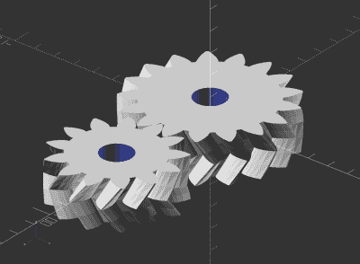

# 机制:齿轮

> 原文：<https://hackaday.com/2018/03/16/mechanisms-gears/>

甚至在工业革命之前，这种或那种齿轮就已经被用来为我们工作或反对我们。从古代碾碎谷物和捣碎亚麻的水车和风车，到为从攻城车到主战坦克的战争机器提供动力的传动系统，齿轮几乎是所有机械设备的重要组成部分。我们机械系列的下一期将简要介绍齿轮及其应用。

### 推动进步

通常情况下，进化是最好的发明者，而[一个连接幼年稻飞虱昆虫后腿的齿轮机构](https://en.wikipedia.org/wiki/Issus_coleoptratus)比人类发明齿轮早了几十亿年。人类使用齿轮至少可以追溯到公元前三世纪的中国，这项技术迅速而广泛地传播开来。在几百年内，精确加工的金属齿轮使得复杂的齿轮装置如[安提基西拉机械装置](http://hackaday.com/2015/11/23/the-antikythera-mechanism/)在希腊得以制造。

最简单地说，齿轮只不过是一个圆周上有某种齿的轮子。这些齿的尺寸和形状被设计成与其他机械元件上的齿啮合，以传递扭矩。多个齿轮串联在一起称为一个齿轮系，如果齿轮系中齿轮的直径不同，传递的扭矩将与差值成正比。因此，如果主动齿轮的直径为 1 厘米，从动齿轮的直径为 10 厘米，齿轮系将扭矩增加 10 倍，同时转速降低 10 倍。

 

螺旋渐开线齿轮，由【Greg Frost】的经典 [OpenSCAD 代码生成。最简单的齿轮叫做正齿轮，它的轮齿直截着圆盘的圆周面。许多中低速齿轮系使用直齿轮，直齿轮具有简单的几何形状，易于大规模生产。但是正齿轮有一些缺点。在齿轮系中，直齿轮的轴都必须相互平行，因此没有办法将动力传递到另一个旋转平面。此外，由于齿面的整个宽度同时啮合，正齿轮在高速运转时齿合在一起会产生很大的噪音。](https://www.thingiverse.com/thing:3575)

为了解决这个问题，可以将齿切割成与旋转轴成一定角度。像这样围绕齿轮的圆周倾斜齿会产生螺旋图案，因此得名螺旋齿轮。斜齿轮不仅更安静，还可以交叉成直角传递动力。代价是因为斜齿，斜齿轮沿其轴线传递推力。推力可以使用推力轴承，如圆锥滚子轴承，或通过在同一轴上使用两个齿方向相反的斜齿轮来抵消轴向推力。这就产生了美丽的人字齿轮，在风力涡轮机等高功率应用中随处可见。

### 粉末齿轮

很长一段时间以来，生产金属齿轮是一个复杂的过程，包括多个加工步骤，以生产出具有所需几何形状的齿。齿可以通过任何数量的加工操作来切割，如拉削、铣削、成形或磨削。

但是齿轮切割既费时又费钱，所以现在大多数齿轮都是通过某种成型操作生产的。当我们看到一个价格点的电动工具内部时，我们讨厌看到的那种塑料齿轮很容易通过注射成型来生产，尽管它们的名声不好，但它们可以产生完全可用的，如果不是特别长寿的齿轮系的话。但是金属齿轮也可以模制，粉末金属齿轮现在占据了很大的市场份额。

粉末金属齿轮是通过用非常细的混合有粘合剂和润滑剂的金属合金粉末填充模具来生产的。模具中的粉末被带有与模具形状匹配的工具的液压顶压缩，巨大的压力将金属颗粒融合在一起，形成足够坚固的固体，便于处理。然后将生坯加热，使颗粒永久融合到最终的金属部件中，在许多情况下，无需进一步加工即可使用。

 [https://www.youtube.com/embed/s1TGXa3pB5M?version=3&rel=1&showsearch=0&showinfo=1&iv_load_policy=1&fs=1&hl=en-US&autohide=2&wmode=transparent](https://www.youtube.com/embed/s1TGXa3pB5M?version=3&rel=1&showsearch=0&showinfo=1&iv_load_policy=1&fs=1&hl=en-US&autohide=2&wmode=transparent)

### 卷你自己的

虽然粉末冶金对于大多数家庭商店来说是遥不可及的，但是 DIY 齿轮对于任何有一些基本机床的人来说都是非常可行的。我们永远不会看够[Chris]加工[点击弹簧时钟](http://hackaday.com/2016/12/06/for-your-binge-watching-pleasure-the-clickspring-clock-is-finally-complete/)的齿轮和小齿轮，虽然这些齿轮在计量领域非常专业，但许多相同的原理也适用于其他应用的齿轮。3D 打印也使定制齿轮系成为可能，在合适的条件下，结果可能是[惊人的坚固](https://hackaday.com/2018/01/13/vintage-logan-lathe-gets-3d-printed-gears/)。别忘了数控刳刨机，它用各种材料制造出大大小小的齿轮。

 [https://www.youtube.com/embed/PFqjQ3l1MRA?version=3&rel=1&showsearch=0&showinfo=1&iv_load_policy=1&fs=1&hl=en-US&autohide=2&wmode=transparent](https://www.youtube.com/embed/PFqjQ3l1MRA?version=3&rel=1&showsearch=0&showinfo=1&iv_load_policy=1&fs=1&hl=en-US&autohide=2&wmode=transparent)

甚至很难触及齿轮背后的工程表面——齿的几何形状、压力角、接触线——我们也无法涵盖真正有趣的齿轮，如谐波传动和行星齿轮。但这至少是一个开始，并且当你开始在你的构建中添加齿轮时，你会尝到什么滋味。在评论中打开牛逼装备项目的闸门！