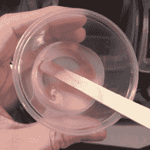

# 灯的幽灵般的光芒得益于快乐的错误

> 原文：<https://hackaday.com/2018/02/27/lamps-ghostly-glow-benefits-from-happy-mistake/>

[cyborgworkshop]最小的妹妹是一款流行视频游戏(*英雄联盟*中的 *Thresh* )中一个角色的粉丝，这个角色挥舞着一个带有神秘绿光的标志性灯笼。他决定[复制那个灯笼](https://cyborgworkshop.org/2018/02/17/thresh-lantern/)。或许是作为给珍爱的家人的礼物？肯定不是！[cyborgworkshop]的目标是简单的快乐，拥有“主宰她”的东西啊，兄弟姐妹不是很棒吗？

Why the glow powder turned pink in clear varnish is a bit of a mystery.

在制作幽灵绿灯的过程中学到了一些有趣的东西。构建日志的第一部分是关于灯笼模型的后期处理，它是在厚 0.48 毫米的层高度上 3D 打印的，但其余部分是关于如何让幽灵般的绿色发光出来。[cyborgworkshop]使用了黑暗颜料中的发光和黑暗粉末中的发光来真正使对象弹出，但这个过程涉及一些试错。最初，他将发光粉末混合到一些透明的清漆中，尽管混合物出于某种神秘的原因变成了粉红色，但一个小的样本点似乎变得很好。然而，在应用于提灯和等待后，清漆仍然粘稠，发光粉末从混合物中沉淀出来。他最终不得不尽最大努力将其移除，并尝试大量使用发光涂料。这最终是一个真正的变相的祝福，因为这种结合产生了一种像石头一样闪亮的纹理！正如[cyborgworkshop]所观察到的，有时错误最终会成为一件作品的亮点。

在更多的高光粉之后，最后的润色是一层薄的黑色来减弱粉的白色，以及一层透明的涂层。结果看起来很棒，下面嵌入了一个短视频。哦，如果有人知道为什么发光粉混合到清漆中会变成粉红色，请在评论中告诉我们！

 [https://www.youtube.com/embed/IGhlk-FTlh4?version=3&rel=1&showsearch=0&showinfo=1&iv_load_policy=1&fs=1&hl=en-US&autohide=2&wmode=transparent](https://www.youtube.com/embed/IGhlk-FTlh4?version=3&rel=1&showsearch=0&showinfo=1&iv_load_policy=1&fs=1&hl=en-US&autohide=2&wmode=transparent)

【Jeri Ellsworth】曾经[记录了从零开始制作发光粉](https://hackaday.com/2010/10/03/zinc-sulfide-glow-power-at-home/)，但是对于一种更传统的使东西发光的方法，这个[努卡-可乐自动售货机 PC 箱](https://hackaday.com/2016/08/14/nuka-cola-pc-case-really-glows/)用混合了紫外线活性蓝色染料的树脂浇铸了一些瓶子复制品，并将它们浸泡在紫外线 LED 照明中，给它们带来舒缓的发光。