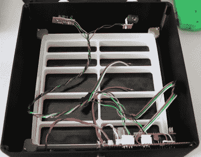

# Arduino BabyTV 在低分辨率下非常有趣

> 原文：<https://hackaday.com/2018/02/26/arduino-babytv-is-big-fun-at-low-resolution/>

你有哪种电视？旧的 720p 型号，还是现在标准的 1080p？也许你已经跃进到了下一代，正在客厅里摇动一个 4K 展示。如果你只是想看当地的运动球比赛，所有这些都很好，但挑战在哪里呢？随着所有的技术和模块化组件的出现，现在所有真正的黑客都在制造他们自己的电视。

 当然，当[【尼古拉】打造自己的 LED 电视](https://github.com/workinghard/BabyTV)时，他确实不得不做出一些让步。首先，这个型号没有调谐器。哦，还有一个小问题*只有 16×16 的分辨率。这可能不是你心目中的完美展示，但对他刚出生的儿子来说却是完美的。*

没错，[Nikolai]在年初获得了“年度黑客家长”奖，并为他的儿子制作了一个 LED 显示屏，他称之为“BabyTV”。

与儿童频道播放的~~节目~~、~~垃圾~~和广告不同，这台电视只播放复古游戏中的动画角色。我们承认，这个项目可能是一个精心制作的*发条橙*风格的尝试，旨在催眠他的儿子，灌输对经典游戏的欣赏。但是我们会允许的。

为了让他的婴儿电视走起来，[Nikolai]使用了 16×16 WS2812B LED 面板和 Arduino Nano。两个旋转编码器用于调节亮度和改变屏幕上当前显示的字符。作为一个特别聪明的黑客，Arduino 有一个红外传感器，并不断观察任何信号。如果检测到红外信号，婴儿电视将切换到下一幅图像。因此，如果 Junior 手中有一个标准的 IR 遥控器，他按下的任何按钮都会导致显示屏切换到下一个“频道”。

从历史上来说，我们在 Hackaday 没有看到太多适合儿童的东西，但 2018 年似乎正在改变这一点。最近的项目，如令人难以置信的零起点迷你挖掘机和 T2 华丽的 AT-ST 高脚椅似乎表明我们正在见证一代黑客成为父母。不要惊慌，但我们可能会变老。

 [https://www.youtube.com/embed/bw_D5chaiGM?version=3&rel=1&showsearch=0&showinfo=1&iv_load_policy=1&fs=1&hl=en-US&autohide=2&wmode=transparent](https://www.youtube.com/embed/bw_D5chaiGM?version=3&rel=1&showsearch=0&showinfo=1&iv_load_policy=1&fs=1&hl=en-US&autohide=2&wmode=transparent)

