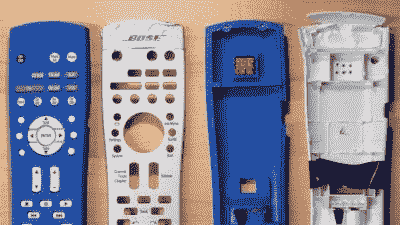
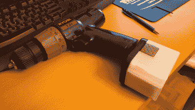
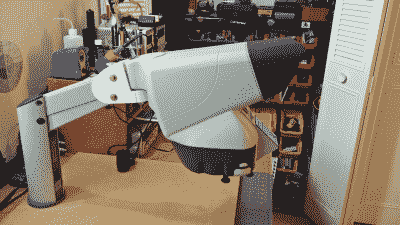
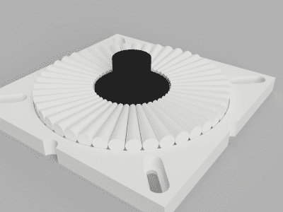
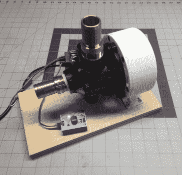
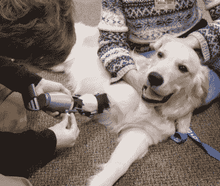
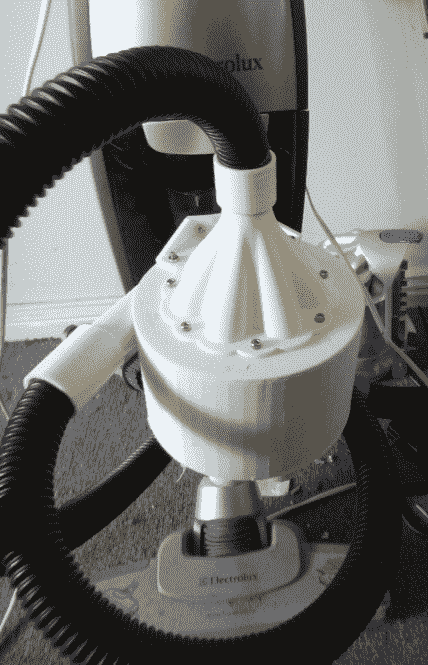

# 您可以打印的维修竞赛:见见获胜者

> 原文：<https://hackaday.com/2018/02/28/repairs-you-can-print-contest-meet-the-winners/>

六周前，我们要求您向我们展示您最好的 3D 打印修复产品，以便有机会赢得 100 美元的 Tindie credit 和其他奖品。你们响应号召，解决了所有问题，从每个人都有的东西，比如拉链和遥控器，到更难懂的东西，比如从垃圾箱里捡来的神奇显微镜。

很难将我们收到的条目削减到前 20 名，因为你提出了这么多令人敬畏的修复。他们中的一些人让我们努力思考*修复*的定义，但他们以自己的方式表现出色。

所以事不宜迟，我们很高兴地宣布我们的修理你可以打印比赛的获胜者。我们还想对那些因独创性而令我们惊叹的项目给予荣誉奖。

## 前三名获奖作品

* * *

以下是从 20 名获胜者中选出的排名最高的参赛作品。这些修复项目都有相当大的设计障碍，但他们的每个工程师都坚持不懈，结果闻起来像一朵玫瑰(当然是由熔化的塑料制成的)。

###  第一名:修理坏掉的遥控器

几年前，当亚历克斯·里奇的狗咬坏了他价值 90 美元的家庭影院遥控器时，他看到了一个不仅仅是更换外壳的机会。每当他家的炉子或空调启动时，它的噪音足以保证把音量开大一点。当然，一旦它关闭，那么音量太大。

[亚历克斯]在新的设计中有足够的余地——以及箱子内部的空间——来添加一个与他的恒温器通信并相应调整音量的小饰品。他还在遥控器的底部隐藏了一个硬件电源开关，以延长电池寿命。他不仅有一个改进的工作遥控器，还有一个放在茶几上的有趣话题。

###  第二名:更换钻头电池组

有时，似乎有计划的淘汰是没有边界的。制造商会毫不犹豫地转向下一个设计或最新的电池成分，除了他们强行回到消费者钱包里的那个。

当涉及到他的旧 Ryobi 钻孔机时，Larry G 不打算玩那个游戏。他认为，只要他能接近旧电池包的形状，并正确连接，他就可以用普通的可充电镍氢电池代替镍镉电池包。新的包是有线的，所以它只支持最大速度，但[Larry]可能会重新访问该项目，并尝试添加 555 的 PWM 速度控制。

###  第三名:显微镜安装支架维修

你翻垃圾箱时发现的最好的东西是什么？[leumasyerrp]偷了一台价值 1500 美元的视觉工程螳螂显微镜，这台显微镜被扔掉了，大概是因为安装支架裂成碎片，无法使用。

[他用 PLA](https://hackaday.io/project/40375-mantis-microscope-repair) 打印了一个新的支架，并用螺栓和尼龙锁紧螺母固定住。到目前为止，它很好地支撑住了重型显微镜。棘手的部分是试图固定它，使显微镜有足够的空间转动，但又不至于在定位后下垂。

## 20 名获奖者获得 100 美元的 Tindie 信用

* * *

这是 20 名黑客的完整名单，他们获得了 100 美元的 Tindie 信用，以表彰他们在修复自己的东西方面做出的巨大努力。你可以在这里浏览所有参赛作品。

*   [3D 打印拉链盒](https://hackaday.io/project/34269)
*   [Phillips CD-I 的 3D 打印带](https://hackaday.io/project/53200)
*   [3D 打印通用线缆固定器](https://hackaday.io/project/46069)
*   [桶形椅轴承修理](https://hackaday.io/project/58846)
*   [被啃坏的远程修复](https://hackaday.io/project/34266)
*   [科尔维尔替换零件](https://hackaday.io/project/43883)
*   【Baratza Vario 的可定制便携式支架
*   [Hololens 头带修复套件](https://hackaday.io/project/52675)
*   [螳螂显微镜维修](https://hackaday.io/project/40375)
*   [NLA: DeWalt DW708 斜切锯“灰尘提取器”](https://hackaday.io/project/44337)

*   [Nexus 7 2013 Sim 卡托盘](https://hackaday.io/project/41271)
*   [忍者搅拌机黑色转灰色适配器](https://hackaday.io/project/41257)
*   [PRSOUC35K 胶枪复生(3D 打印零件)](https://hackaday.io/project/34275)
*   [橡胶修复用印刷模具](https://hackaday.io/project/43854)
*   [修理工具墙整理器](https://hackaday.io/project/46931)
*   [用 3D 打印零件修理我的工具箱](https://hackaday.io/project/34318)
*   [用于 Ryobi 7.2v 钻机的更换电池](https://hackaday.io/project/38597)
*   [更换碎裂的冲洗助剂分配器盖](https://hackaday.io/project/57651)
*   [吸盘修复](https://hackaday.io/project/43145)
*   [MSX 电脑触发键](https://hackaday.io/project/44344)

## 特别奖获得者

* * *

现在，你们期待已久的时刻到了。

在比赛开始时，我们为最佳学生修理提供了特别奖，并为一个组织的最佳修理提供了另一个特别奖。这两位获奖者都获得了一台 Prusa i3 Mk3，它具有多材料升级功能，可以一次打印多达四种颜色或材料，而无需手动重装。

###  最佳学生参赛作品:桶椅轴承修理

我们最优秀的学生参赛作品利用挤压塑料的力量[重新发明了轴承，省去了一把旋转桶形椅子](https://hackaday.io/project/58846-barrel-chair-bearing-repair)。

几年前，[马特]的父母发现了一把舒适的转椅，但它再也不能转动了。由于轴承是铆接在一起的，他不能只是清理污垢，然后重新包装。他不得不重建它。

如果你从来没有玩过印刷的滚珠轴承，它们通常很粗糙，无法使用。[Matt]围绕印刷的限制进行设计，并提出了我们只能称之为平面锥形滚柱轴承的东西。

滚子是锥形的，设计成两端以相同的速度滚动。[Matt]首先制作了一个直径为 70 毫米的概念验证轴承。它移动得很好，所以他把它放大以适合椅子。新轴承很好地承受了重量，但旋转使中心柱从轴承上脱落。他在 TPU 打印了一份替代品，从那以后就一直顺利旋转。

###  最佳组织参赛作品:3D 打印普锐斯舱门释放开关盖

我们来自一个组织的最佳参赛作品[使用了一些熔融沉积模型来重新设计丰田普锐斯](https://hackaday.io/project/36279)中的一个错误。

[马克]他的普锐斯有问题。舱门释放装置有一个柔软的橡胶盖，在夏天会变得黏黏的，在冬天会变得太硬而无法正常工作。

他向密尔沃基创客空间的朋友寻求帮助，他们设计了一个替换的封面，在 TPU 印刷，并用硅胶密封以防止水。它已经工作了一年多，在任何天气下都可以弯曲，甚至低于 0°F/-17°c。

## 荣誉奖

* * *

  A cheap pump gets an upgrade with a BLDC motor.  A good boy deserves a great prosthetic.  Better dust extraction through 3D printing.

我们有很多很多条目实际上不是修复:在修复之前没有任何东西被损坏。但是其中一些很酷，所以我们想大声喊出来。

[Andrew]需要一台变速泵，但他手头只有一台 Harbor Freight 的 3/4 马力定速泵。[他买了一台 BLDC 电机，通过打印一个适配器法兰、一个冷却新电机的轴流风扇和一个与泵相连的外壳，将它组装到泵上](https://hackaday.io/project/47073-bldc-variable-speed-water-pump)。她如何选择？最高时速 850 英里！

[Ben]的工程老师给他布置了一个有趣的任务:为[Grey]制作一个假肢，这是一只天生腿短的小狗，他的老师在他自己的小狗顺从学校遇到了它。[Ben]想出了一个 20 件的可调节假肢，它与小狗的肘关节一起工作。这是 100%参数化的，所以[Grey]可以平稳地进入成年期。

[Nelson]厌倦了用堵塞过滤器的细小颗粒杀死真空吸尘器，所以[他设计并打印了一个 7 涡流旋风分离器，在颗粒到达过滤器之前收集它们](https://hackaday.io/project/20080-dust-extractor)。多亏了物理学的力量，他每年将节省大约 100 美元和大量的时间。

## 惊人的条目

3D 打印机是一次性制造的终极设计工具，当涉及到修复我们生活中的碎塑料时，没有比 3D 数控热胶枪更好的选择了。

这是非常困难的决定获奖作品的修复你可以打印竞赛，我们希望我们可以奖励每个人一个奖项。来自 Hackaday 社区的工作超出了预期，我们对所看到的感到惊讶。感谢所有参与进来的人，也感谢所有选择修理他们零碎的消费电子产品而不是扔掉它们的人。