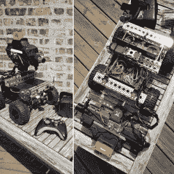

# M1 神经机器人:当原型进化时

> 原文：<https://hackaday.com/2018/03/06/the-m1-nerfbot-when-prototypes-evolve/>

当你遇到一个对所有事情都充满热情的自学成才的创造者时，你会得到什么？一个移动的 nerf [火炮平台](https://www.robotshop.com/letsmakerobots/m1-nerfbot-build1)能够每秒发射 15 发飞镖。很明显。

由[GrimSkippy]在“让我们制造机器人”社区中发布的帖子建造的 M1 神经机器人应该是一个  随着他教育的进展不断更新的原型。既然如此，进步是显而易见的；它有两个摄像头——一个在炮塔的炮筒上，另一个在底盘上，三个超声波传感器，由 Xbox 360 控制器控制，并将视频流传输到 M1 上的网页，这不仅仅是一个初学者项目。

也许最引人注目的是 M1 如何追踪其目标。摄像头将自己的视频发送到上述网页，然后——稍加重组——[ GrimSkippy]就可以通过一部安装在 FPV 耳机上的智能手机访问视频流。当他环顾四周时，来自手机的回转仪数据被发送回 M1，将头部的运动转化为炮塔和底盘凸轮的运动。看看吧！

 [https://www.youtube.com/embed/KUZNz3a3TV0?version=3&rel=1&showsearch=0&showinfo=1&iv_load_policy=1&fs=1&hl=en-US&autohide=2&wmode=transparent](https://www.youtube.com/embed/KUZNz3a3TV0?version=3&rel=1&showsearch=0&showinfo=1&iv_load_policy=1&fs=1&hl=en-US&autohide=2&wmode=transparent)

两个继电器控制 Nerf 枪的发射机制，以半自动、三发和五发连发方式发射。这些超声波传感器使控制器在距离物体 6 英寸以内时发出隆隆声，并使 M1 在距离物体 2 英寸以内时完全停止。

总之，[机器人大军](https://hackaday.com/2015/06/02/my-robot-army-maker-faire/)增加了一个更有能力的‘机器人’—[不再需要](https://hackaday.com/2017/08/04/opencv-turret-tracks-motion-busts-airsoft-pellets/)。