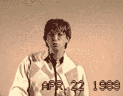
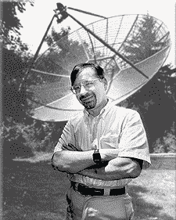
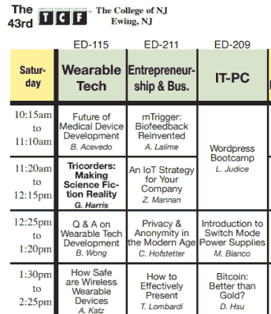

# 世界上最古老的计算机节的演变

> 原文：<https://hackaday.com/2018/03/07/evolution-of-the-worlds-oldest-computer-festival/>

特伦顿计算机节(TCF)没有像 DEF CON 或 HOPE 这样的大型技术会议的知名度。它甚至不如 DerbyCon、ShmooCon 或 Hackaday Superconference 等更小的本地化会议出名。事实上，大多数读者很可能从未听说过 TCF。尽管在黑客词典中没有一席之地，TCF 还是有很多值得夸耀的地方。它接待了从比尔·盖茨到理查德·斯托尔曼的科技名人，现在已经是第 43 届了，是世界上持续时间最长的科技节。

Bill Gates giving the keynote at TCF in 1989

当最初构思于 1976 年时，该展览致力于个人电脑的黎明时代，但从那时起，它已经发展成为一个整体技术的庆典。当 3 月 17 日 TCF 开赛时，不会有媒体闪电战或巨额企业赞助。此次活动不会有同步的在线直播，演讲者或与会者佩戴的徽章也将是纸质的。

在 TCF，你将会看到对各种形式的技术充满热情的人们所做的一系列演讲。这些技术涵盖了从量子计算到开锁，从 Arduino 到航天飞机航空电子设备的所有领域。

TCF 的核心是联合创始人和现任主席艾伦·卡茨博士。最近，我有机会与 Katz 博士讨论了举办此类会议的挑战，以及在瞬息万变的技术环境中保持相关性的秘诀。

## 个人电脑的诞生

Dr Allen Katz

举办一场成功的技术会议本身就是一项挑战，但设法举办 40 年完全是另外一回事。你可能会认为，在做了这么长时间后，卡茨博士可能会厌倦谈论它，但在我给他发电子邮件回答 Hackaday 的一些问题后不到五分钟，他回复了他的个人电话号码，并让我给他打电话。

卡茨博士深情地谈到了 TCF 的早期，那时个人电脑不是你可以随便去百思买就能买到的东西。TCF 开始于自制电脑的时代，如 Altair 8800 和 Apple I，它既是一个供应商出售电脑套件的场所，也是一个寻找志同道合者、交流想法和技巧的地方。

在那个时代，大多数计算机套件都是从邮购目录中购买的，Katz 博士将展览的成功归功于早期计算机制造者面对面交流的愿望。我认为把人们聚集在一起的能力，这种个人接触是有价值的。

随着个人电脑越来越受欢迎，特伦顿电脑节也越来越受欢迎。1989 年比尔·盖茨来做主题演讲的时候，这个展览吸引了大约 12000 名观众，这已经开始成为一个问题。“1990 年，我们被新泽西大学开除了,”卡茨博士回忆道镇上说你不能主持节目，这是公共安全问题。人们无法穿过街道。"

最终，TCF 搬到了位于爱迪生的新泽西会展中心，成为了广受欢迎的“电脑秀”巡回赛的一部分。在网上销售占据主导地位之前，像这样的展会为供应商提供了一个机会，直接向电脑爱好者提供他们最新最棒的硬件，而无需电子商店的加价。但是这个时代是短暂的，到 2000 年初，越来越多的人只是在网上购买他们的硬件。

“当易贝和在线销售进来时，我们看到了巨大的下降，”卡茨博士说。“你不像以前那样每个周末都有这些电脑展，因为观众不在那里了。”

## 新的方向

到 2005 年，TCF 兜了一圈又回到了 TCNJ 校园，但这次带着一个新的使命。很明显，仅仅作为一个买卖计算机硬件的场所已经不再可行，所以这个展会需要变得更有意义。提供一些你在网上买主板或处理器时得不到的东西。

> “再也不会像以前那样了。学院是教育机构，它的主要目的是教育，这是我们过去从未尝试过的。人们来参加这个节日的主要原因是为了购物体验。我们尽力保持购买体验。我们去看小贩和展品。但与此同时，我认为人们更愿意进来参加一些有教育意义的活动。”

TCF 将保留其供应商区域，尽管形式要小得多，并开始展示越来越多的技术讲座和演示。但是，TCF 不断变化的本质，以及在许多方面的技术社区，并不是没有后果。当被问及节目形式的改变如何影响节目的受欢迎程度时，卡茨博士说，他们仍然吸引了足够多的观众，让每个人都高兴。“我们现在吸引了大约 800 人。可敬。我们并行处理很多事情，我检查所有的谈话。我们真的能够运行一个广泛的程序。谈话充满了，发言者并不沮丧。你不想带一个演讲者进来，却有四五个人到场。”

## 不断发展的内容

Some of the talks for this year’s TCF, including one on building Tricorders

你不禁会想，如果 1976 年 TCF 的与会者能够预见未来，看到有一天这里会举办什么样的会谈，他们会怎么想。即使在主持这个节目这么多年后，当 Katz 博士描述他创建 TCF 时听起来像科幻小说的演讲和演示时，你也能听到他声音中的兴奋。他笑着打趣道，“谁会想到我们会在 2018 年谈论三录仪？”

今年的演讲日程包括加密货币和人工智能的最新发展等前沿话题，人们很容易忘记，在这些演讲者出生之前，TCF 就已经开始了。“我们试图拓宽它的范围，这样它就不仅仅是计算机了，”Katz 博士说。"这实际上与新兴技术有关，这些技术与数字电子技术密切相关."

卡茨博士解释说，他们试图做的事情之一是引入更多样的演示来保持新鲜感。但这并不容易。当 TOOOL 的新泽西分部在 2016 年联系他进行开锁的现场演示时，他心存疑虑。“我从没想过撬锁会成功，”卡茨博士承认道。“但事实证明它非常受欢迎，很多人告诉我他们真的很喜欢它。”

## 展望未来

即使在 43 年后，卡茨博士说 TCF 仍有一些方面需要改进。虽然他们经常被要求，但目前没有 TCF 演讲的录音。愿望是有的，但是资金和志愿者的缺乏使得到目前为止不可能以应有的质量水平记录这些演示。不过他很快指出，如果演讲者不反对的话，任何想自己录制演讲的人都非常欢迎。

卡茨博士还表示，他希望看到下一代有更多的参与。“我们需要引入更年轻的人，他们的想法与经营了 40 年的人不同。”虽然他们确实取得了进步，但他相信他们总能做得更好。他特别希望看到更多的 TCNJ 学生出席，但他承认，由于该剧发生在春假期间，学校可能是他们大多数人最不想去的地方。

但最重要的是，最大的目标只是继续寻找吸引与会者的内容。特伦顿计算机节永远不会是最大或最耀眼的技术会议，但这从来不是目标。Katz 博士说，只要演讲者高兴，参与者学习，这个节目就会继续下去。