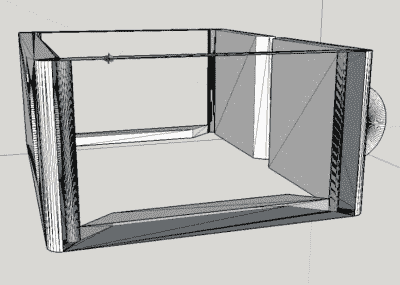

# 为品牌外设备定制 STL

> 原文：<https://hackaday.com/2018/03/07/customizing-stls-for-off-brand-devices/>

[Rob Clarke]需要为他的非品牌行动相机安装一个支架，但这不完全是熙熙攘攘的配件市场需要的东西。更糟糕的是，这款相机如此低调，以至于他也找不到 3D 打印的底座。幸运的是，用他的卡尺检查确认了他的相机大约和老款 GoPro Hero 3 一样大，所以他所要做的就是[修改现有的设计以满足他的需求](https://www.youtube.com/watch?v=BycjggKHY-U)。

 任何处理过 STL 文件的人都会告诉你，修改它们很痛苦。STL 本质上是一个完整的实体模型，而不是用来摆弄的。这有点像试图拍摄一幅经过编辑的图像，然后回到 Photoshop 或 GIMP 中用来创建它的图层。最终输出被“拉平”，因此失去了粒度控制。

也就是说，在这种情况下，[Rob]相当幸运。他找到了一个 90%的 GoPro 支架，他只需要调整深度和改变侧面孔的位置。他将 STL 加载到 SketchUp 中，删除了两边，并用新的曲面替换它们。这给了他一个干净的石板，为他的相机的 USB 端口和 microSD 卡添加适当的开口。为了调整底座的深度，他只需在 Z 轴上拉伸模型。

[Rob]事件继续进行，[发布了他修改的 STLs，作为他在 Thingiverse 上为任何拥有相同相机的人找到的原始案例的混音](https://www.thingiverse.com/thing:2811338)。这是我们喜欢看到的。

如果您有兴趣了解更多关于使用 SketchUp 设计 3D 打印零件的信息，请查看我们自己的【Brian bench off】提供的这个[优秀指南。](https://hackaday.com/2014/01/15/3d-printering-making-a-thing-with-sketchup/)

 [https://www.youtube.com/embed/BycjggKHY-U?version=3&rel=1&showsearch=0&showinfo=1&iv_load_policy=1&fs=1&hl=en-US&autohide=2&wmode=transparent](https://www.youtube.com/embed/BycjggKHY-U?version=3&rel=1&showsearch=0&showinfo=1&iv_load_policy=1&fs=1&hl=en-US&autohide=2&wmode=transparent)

