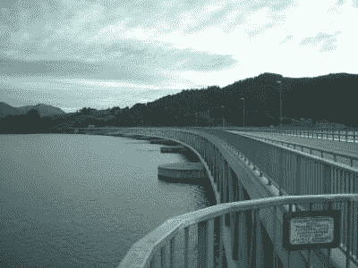
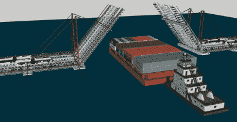
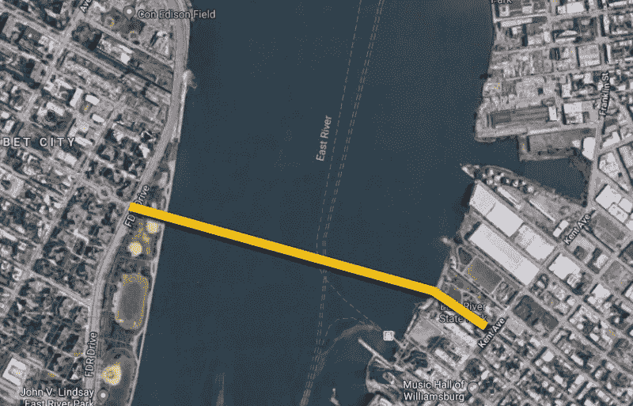

# 这座浮桥是作为纽约市交通修复浮动

> 原文：<https://hackaday.com/2018/03/08/the-pontoon-bridge-being-floated-as-an-nyc-transit-fix/>

纽约市的 L 列车每天运送大约 40 万名乘客，连接曼哈顿和布鲁克林，沿着东河下的第 14 街运送乘客，并穿过威廉斯堡、布什威克、里奇伍德、布朗斯维尔和卡纳西等社区。这些乘客中约有 225，000 人通过 Canarsie 隧道，这是一条双管铸铁铁路隧道，于 1924 年在曼哈顿和布鲁克林之间的东河下方修建。像许多其他纽约市的公路和地铁隧道一样，当飓风桑迪的风暴潮用数百万加仑的盐水淹没管道时，卡纳西隧道受到严重破坏。六年后，隧道即将关闭，这促使纽约人发展自己雄心勃勃的基础设施构想。

### 改变 25 万通勤者的路线

大都会运输署(MTA)稳步修复了其他受损的地铁隧道，但将 L 列车留在了最后。MTA 不会在夜间和周末列车停运期间解决这个问题，而是将完全关闭 Canarsie 隧道，进行为期 15 个月的大修，计划从 2019 年 4 月开始。随着曼哈顿和布鲁克林之间的重要联系被切断，成千上万的通勤者将需要一种新的方式穿越东河。

MTA 的[关闭缓解计划](https://ny.curbed.com/2017/12/13/16774084/l-train-shutdown-mitigation-plan-alternatives-mta-dot-nyc)包括关闭曼哈顿第 14 街，除了城市公交车，增加威廉斯堡大桥的公交服务，在 G、J、M 和 Z 线上运行更多的列车。但是在 MTA 计划宣布之前，有进取心的纽约人已经开始为即将到来的交通噩梦制定自己的解决方案。其中一个更雄心勃勃的计划建议建造一个连接曼哈顿和威廉斯堡的[高空缆车](http://www.eastriverskyway.com/)，类似于罗斯福岛有轨电车。 [ReThink Studio](https://ny.curbed.com/2016/7/27/12295718/l-train-alternative-e-train-reroute) 展示了一个令人惊讶的完整项目，将 E 和 G 列车连接起来，形成曼哈顿-布鲁克林-皇后区环线，这可能会在 L 列车停运期间以及未来几代人的时间里改善通勤状况。

最新的非传统提议来自房地产投资者和男模帕克·希恩，他正在建造一座横跨东河的临时浮桥。他的计划将提供两条公交专用道和两条步行/自行车专用道，从威廉斯堡的第八街开始，然后穿过河流到达曼哈顿的第十街。在曼哈顿，公共汽车会在城市街道上滚动，走 C 大道，然后在第 14 街上行驶，将乘客送到第 14 街的目的地，那里曾经是 L 运行的地方。

### 帕克·希恩有一座桥要卖给你

 

伯格森大桥是一座永久性浮桥，自 1992 年起投入使用【图片由[Bengt-Inge Larsson](https://commons.wikimedia.org/wiki/File:Bergs%C3%B8ysundbrua.jpg)CC-BY-SA 2.5】

希恩的想法是使用浮桥比建造一座真正的永久性建筑要便宜得多。如此长度的吊桥，如附近的威廉斯堡大桥，需要使用沉到河底的沉箱、数英里长的钢缆以及河两边巨大的桥台来建造巨大的桥墩。然而，浮桥只是漂浮在水面上，桥的重量被桥面空心支撑处的浮力所抵抗。几千年来，在军事行动中，临时浮桥被用来运送货物和设备穿过水体，而永久性浮桥现在长度超过两公里。“L-alternative Bridge”将由 37 个预制桁架段组成，在场外建造和组装，然后漂浮到位并锚定以防止它们漂走。

现在这个项目已经进入 Kickstarter 活动阶段，希恩的浮桥提议已经开始受到纽约市内外媒体的积极报道。当 [Fred Wilson 在 AVC 博客](http://avc.com/2018/02/funding-friday-the-l-ternative-bridge/)上讨论这个项目时，这个项目引起了 Hackaday 的注意。不幸的是，对于乘地铁上下班的人来说，这样一座桥不太可能在短期内漂浮在东河上。

### 桥梁与驳船、政府合作和潮汐

Parker Shinn’s proposal has two lanes for buses, two lanes for bike/pedestrian, and a drawbridge for water traffic

正如希恩在他的 Kickstarter 页面上提到的，为了让大型船只和驳船通过，吊桥部分是必要的。然而，考虑到东河上繁忙的海上交通，这座吊桥可能会花更多的时间在上升而不是下降。希恩还承认，任何跨越航道的桥梁建设都需要美国海岸警卫队的正式批准。此外，在开展此类项目之前，还需要进行层层冗长的环境影响评估和交通研究。即使这些都以某种方式加快了，我预计会看到该项目被昂贵和耗时的诉讼扼杀。

希恩展示了他的桥的布鲁克林一侧与威廉斯堡的第八街相连，但这条城市街道并不临水。相反，这条街的西部终点在肯特大道，距离东河大约 600 英尺。第八街尽头和河流之间的土地是东河州立公园，它显然不是纽约市的财产。换句话说，要让希恩每天乘坐的数百辆公交车隆隆驶过这 600 英尺的路段，他需要得到纽约州公园、娱乐和历史保护办公室的完全许可。

建议的浮桥位置【图片来自[谷歌地图](https://drive.google.com/open?id=1oKRko3sqXPzGwyVu3vznlBb_OpZFlYuR&usp=sharing)】

浮桥在曼哈顿的登陆需要在 FDR 上方的高架部分，这是一条沿曼哈顿东侧南北走向的六车道高速公路。希恩承认，这里需要一座立交桥，但这样的结构需要真正的地基基础来将其重量带入地下。这种拥挤的基础建设在纽约市经常发生，但如果这座桥要在 12 个月后开放，他们最好现在就开始采集土壤样本。

最后，东河在技术上并不是一条河流:它是一条狭窄的狭长地带，连接着长岛海峡和大西洋的盐水水域，这意味着它更准确地被称为东潮汐海峡。这里的水流特别强烈和不可预测，潮差很高，该地区容易受到强烈的风暴潮的影响。东河上的固定渡口基本上不受下面汹涌的河水的影响，而浮桥则受潮汐的支配。目前还不清楚他选择的船锚是否能够抵抗桥上强烈的横向力。正因为这一点，浮桥通常被保留用于跨越平静的水域，如湖泊和特别平静的河流。

### 基层基础设施

虽然建造东河浮桥的可能性极小，但看到像希恩这样的公民积极追求雄心勃勃的基础设施项目，令人振奋。MTA 对邻居关于 L 号列车停运的反馈反应良好，但面对影响我们日常生活的重大变化，我们绝不应保持被动。150 年前，当约翰·奥古斯都·罗布林开始设计布鲁克林大桥时，他只是一个有着远大理想的普通公民。

浮桥可能是一个产生更多问题的解决方案，但是关闭 L 火车隧道的一个很好的解决方法可能仍然存在。需要什么样的工程技术才能让通勤者穿过东河？请在下面的评论中告诉我们。

* * *

亚历克斯·温伯格是一名居住和工作在纽约市的结构工程师。你可以在 a@alexweinberg.com 给他发电子邮件。