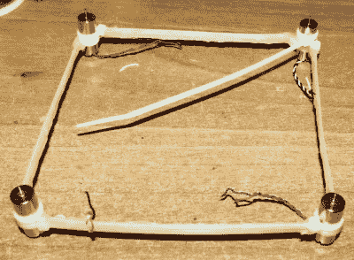

# 拉链四轴飞行器的框架便宜到极点

> 原文：<https://hackaday.com/2018/03/09/zip-tie-quadcopter-frame-is-as-cheap-as-they-come/>

多年来，我们已经看到了一些廉价的四轴飞行器，但这一款是最棒的。在看到有人发布了一个关于用拉链和热熔胶建造四轴飞行器框架的笑话后，[【iron mew】决定真正尝试一下](https://www.reddit.com/r/Multicopter/comments/82nka7/i_built_a_brushed_quad_frame_out_of_zipties_and/)。最终的结果是一个微型四轴飞行器，它实际上体面地飞行了一半，并且由于灵活的结构，似乎相当耐碰撞损坏。

 建造框架的第一次尝试失败了，因为拉链带(不出所料)太柔韧，无法支撑马达的重量。最终，[IronMew]意识到试图复制传统的四轴飞行器框架设计是行不通的。他最终想出的布局本质上是普通四轴飞行器框架的反转，而不是一个手臂向外辐射以支撑马达的机身。

用健康的热胶水涂层加固的拉链被排列成一个正方形，每个角上都有一个马达。然后用四个拉链带来支撑中央的“豆荚”,里面装着电池和电子设备。没有试图加强这部分框架，因此沉重的中央吊舱在飞行中有点下垂。[IronMew]认为这最终可能实际上是有益的，因为他相信在录制 FPV 视频时，这可能会产生稳定的效果。

他提到，他仍然在努力在飞行计算机中正确设置 PID 值，但在休息后的视频中，你可以看到它在第一次尝试中飞行得相当好。我们不建议你在建造你的第一架四轴飞行器的时候撕开一包拉链，但这确实表明有足够的实验空间。

如果你想让你的下一部作品与众不同，我们已经介绍了一些独特的四轴飞行器框架。如果你有足够大的床[你可以 3D 打印一个非常好的框架](http://hackaday.com/2018/01/15/3d-printing-a-better-quadcopter-frame/)，但是如果你有更多的时间而不是设备，你总是可以[从一块胶合板](https://hackaday.com/2014/05/14/frankensteined-x4-quad-is-brought-back-to-life/)上切割一个。

 [https://www.youtube.com/embed/XU1iy5P3rwA?version=3&rel=1&showsearch=0&showinfo=1&iv_load_policy=1&fs=1&hl=en-US&autohide=2&wmode=transparent](https://www.youtube.com/embed/XU1iy5P3rwA?version=3&rel=1&showsearch=0&showinfo=1&iv_load_policy=1&fs=1&hl=en-US&autohide=2&wmode=transparent)

