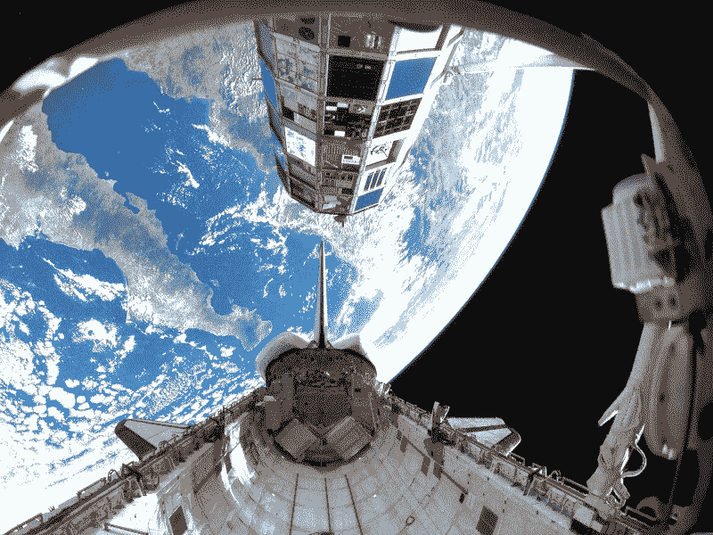
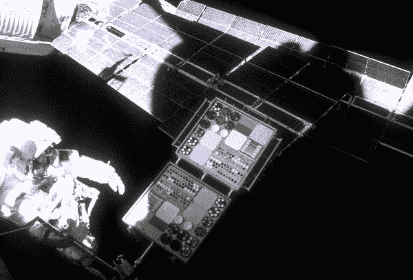
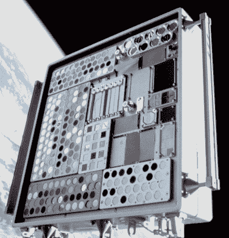
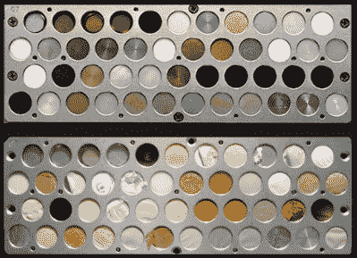
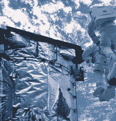
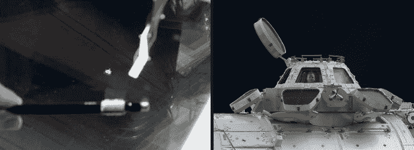
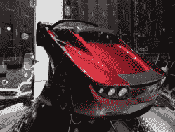

# 迷失在太空:材料如何在太空中降解

> 原文：<https://hackaday.com/2018/03/12/lost-in-space-how-materials-degrade-in-space/>

Hackaday 的读者很清楚随着时间的推移暴露在环境中的材料所造成的问题，无论是电路板上的氧化接触垫还是因长期暴露在太阳紫外线下而变脆的塑料。

现在考虑一下国际空间站(ISS)上的材料所面临的危险，ISS 从 1998 年开始发射，计划使用到 2028 年。这是在未经过滤的阳光、极端温度、微流星体甚至氧气引起的问题的环境中总共 30 年的时间。新推出的特斯拉跑车面临的风险是什么，这是一种完全非太空硬化的车辆，在围绕太阳的百万年轨道上运行？恶劣的太空环境是如何影响构成国际空间站和跑车的材料的？

幸运的是，自 20 世纪 70 年代以来，我们一直在地球轨道上做实验，这些实验可以给我们答案。任务和实验本身和结果一样有趣，所以让我们看看我们是如何将材料送入轨道，在严酷的太空中进行测试的。

## 天空实验室失败的材料实验

1973 年发射的空间站“天空实验室”进行了一些实验。一个由两个 17 厘米(6.7 英寸)的正方形面板组成，每个面板在 2.54 厘米(1 英寸)的圆盘上具有 36 个热涂层样品。另外两个同样大小的面板包含 5 密耳厚的聚合塑料条。

不幸的是，事情并没有一个良好的开端，尽管吸取的教训有助于防止未来的实验重演。这些样本都被怀疑是来自一次冷却回路泄漏的工作流体所污染。

## LDEF，长期暴露设施，时间过长

LDEF as seen from the Space Shuttle

“天空实验室”11 年后，长时间曝光设备(LDEF)被发射到太空进行一项持续近 6 年的实验。它比之前的实验要大得多，有一辆公共汽车那么大。

LDEF 于 1984 年 4 月由挑战者号航天飞机送入轨道，打算在 1985 年 3 月返回地球，但一系列的延迟意味着它在那里呆了 5.7 年，直到 1990 年由哥伦比亚号运载回来。由于停留时间长，在返回地球时，甚至 LDEF 的结构也被仔细检查是否有任何影响。

实验覆盖了 LDEF 的所有十二面，包括两端。为了防止天空实验室失败的重演，卫星的姿态不是使用具有潜在污染燃料的推进器，而是通过在一端增加质量来控制，使地球的重力始终保持这一端面向地球。

共有来自九个国家的政府和大学的 57 项实验。实验包括暴露材料、涂层、热系统、光纤和电子设备。

## MEEP 在和平号上测试建造国际空间站的材料

The MEEP on Mir

随着 1996 年国际空间站的筹划，需要对用于空间站的特定材料进行进一步的实验。幸运的是，俄罗斯和平号空间站当时正在轨道上，与国际空间站飞行在相同的高度。由此诞生了和平号环境效应有效载荷(MEEP)实验。这些实验被带到那里，并由航天飞机回收，停留 18 个月。

一个实验(PPMD)由金、锌和铝板组成。它记录了碎片撞击他们的频率、碎片的大小、来源以及造成的损害。另一项实验(ODC)捕获了返回地球的气凝胶中的碎片，以确定碎片的可能来源。最后两个实验(POSA I 和 POSA II)测试了对各种材料的影响，包括油漆样品、玻璃涂层、多层隔热材料和各种金属样品。

## 国际空间站自身的实验

1998 年，国际空间站(ISS)开始了它的轨道生活，并延续至今。它的目的是作为一个研究实验室，作为一个持续载人的长期空间站，它接管地幔作为空间材料研究的主要场所是有意义的。

MISSE-1’s PEC2 on the ISS’s Quest module

这项研究被命名为 MISSE-1 到 MISSE-8 的一系列实验，MISSE 代表国际空间站材料实验。大多数实验都安装在称为被动实验容器(PECs)的面板上，与天空实验室面板一样，这些面板包含暴露在太空中的样本。一些实验是活跃的，因为它们可以与国际空间站接口以获得电力和通信。

为了让你了解一个典型的实验，MISSE-5 由一个包含 36 个太阳能电池的 PEC 和另一个包含 200 多种柔性材料的 PEC 组成。虽然它们不总是胸肌。MISSE-7 包括[space cube](https://en.wikipedia.org/wiki/SpaceCube)，这是一个基于 Xilinx Virtex 4 FX60 FPGAs 的多处理器空间应用平台，其目的是通过软件演示辐射加固。

大多数失误已经上升，并使用航天飞机返回，但 SpaceX 已经返回了其龙太空舱的一些部件。

## 学到了什么？

MISSE-2 samples: before and after

所有这些实验的一个发现是，低地球轨道材料退化的主要来源是原子氧。在 LEO 高度，航天器以大约 27，600 公里/小时(17，200 英里/小时)的速度移动，在这个速度下，与原子氧的碰撞足以打破分子键，导致氧化。对于聚合物，氧化产物是气体，腐蚀材料。一些金属也会被腐蚀。最终结果是结构、热或光学退化。在 MISSE-1 和-2 中，原子氧腐蚀了许多聚合物样品，以致于没有留下任何样品。

Hubble thermal control insulation damage

没有显著的大气，辐射是另一个降解源，使许多塑料和涂层退化和变黑。哈勃太空望远镜给出了一个辐射损伤的极好例子。在哈勃太空望远镜进入太空 6.8 年后，在航天飞机的第二次维修任务中，宇航员发现一些热控隔热层广泛脆化，这是一种镀铝-特氟隆氟化乙烯丙烯隔热层。测试发现原因是电子和质子辐射，加上太阳耀斑 x 射线和紫外线辐射以及热效应。

微流星体和数以百万计的人造碎片颗粒也会造成损害(与陨石不同，流星体是一种不会到达地球表面的流星)。100 多个微流星体撞击了 MISSE-1 和 MISSE-2 实验。

Cupola window damage

2012 年 6 月，当国际空间站上的宇航员发现这里显示的撞击时，发现了一个非实验性的微流星体损坏的例子。它出现在圆顶建筑的一扇窗户上。冲天炉是国际空间站的一个模块，通过它的七个窗口拍摄地球的照片和视频。吸取 20 世纪 80 年代俄罗斯礼炮 7 号空间站的教训，窗户有百叶窗，所以这个百叶窗在评估损害时关闭，后来在认为安全时重新打开。窗户由四层组成:外部碎片层、两个压力层和内部刮擦层。如果损坏严重，可以更换车窗。

## 特斯拉跑车的命运

Tesla Roadster prior to launch

这就把我们带到了特斯拉跑车。如果你一直埋头于你的最新项目而没有听说过，SpaceX 最近对他们的猎鹰重型火箭进行了首次测试，用特斯拉跑车作为压载，将汽车送入围绕太阳的轨道，最远到达小行星带。我们报道说，最近的一项分析显示，它很有可能在未来一百万年内撞击地球或金星。但是如果它出现了，它会以可识别的形式出现还是以粒子云的形式出现？

跑车没有暴露在地球轨道上的原子氧中。然而，塑料、皮革座椅和橡胶轮胎主要由含有碳-碳和碳-氢键的有机分子组成。恒星辐射的能量可以打破这些束缚。有机物体，如被无机分子(无碳分子)阻挡的碳纤维框架，会持续更长时间。任何铝和其他金属都应该存在，但玻璃最终可能会被流星体击碎。无论是 10 年后还是 100 万年后，结果都可能是可识别的无机部分覆盖着不太可识别的有机部分，并伴随着一团小的有机粒子，主要是油漆碎片，留下一个物质退化但有趣的物体绕太阳运行。