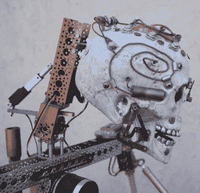

# 和贾维斯一起把万圣节带到一个新的高度

> 原文：<https://hackaday.com/2018/03/18/taking-halloween-to-the-next-level-with-jarvis/>

作为一名狂热的“经常出没的黑客”，[史蒂夫·科奇]对如何将高科技引入万圣节略知一二。他想制造一个可以陪他参加会议的移动机器人，以展示他使用的那种电子机械装置和控制装置，于是他想到了贾维斯的主意。最初的计划是制造一个更传统的机器人，但加上一个动画头骨和一些蒸汽朋克风格的点缀，贾维斯绝对是你不想在十月的夜晚遇到的那种东西。

 贾维斯的建造始于 2016 年，在【史蒂夫】看到来自 ServoCity 的[特工 390](https://www.servocity.com/agent390) 履带式机器人底盘之后。通过增加额外的车轮和定制的轨道，他将代理 390 转换成三角形的轨道排列，他说自从“约翰尼 5”在*短路*中展示它们以来，他就一直在关注这种排列。

让贾维斯移动和说话需要一系列令人眼花缭乱的电子设备，尤其是“女妖”道具控制器。这种装置是为了简化电子动画头的结构而制造的，它不仅能提供看起来很自然的随机运动，还能实现自动颌同步。通过无线音频连接，[史蒂夫]能够通过安装在机器人胸部的扬声器说话，而头骨会实时自动将其嘴与他的讲话相匹配。结合双轴万向节中的 GoPro，这使得 JARVIS 可以作为一个相当强大的远程呈现平台。令使用它的人高兴/害怕的是。

让贾维斯移动不仅需要由 Agent 390 平台提供的两个大电机和一个专用控制器，还需要至少 13 个用于头部、手臂和夹钳的伺服系统。甚至还有一个线性致动器用来上下倾斜头骨，大概是为了吓唬不同身高和年龄的人。贾维斯甚至在头骨上安装了一双 [Adafruit 的电子眼](https://learn.adafruit.com/animated-electronic-eyes-using-teensy-3-1)，就好像你认为你可以免去在黑暗中看到发光的眼睛跟着你的恐惧。

为了控制所有这些硬件，[Steve]使用了两个 RC 发射器和一个智能手机来显示来自 GoPro 的视频。让贾维斯做它的事情需要一些认真的手指体操，这一点[史蒂夫]说他仍在努力掌握。

正如许多增光添彩的项目可以证明的那样，黑客们似乎乐于想出新的令人兴奋的方法来恐吓年轻人和老年人。有时他们[甚至不能等到万圣节](http://hackaday.com/2017/11/30/tis-the-season-for-terror-with-diy-krampus/)。

 [https://www.youtube.com/embed/qkizkzkoKZI?version=3&rel=1&showsearch=0&showinfo=1&iv_load_policy=1&fs=1&hl=en-US&autohide=2&wmode=transparent](https://www.youtube.com/embed/qkizkzkoKZI?version=3&rel=1&showsearch=0&showinfo=1&iv_load_policy=1&fs=1&hl=en-US&autohide=2&wmode=transparent)

 [https://www.youtube.com/embed/4SrOLSFn_5w?version=3&rel=1&showsearch=0&showinfo=1&iv_load_policy=1&fs=1&hl=en-US&autohide=2&wmode=transparent](https://www.youtube.com/embed/4SrOLSFn_5w?version=3&rel=1&showsearch=0&showinfo=1&iv_load_policy=1&fs=1&hl=en-US&autohide=2&wmode=transparent)

