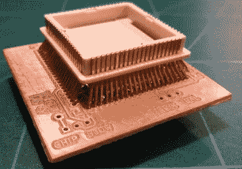
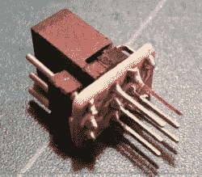

# 恭敬地修改 Amiga 500

> 原文：<https://hackaday.com/2018/03/12/respectfully-modifying-the-amiga-500/>

修改 Amiga 500 以加快对内存扩展包中 RAM 的访问是一个有据可查的过程，该过程的指南写于 20 世纪 90 年代早期，当时硬件只有几年的历史。但由于它们是为当代硬件而写的，它们在如何对待一台已经超过 30 年的老式计算机方面没有做出任何让步。1993 年，在 Amiga 500 主板上切割痕迹只是为了让一台过时的台式电脑延长几个月的使用寿命而做的最后努力。但在 2018 年，这有点像那个老太太试图在西班牙“修复”一幅耶稣的壁画；这可能是出于好意，但你还是把事情搞砸了。

 这种东西在【Inkoo Vintage Computing】上飞不过去。在那里，你可以找到一个指南，详细说明了如果他们想在不对主板进行任何不可逆转的更改的情况下执行经典修改[可以达到的令人印象深刻的长度。为了避免切割痕迹和焊接的 bodge 线，这个版本的修改利用了一个新颖的适配器，打破了 8372A 芯片上的必要连接。](https://inkoovintagecomputing.wordpress.com/2018/02/15/amiga-500-chip-ram-expansion-with-no-motherboard-modifications/)

适配器只是一个自制的 PCB，带有阳和阴[塑料引线芯片载体](https://en.wikipedia.org/wiki/Chip_carrier#Plastic_leaded_chip_carrier) (PLCC)连接器。芯片上需要重新布线的几个引脚暴露在适配器上作为焊盘，以便于布线。适配器上甚至有几个跳线来打开和关闭修改。

毫不奇怪，构建这个适配器最棘手的部分是寻找过时的 PLCC 连接器。假设你能找到它们，那么剩下的挑战就是将它们焊接在一起。从[Inkoo Vintage Computing]页面上的图片来看，这可不是在公园里散步。

Amiga 的扩展托架中使用了另一种类似的布置，其中一个引脚实际上被“切割”在连接器中。一个小型 PCB 焊接到一个 3×2 接头上，以重新路由信号，另一个跳线用于使能和禁用该引脚。幸运的是，Amiga 内存扩展上的长引脚足够宽容，小电路板可以在不中断电接触的情况下安装在它们之间。

我们对这些地区的 Amiga 500 并不陌生。我们已经讲述了如何让 1987 年的老式机器在 21 世纪上线，以及如何使用 T2 的树莓 Pi 来模拟原始的软盘驱动器。如果你在比你年龄大的电脑上工作时有一种存在主义的恐惧，你甚至可以用 3D 打印的盒子制作自己的 [faux-Amiga。](https://hackaday.com/2017/07/18/almost-an-amiga-for-not-a-lot/)