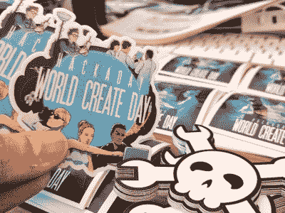
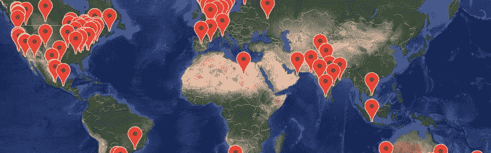

# 聚在一起，在本周六的世界创造日动手吧！

> 原文：<https://hackaday.com/2018/03/15/get-together-and-hack-this-saturday-at-world-create-day/>

这个周末花些时间在你所在地区的 Hackaday 社区。本周六黑客日世界创造日将有超过 100 个社区组织的聚会。查看大地图，找到一个离你最近的，点击他们活动页面右上角的“加入这个活动”按钮，让他们知道你要来。

Sticker packs we’ve been sending out to local event organizers.

和新老朋友聚在一起，为一个你渴望已久的项目而努力，总是一件令人兴奋的事情。从你的工作台上拿些东西，和其他人一起玩玩。这是开始参加 [2018 Hackaday 奖](https://hackaday.io/prize)的绝佳机会。为项目集思广益，获取关于早期构建计划的建议，并考虑组建一个团队。提交你在本周六的参赛作品，并在接下来的几周内对其进行改进。

还能报名主持世界创造日吗？当然啦！请填写这张表格，我们会马上为您安排好。

如果你不能参加现场活动，你仍然可以参加。留出时间来破解并通过社交媒体展示你正在做的东西。我们有一个 [Tweetwall](http://worldcreateday2018.tweetwally.com/) 设置(很适合在小组会议期间放在投影仪上)，它与标签[#世界创造日](https://twitter.com/search?q=%23WorldCreateDay)分享推文。

### 不要忘记讲述你的世界创造日的故事

我们从您的 meetup 中寻找酷故事和有趣的黑客，以便我们可以在 Hackaday 上展示它们。去年，我们举办了一系列会议，比如在塞浦路斯的[自动化园艺和在大阪的](https://hackaday.com/2017/05/16/world-create-day-2/)蚀刻机器人印刷电路板。还有一个关于[婴儿吉他放大器、力量赛车系列和古怪挥舞的服装组合](https://hackaday.com/2017/04/24/behold-the-many-builds-of-world-create-day/)的综述。这确实是一件世界性的事情，这里有一个[横跨印度、澳大利亚和美国](https://hackaday.com/2017/05/13/from-amritsar-to-busselton-more-world-create-day-stories/)的综述。

拍照，写下发生了什么，并标记所有内容#WorldCreateDay，这样我们就有信息来报告您的 meetup！

The [HackadayPrize2018](https://hackaday.io/prize) is Sponsored by:     