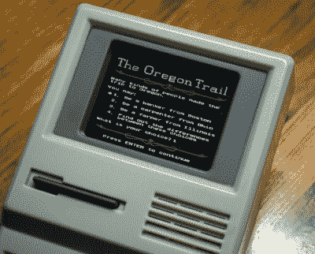

# 拆卸:俄勒冈小径掌上电脑

> 原文：<https://hackaday.com/2018/03/14/teardown-the-oregon-trail-handheld/>

如果你是 20 世纪 80 年代或 90 年代的学龄儿童，你几乎肯定玩过俄勒冈小道。由于其模糊的教育性质，它是学校电脑的主要产品，直到 21 世纪初，创造了一代又一代的粉丝。既然这些粉丝已经到了有可支配收入的年龄，我们自然会看到*俄勒冈之路*商品的复兴，以利用人类最大的弱点之一:怀旧。

 进入[目标独占*奥勒冈小道*掌上游戏](https://www.target.com/p/handheld-oregon-trail-game/-/A-52719211)。售价 24.99 美元，设计看起来像每个特定年龄的人都记得的“计算机课”中的经典米色盒子计算机，它让你在旅途中体验死于痢疾的所有刺激。自然，在过去已经有了针对移动设备的游戏版本，但是当你想让咖啡店里的同龄人嫉妒的时候，这将如何帮助你呢？

但是我们在这里并不是要对那些在他们心中对俄勒冈之路有着特殊地位的人做出评判。当然，比起互动的早期美国历史，还有更糟糕的事情你可以去钻研。不，你读这篇文章是因为有人推出了一个掌上电脑外观的游戏系统，配有简化的键盘，你想知道里面有什么。如果曾经有一个廉价的游戏系统乞求被注入树莓派和一些复古的 PC 游戏，这个东西就是它。

## 但是首先…

如果我没有至少玩一会儿就把它拆开，并对整个系统进行评论，那我就失职了。我不得不说，考虑到它有多便宜，这真是令人印象深刻。外壳感觉很结实，按钮反应很好，我不禁喜欢电源按钮(软盘驱动器中的灰色条)产生的令人满意的“ker-chunk”。那噪音让我想起了在我的 386 上玩 DOS 游戏的日子。

屏幕出奇的清晰，尽管与我们每天盯着看的智能手机相比有点暗淡。尽管以现代标准来看，它非常小，但一切都非常易读，图形看起来也很棒。

好了，现在我们已经收起了玫瑰色的眼镜，让我们看看这个人造电脑里面藏着什么。

## 成长空间

所以你在俄勒冈小道内注意到的第一件事就是它绝对是洞穴状的。外壳必须至少是它需要的两倍大，设备的大部分只是死空间。你可以*轻松*将圆周率 3 装进盒子里，更不用说圆周率 0 了。还有足够的空间来放置可充电电池，这很好，因为为设备供电的三个 aa 不太可能让你走得很远。

用一些数字来表示，箱子的内部大约 140 毫米长，82 毫米宽，40 毫米深。我真的不知道箱子里有多少空间，你可以用石头填满它，然后很容易地把它拧回去。从材料的角度来看，这似乎非常浪费，但如果你试图在里面放入额外的齿轮，这绝对是非常棒的。

## 主板和液晶显示器

正如你所料，俄勒冈小径的主板将大部分好东西藏在黑色环氧树脂下。有一个令人眼花缭乱的测试点阵列，但没有一个标签说他们做什么。有几个看起来很有趣的焊料跳线垫，但在以不同的组合桥接它们之后，我没有注意到任何改变游戏的东西。我肯定他们至少会改变语言，但是不行。

板上的一个设备的标签已经完全被擦掉了，但是另外两个设备在显微镜下是可见的。

      

HT24LC08 是一个 1KB 的串行 EEPROM ，所以如果你想破解你的旅行车的内容，这可能是一个好地方。另一个芯片，G25Q80CW 我不太清楚。我做的搜索一无所获。

当然，主板很可能会被任何购买俄勒冈小道的人扔进垃圾箱，所以我们不会在细节上停留太久。

至于屏幕，柔性电缆直接焊接到主板的背面。ID ZSX0243 印在面板的背面，甚至压印在带状电缆上，但就像主板上的第二个芯片一样，我没有在网上找到任何有用的信息来说明如何与它接口。

    

## 键盘

最激动人心的消息可能是，俄勒冈小道上的键盘异常容易被破解。这是[一个简单的薄膜键盘](https://hackaday.com/2015/01/25/making-membrane-keypads-from-scratch/)，为了方便起见，每根线都有单独的标签(在键盘*和*主板侧)。它可以直接焊接到您最喜欢的微控制器或 SBC 的 GPIO 引脚上。

      

我认为最大的问题是目前游戏中按键的效用非常有限。方向垫(有对角线)很好，但不确定你真的能从“马车”按钮中获得多少里程。最好的办法可能是重新绘制按键，或者全力以赴，用任何符合你预期目的的图标 3D 打印新的按键。

 顺便说一句，还记得我说的按下电源按钮时发出的怀旧声吗？来看看，它听起来像电脑电源开关的原因是因为这正是他们使用的，完成弹簧辅助。无论在哪我都能认出那个小开关。我不知道这是否是设计者故意的小细节，或者只是他们实现硬电源开关的最简单的方法，但无论如何我都会接受。

总的来说，俄勒冈小径上的物理控制应该很容易实现到你脑海中的任何项目中，并且对按键进行一些修饰，应该会使设置非常流畅。

## 最后的想法

玩一会儿俄勒冈小径很有趣，我认为他们在这个新平台上做了令人尊敬的工作，将游戏体验带回到生活中。但事实是，你可以每隔几年就在电脑或手机上玩一次游戏，因为现实生活的压抑迫使你重温一个小时左右的青春时光。到那时，你会记得我们现在有 YouTube，然后继续前进。

我认为它作为一个黑客平台提供了更好的价值。花 25 美元，你就有了一个看起来非常酷的外壳，里面有足够的空间，还有一个交钥匙用户界面，看起来就像是被重新设计了一样。它甚至有一个电源按钮和扬声器安装和连线。老实说，这个东西[几乎是一个复古的模拟器套件](https://hackaday.com/2014/07/06/the-raspi-gameboy-for-the-rest-of-us/)。

无论它是由怀念学生时代的千禧一代购买，还是由黑客购买，他们都希望将它拆开并制作一个掌上末日(T1)，我认为 Target 将会带着这个笑着走向银行。