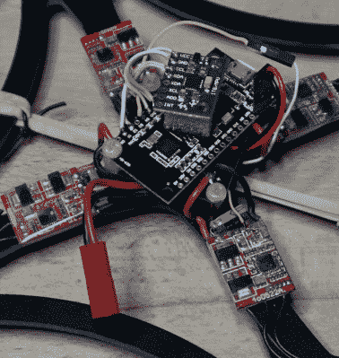

# 用 ESP8266 控制一群遥控车辆

> 原文：<https://hackaday.com/2018/03/17/control-a-swarm-of-rc-vehicles-with-esp8266/>

在 RCgroups，用户[Cesco]分享了一个非常有趣的项目，该项目使用了一直很受欢迎的 [ESP8266 作为 RC 车辆的发射器*和*接收器](https://www.rcgroups.com/forums/showthread.php?3044440-Esp8266-RC-with-ESPNOW)。有趣的是，这段代码利用了 ESP-Now 协议，该协议允许设备创建一个网状网络，而没有成熟 WiFi 的开销。根据 Espressif 文档，这种模式类似于无线鼠标和键盘中使用的低功耗 2.4GHz 通信，专为持久的点对点连接而设计。

 将 ESP8266 转换为发射器或接收器就像注释掉源代码中的一行并刷新固件一样简单。一个发送器(在源代码中称为服务器)可以同时命令八个接收 ESP8266s。【Cesco】具体用远程飞机编队飞行的例子；只有在需要手动着陆的时候才会从网状网络中出来。

[Cesco]已经用陆地和空中交通工具做了实验。他展示了一辆看起来非常笨重的履带式漫游车，以及一架快速组装的四轴飞行器。他警告说，四轴飞行器像“湿海绵”一样飞行，但它确实是通过 ESP 处理所有的空中通信来飞行的。

明确地说，你仍然需要一个传统的 PPM 兼容的 RC 接收机和发射机对来使用他的代码。esp 只是处理空中通信。例如，它们不直接负责接收用户输入或运行速度控制。

这不是我们第一次看到 [ESP8266 坐在四轴飞行器的副驾驶座位上](https://hackaday.com/2017/12/23/control-a-quadcopter-over-websockets/)，但是当我们考虑到[拥有我们自己的飞行机器人群](https://hackaday.com/2013/03/30/treasure-trove-of-swarm-robotics-research/)的可能性时，我们感到的狂热兴奋给这个特别的项目带来了有趣的转折。