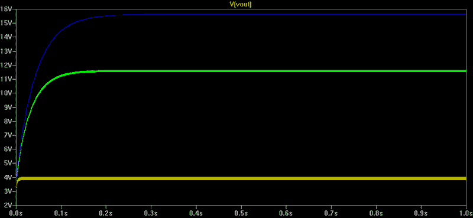

# 电路 Dickson 电荷泵

> 原文：<https://hackaday.com/2018/04/06/circuit-vr-the-dickson-charge-pump/>

曾几何时，采用低 DC 电压——比如一节电池——并将其转换为更高的电压是痛苦的。然而，现在便宜且易于使用的 DC 到 DC 转换器已经很容易买到了。然而，对于一些小任务来说，这些似乎有些过头了。例如，考虑这样一种情况，您需要为不消耗太多电流的 MOSFET 栅极提供更高的电压。也许你需要更高的电压来触发微控制器的编程模式，而不是别的。电流消耗是最小的，而一个完全成熟的直流-DC 转换器是多余的。对于这样的情况，很容易使用一些电压倍增方案。有很多，但在这篇文章中，我将带你进入 Dickson 电荷泵。这是 **Circuit VR** ,因为我们不仅要讨论电路，还要看一个 LT Spice 仿真，你可以自己试试。

迪克森是有趣的，因为它不需要任何交流转换或变压器。相反，它使用二极管或其他开关元件在电容器之间分级转移电荷。理论上，每一级都将通过电源电压有效提高电压。然而，正如我们将要看到的，现实并不那么美好。

## 完美世界

这是电荷泵的 LTSpice 原理图。你可以从 [GitHub](https://github.com/wd5gnr/circuitvr) 下载文件。

`Vin`只是电源电压:本例中为 3.3 V。`Vphase0`和`Vphase1`是两个彼此相反的方波。也就是说，当`Vphase0`为高电平时，`Vphase1`为低电平，反之亦然。这些可能是微控制器的输出，尽管它也可能是 555 和一个反相器或任何其他你能想到的两相时钟源。

想想手术的第一瞬间。`C1`为空，`Vphase0`为低。`C1`将通过`D1`充电，直到达到电压`Vin`。

然后`Vphase0`变高。电容器储存能量，所以它不能像电阻器那样电压为零。事实上，当我们说`C1`将对`Vin`充电时，我们真正的意思是电容器两端的电压将对`Vin`充电。并且由于`Vphase0`现在处于`Vin`，所以`C1`两端的电压仍然是`Vin`，所以来自 D1、`C1`和`D2`的接点的电压将是`Vin`的两倍:来自`Vphase0`的`Vin`和来自`C1`的`Vin`。

该过程在下一阶段重复。`C2`充电到 2 x `Vin`而`Vphase1`为低，然后当`Vphase1`变高时跳到 3 x `Vin`。理论上，您可以添加任意多的级，以获得输入电压的整数倍。最后一个电容`C5`不增加任何电压，因为它接地，但平滑输出。

## 现状核实

当然，现实有些不同。二极管会降低一些电压。我用肖特基二极管来减小这种影响，但还是。输出方波不会一直到达供电轨。当电容器储存能量而不是充电时，你汲取的电流越多，你就会降低越多，这也会影响输出。

那么情况有多糟呢？Spice 中尉很容易回答这个问题。如果你以前没有用过，LT Spice 是 Spice 的一个很好的改编，Spice 是知名的电路仿真软件。LT Spice 来自 Linear Technologies，但是他们免费提供给社区。可以从[线性网站](http://www.linear.com/designtools/software/)下载。如果你需要[一个快速教程](https://hackaday.com/2016/02/26/adding-spice-to-your-workbench/)，我们之前有一个你可以看看，或者看看这篇文章末尾的视频。虽然 LT Spice 在 Windows 下运行，但它在 WINE 上运行得很好，所以你也可以在你的其他计算机上运行它。

## 香料戏法

画一个原理图并模拟它真的很容易。然而，我用了一些小技巧让事情变得简单。`C1`到`C4`都有相同的值，如果你想试验这些值，输入每个值是非常痛苦的。三个电压源也是一样的。虽然只有一个代表负载电阻的`RL`，但它也是测试期间您可能想要改变的一个参数。

为了使事情变得简单，我没有为这些项目指定具体的值。对于`C1`到`C4`，我把`{C}`赋值为值。这意味着我必须在其他地方指定一个名为`C`的参数。我还使用了参数`{RL}`和`{V}`。如果你靠近原理图的左上方，你会看到一个设置三个参数的`.params`命令。这使得改变事情来尝试不同的场景变得非常容易。

一旦有了一个参数，你可以做的另一件好事就是把它扫描成不同的值。这就是最顶层的`.STEP`指令所做的。它将`C`变为三个不同的值。您也可以省略`LIST`关键字，只提供开始、停止和增量。例如，`.STEP C 0.1u 1u 0.2u`将导致模拟使用 0.1、0.3、0.5、0.7 和 0.9 作为步长值。当然，如果你只是想要一个简单的模拟，你可以去掉`.STEP`线。

## 结果

从下面的结果可以看出，较大的电容(`C1`–`C4`)在一定程度上有所帮助。当然，`C5`越大，`RL`越高，充电到最终值的时间就越长。绿色走线是 10 μF 走线。蓝色和红色走线分别对应 1 μF 和 0.1 μF。

您会注意到两个时钟信号的周期都是 1 ms 或 1 kHz。每个都只持续一半的时间(500 μs ),但`Vphase1`在开始时有 500 μS 的延迟。这是他们保持不同相的原因。如果您想试验频率、占空比或上升和下降时间，可以打开这两个信号源并进行更改。一般来说，频率越高，结果越好，电容越小，至少在某种程度上是这样。寄生电容始终是一个问题，随着频率的增加，这个问题变得更加严重。

您可能还想尝试不同的`C5`值，或者尝试用普通二极管替换二极管，看看会花多少钱。当然，改变负载电阻以汲取更多电流会改变事情。例如，看看下面使用`.step param rl 1k 10k 100k`的模拟。

在 1kω时，几乎没有任何增加。负载消耗的电流接近 4 mA。使用 10kω，您可以获得 3 到 4 倍的乘法。100kω时，增益超过 4 倍。尝试将`C`改为 10 μF，你会看到更好的效果。或者尝试 47 μF，您可能还希望将`C5`提高到 1kω，以获得更好的滤波效果。你可以看到下面的迹线有多厚，这是未经滤波的纹波。

不过，最好的办法可能是简单地探测电路的不同部分，直观地了解每一级如何建立在前一级的基础上。别忘了，你还可以测量电流，这通常可以帮助你了解电路的工作情况。然而，当使用`.STEP`命令时，如果你只显示一个值，你只能得到颜色很好的轨迹。如果添加多条迹线，每一族迹线将获得单一颜色。

## 价值

这才是模拟的真正价值。玩几分钟这个电路，你就会感觉到是什么参数改变了输出。非常有价值。当然，您可以对电路进行试验，这可能是您应该做的下一件事，但当您想要调整许多参数时，它远不如使用 LTSpice 等仿真器那样节省时间和成本。

完美吗？不，试验板版本可能会有一点不同，因为我用的是理想电容。如果右键单击每个电容，选择一个实际电容的模型，您可能会注意到一些细微的差异，因为该模型考虑了寄生电阻和其他影响。

还有其他方法可以用来修改 Dickson 电荷泵。例如，在 IC 上，二极管可能是 MOSFETs。也有试图克服二极管开关阈值或校正其他不良效应的变化。

像这样的模拟最有趣的事情之一是你可以很容易地探索任何地方，并快速尝试新的想法。也许你会提出一个新的乘法器架构，他们会以你的名字命名。

 [https://www.youtube.com/embed/6QzTZDm0guM?version=3&rel=1&showsearch=0&showinfo=1&iv_load_policy=1&fs=1&hl=en-US&autohide=2&start=7&wmode=transparent](https://www.youtube.com/embed/6QzTZDm0guM?version=3&rel=1&showsearch=0&showinfo=1&iv_load_policy=1&fs=1&hl=en-US&autohide=2&start=7&wmode=transparent)

