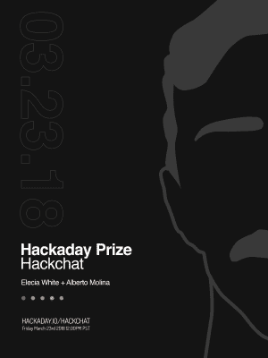

# 周五黑客聊天:所有关于黑客日奖

> 原文：<https://hackaday.com/2018/03/21/friday-hack-chat-all-about-the-hackaday-prize/>

在本周的黑客聊天中，我们将讨论黑客日大奖。我们本周的聊天嘉宾是阿尔贝托·莫利纳和艾丽西娅·怀特。

Elecia White 是 2015 年和 2016 年 Hackaday 奖的评委，她将从评判的角度讨论什么是优秀的参赛作品。艾丽西娅是 [Logical Elegance，Inc.](http://logicalelegance.com/) 的嵌入式软件工程师，《T2》制作嵌入式系统的作者，以及 [Embedded.fm 播客](http://embedded.fm/)的主持人。

阿尔贝托·莫利纳(Alberto Molina)凭借 [Dtto](https://hackaday.io/project/9976-dtto-explorer-modular-robot) 获得了 2016 年 Hackaday 奖的大奖，这是一款开源、自我重新配置的救援机器人，阿尔贝托正在继续开发。Alberto 是一名电子工程师，他想设计下一代机器人，他将分享他的见解，为您的项目制作一个精彩的参赛作品。

 [黑客大奖](https://hackaday.io/prize)是有史以来最大的硬件竞赛。这是开放硬件的奥斯卡奖(并且将一直如此，直到我们得到停止)。Hackaday 奖是一项竞赛，成千上万的硬件黑客、制造商和艺术家竞相打造更美好的未来。

2018 年是 Hackaday 奖的第五个年头，今年的主题是*建立希望*。我们鼓励每个人运用你的想法和创造力，创造出有意义的东西。这样做，你就有可能赢得 50，000 美元的大奖。总的来说，我们将拿出 200，000 美元的现金奖励来构建硬件，这是其他硬件竞争对手无法比拟的。

与所有黑客聊天一样，Hackaday.io 的技术社区负责人 Stephen Tranovich 也将参加此次黑客聊天。Steven 今年一直在努力为该奖项提供后勤支持，并将回答所有关于参加 2018 年 Hackaday 奖的问题。

在这次黑客聊天中，我们将讨论如何评判该奖项，2018 年黑客日奖的新挑战，黑客日奖获奖者已经取得的成就，当然，还有你们的问题。我们知道大家对 Hackaday 奖很感兴趣，我们希望大家能问一下自己的想法。如果您有问题，[只需将其作为评论添加到 Hack Chat 活动页面](https://hackaday.io/event/90455-hackaday-prize-hack-chat)，我们将为您解答。

我们的 Hack Chat 是在 [Hackaday.io Hack Chat 群发消息](https://hackaday.io/project/5373/token/7879571d-62c3-46a8-af36-2b6f265590f2?redirect=messages)上的实时社区活动。本周它将在通常的时间，太平洋时间，3 月 23 日，星期五中午，发生。想知道在你们这一带什么时间发生吗？[有倒计时器！](https://www.timeanddate.com/countdown/generic?iso=20180323T12&p0=224&msg=Hackaday+Prize+Hack+chat&font=cursive)

点击右边的语音气泡，你会被直接带到 Hackaday.io 上的黑客聊天群。

你不必等到星期五；随时加入，你可以看到社区在谈论什么。

The [HackadayPrize2018](https://hackaday.io/prize) is Sponsored by:     