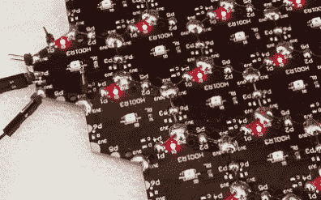
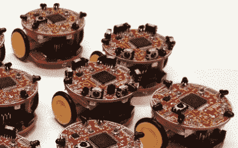
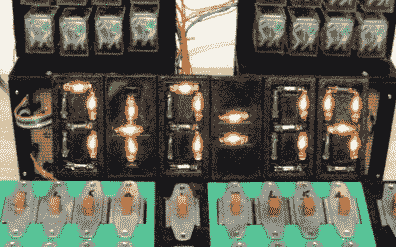
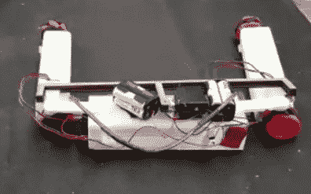

# 今年我们要取得更大的成就

> 原文：<https://hackaday.com/2018/03/23/were-making-it-rain-achievements-this-year/>

我们刚刚公布了一系列硬件项目的第一轮成果，还会有更多的成果。

你可能在上周的大张旗鼓中错过了它，所以今天我们来仔细看看。成就是 Hackaday 奖的最新版本，我们对此感到非常兴奋！随着我们看到的项目中如此多的创造力，这些成就认识到了一系列不同的方面，从严肃到轻松，甚至是彻头彻尾的荒谬。该奖项的每个挑战只能有 20 名决赛选手，但可以有几十个项目解锁每个成就。

今天我们来看看其中的三项成就:沃尔创、泡菜里克和非凡半机械人联盟。你也可以通过[当前的成就列表](https://hackaday.io/prize#section-achievements)来了解它们都是些什么。

##  伏特龙成就

  Modular PCBs  Swarm Robotics

解开 Voltron 成就的五个项目并不是为了保卫宇宙(但如果那是你正在做的，酷！).我们所寻求的是许多事物结合在一起，变得比整体更伟大。两个很好的例子是 Hexabitz 项目，这是一个边缘焊接的模块化 PCB 系统，以及一个设想[群机器人用于建造、检查和维护的项目](https://hackaday.io/project/87077-infrastructure-and-construction-robot-swarm)。

##  泡菜瑞克成就

  Neon 7-Segment Displays  Car Robot or Snake Robot?

这需要解释吗？如果你的大脑跳过一个周期，你的嘴唇发出一个结结巴巴的“什么？!"然后你已经解锁了[泡菜里克成就](https://hackaday.io/list/96853-2018-prize-pickle-rick-achievement)。这些是源于“因为我能行”心态的与众不同的黑客，我们喜欢他们。这个小组的前两个项目是[一个霓虹灯七段显示器](https://hackaday.io/project/85369-make-your-own-7-segment-displayswith-neon-light)(配有笨重的拨动开关和机械继电器)和一个[机器蛇，它把](https://hackaday.io/project/90288-project-shapeshift)变成了一辆机器人汽车。什么？！

##  非凡电子人联盟成就

一个人去很危险。好吧，也许不是，但作为一个紧密团结的团队，你可以做得更多！我们正在寻找团队参赛作品，这就是你如何解锁[非凡电子人成就联盟](https://hackaday.io/list/96902-2018-prize-the-league-of-extraordinary-cyborgs)。

### 解锁我们遗忘的成就

[这些成就](https://hackaday.io/prize#section-achievements)很容易解锁。你的项目需要是一个 Hackaday 奖参赛作品，并符合成就标准。他们没有现金奖励(也不影响你中奖的机会)。成就是对热衷于他们正在建造的硬件的黑客的礼帽。

我们将挖掘参赛作品，并在过程中给予奖励，当然，我们也希望得到您的帮助。当你看到完美的项目时，在那一页留下你的评论和支持。您还可以向 Hackaday.io 的技术社区负责人 Stephen Tranovich 发送 Hackaday.io 消息，请求解锁成就。

当前显示的[列表](https://hackaday.io/prize#section-achievements)没有包括所有的成绩。其中一些是秘密的(我们会在开始颁奖时告诉你)。我们将在此过程中添加更多。如果你突然想到一个有趣的成就，请在下面的评论中告诉我们，我们可能会添加它！

The [HackadayPrize2018](https://hackaday.io/prize) is Sponsored by:     