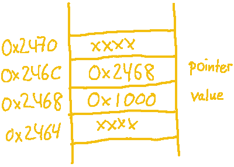

# C 语言中指针的基础和缺陷

> 原文：<https://hackaday.com/2018/04/04/the-basics-and-pitfalls-of-pointers-in-c/>

指针——你要么喜欢它们，要么还没有完全理解它们。但是，在你现在进入注释部分之前，指针确实是一个两极分化的主题，它既是 C 的最大优势，也是问题的主要来源。权力越大，责任越大。互联网和图书馆里有很多关于指针的教程和书籍，你可以随意挑选其中的任何一本，这样你就可以开始学习了。然而，尽管指针的基本原理在理论上相当简单，但要完全理解它们的用途并发掘它们的真正潜力却是一项挑战。

因此，如果你一直对指针有点模糊，请继续阅读一些关于指针在哪里以及如何使用的真实场景。第一部分从常规指针、它们的基础知识和常见陷阱开始，以及一些通用和微控制器特定的示例。

## 基础知识

存储可变数据的计算机 RAM 有点像幼儿园的小房间，只是每个盒子都有地址而不是名牌。当您在 C 中使用变量时，编译器会将内存中的特定位置(通过地址)与您给它的变量名相关联。指针让你进入这种关联的中间——让你访问内存地址本身，而不是存储在那里的内容。

为了确保我们在同一页上，我们首先回顾一下指针语法，如何分配和使用它们，以及如何不使用它们。

```

// regular int variable with initial value
int value = 0x1000;
// int pointer variable, pointing to the location of value
int *pointer = &value;

printf("value:    0x%x at address %p\n", value, &value);
printf("pointer:    %p at address %p\n", pointer, &pointer);
printf("*pointer: 0x%x at address %p\n", *pointer, pointer);

```

为简单起见，我们假设一些虚构的地址，我们的第一个示例将给出以下输出:

```

value:    0x1000 at address 0x2468
pointer:  0x2468 at address 0x246c
*pointer: 0x1000 at address 0x2468

```

 `&`获取它所前置的变量的地址，而`*`“解引用”一个指针——你可以认为它请求指针所指向的地址的值。我们可以看到，`value`驻留在地址`0x2468`，而`pointer`驻留在地址`0x246c`，其中`pointer`的内容是`value`的地址。那就是旋风之旅。

在不知道数字是什么类型的情况下，将数字存储在内存中没有多大用处——数字有多少字节长，是否有符号，等等。仅基于这些值，我们无法判断哪个代表内存地址、整数或任何其他数据，它们都只是数字，这取决于我们如何使用和引用它们。这就是为什么指针本身有自己的类型——指向存储在地址中的类型数据的指针类型。对于作为常规变量的`pointer`和作为对另一个内存位置的引用的`*pointer`来说尤其如此。当我们给它们中的任何一个赋予新的值时，这种差异变得更加明显。

```

// simple variable assignment
value    = 0x2000;
// regular pointer dereference and assignment, same result as the statement before
*pointer = 0x2000;
// assigning to the pointer itself without dereferencing
// technically okay, but compiler warns about assigning a regular integer to a pointer variable
pointer  = 0x2000;
// explicit cast keeps the compiler happy, but..
pointer  = (int *) 0x2000;
// ..dereferencing is where things get tricky now
*pointer = 0x2000;

```

在一个带有[内存管理单元](https://en.wikipedia.org/wiki/Memory_management_unit)的系统上，比如你的普通台式电脑，你肯定会在最后一行出现[分段错误](https://en.wikipedia.org/wiki/Segmentation_fault)。发生了什么事？在第三行，我们在指针中写了一个新地址(`0x2000`)。编译器抱怨是因为我们把一个整数写入了一个变量，这个变量应该是一个整数的指针，我们应该监听的。

相反，我们只是通过显式地告诉编译器将`0x2000`存储为指向第四行中整数的指针，从而摆脱了错误警告。当我们试图将一个值写入与这个指针相关联的地址时，它越界了。谁知道什么住在内存位置`0x2000`？在一台大型计算机上，MMU 阻止你写程序领域之外的地址，否则会有致命的后果。自然，这在没有这种保护的系统上变得更有趣，比如绝大多数 8 位微控制器。在这种情况下，只要您知道自己在做什么，将硬编码的内存地址分配给指针就非常好。另一方面，如果你以前为微控制器编程，你很可能已经使用了硬编码的指针位置，甚至没有注意到。

## 微控制器寄存器

让我们来看看这段简单的代码，它可以用来打开连接到 AVR ATmega328 的 LED:

```

// file led.c
#include <avr/io.h>

DDRB  = (1 << DDB1); // set up PB1 as output
PORTB = (1 <<  PB1); // set output on PB1 high

```

`DDRB`和`PORTB`是 ATmega 的两个 GPIO 寄存器，由`avr-gcc`定义为预处理宏。如果我们看一下预处理器的输出，我们可以看到这两个宏背后的内容:

```

$ avr-gcc -E -mmcu=atmega328 led.c
...
(*(volatile uint8_t *)((0x04) + 0x20)) = (1 << 1);
(*(volatile uint8_t *)((0x05) + 0x20)) = (1 << 1);
$

```

是的，您的微控制器寄存器实际上是指向硬编码内存地址的指针。如果你看一下 ATmega 数据表中的*寄存器摘要*部分，你会发现这两个寄存器确实分别映射到地址`0x24`和`0x25`。作为指针，我们可以像对待其他指针一样对待它们。

### 将寄存器传递给函数

对于指针来说，它指向的是哪种内存并不重要。无论是引用堆栈上的局部变量，还是映射到 RAM 中的寄存器，最终都只是地址后面的数据。按照这种逻辑，如果我们能在 C 中做类似于`some_function(&regular_variable)`的事情，也就是将一个指针作为参数传递给一个函数，我们应该能对寄存器做同样的事情。

我们都喜欢 LED，切换 LED 总是一个很好的例子，但让我们假设我们不能承诺一个特定的 I/O 引脚来控制我们的 LED，我们宁愿保留我们的选项，以便稍后轻松地改变它，甚至可能在运行时。

```

// a simple struct that stores a GPIO port and pin number
struct gpio {
    volatile uint8_t *port;
    uint8_t pin;
};

// a variable for our LED GPIO pin
struct gpio led;

// assign the given port and pin to our led struct
void led_setup(volatile uint8_t *port, uint8_t pin) {
    led.port = port;
    led.pin  = pin;
}

// turn the LED on by setting its GPIO pin to 1
void led_on(void) {
    //  PORTB |= (1 << PB1)
    *led.port |= (1 << led.pin);
}

// turn the LED off by clearing its GPIO pin
void led_off(void) {
    //  PORTB &= ~(1 << PB1)
    *led.port &= ~(1 << led.pin);
}

int main(void) {
    DDRB = (1 << DDB1); // set PB1 as output
    led_setup(&PORTB, PB1); // note the ampersand &
    led_on();
}

```

现在，我们不是直接访问 GPIO 寄存器，而是将对该寄存器的引用存储在一个全局变量中，稍后取消对该变量的引用，这将允许我们再次访问实际的寄存器。执行`led_on()`时，该函数不再关心 LED 实际连接到哪个 I/O 引脚。不可否认，这个特殊的例子并不能证明增加的复杂性是合理的，我们可以用预处理宏实现或多或少的相同效果。然而，假设我们想要控制任意连接的多个 led，或者有一个通用的处理程序来轮询多个输入，我们现在可以将引用存储在一个数组中并遍历它。

如果我们再看一下预处理器的输出，你可能会注意到现在有一些多余的指针操作在进行，因为`&PORTB`被转换成了`&(*(volatile uint8_t *)((0x05) + 0x20))`，这与`(volatile uint8_t *)((0x05) + 0x20)`本质上是一样的。另一方面，`&*&*&*&(*(volatile uint8_t *)((0x05) + 0x20))`也是如此，它们都将产生完全相同的二进制文件。换句话说，没什么区别，但是`&PORTB`似乎比`(volatile uint8_t *) 0x25`要清晰得多。

现在你可能已经注意到了关键字`volatile`。如果你想更多地了解它，[我们在过去的](https://hackaday.com/2015/08/18/embed-with-elliot-the-volatile-keyword/)中专门写了一整篇文章。

## 指针需要一个家

成功使用指针并避免分段错误的最重要的要求是，它们在内存中总是有足够大的空间可以实际访问。同样，在没有 MMU 的系统上，内存中的任何位置从技术上来说都是这样一个位置，但是内存保护要严格得多，我们还需要避免不指向任何特定位置的指针。

```

// uninitialized pointer variable
int *pointer;
// dereferencing might access any arbitrary location in memory
*pointer = 123;

```

根据其他一些因素，这不一定会导致分段错误，但这并不意味着它没有问题。为了让您的生活更轻松，请始终确保指针具有它所指向的实际位置。然而，一旦一个指针有了一个有效的相关内存位置，我们就可以对这个空间做任何我们想做的事情。

```

// have one type of struct
struct something foo = { ... };
// make a different type of struct believe the first one is one of them
struct something_else bar = *((struct something_else *) &foo);

```

这是一个完全有效的类型转换，只要访问`bar`的成员不会超过`foo`的大小，我们就安全了。这样的类型转换是否有意义当然是另一回事，并且取决于上下文，但是指针给了我们随意转换的自由。使用这种自由的另一种方式是将顺序数据组装到一个公共缓冲区中。

### 用指针组装数据

假设我们需要将这两个`struct`连接成一个缓冲区。我们可以在其中使用一个`char[]`缓冲区和`memcpy()`两个`struct`，但是这样我们就使用了两倍的内存。相反，我们可以简单地让缓冲区相信它实际上是两种类型的`struct`:

```

char buf[BIG_ENOUG_SIZE];
struct something *foo;
struct something_else *bar;

// point foo to the beginning of buf
foo = (struct something *) buf;
// point bar to the location after foo inside buf
bar = (struct something_else *) (buf + sizeof(struct something));

```

再次强调，指针仅仅是内存地址。编译器会指导我们避免最明显的错误，但最终，我们如何解释这些地址中的内容取决于我们自己。如果我们根本不想解释这些数据，我们可以使用 C 的通用指针类型`void *`。

### 空指针

在某些情况下，我们只对内存地址本身感兴趣，我们可能只想传递那个地址，例如传递给一个不关心数据本身如何排列的函数。如果我们使用`void`指针，我们可以简单地对它进行赋值，而不需要任何显式的类型转换，这可以帮助我们保持代码更加整洁。

```

// actual storage for the struct
struct something s;
// assign it to void pointer, no cast needed here
void *foo = &s;
// assign it back to a specific pointer, no cast needed here either
struct something *bar = foo;

```

`void`指针通常出现在动态内存分配函数中，例如作为`malloc()`的返回类型和作为`free()`的参数类型，以及任何其他通用内存访问函数，如`memcpy()`或`fwrite()`。但是请记住，因为它删除了数据本身的细节，所以解引用一个`void`指针将导致编译器错误，除非我们首先转换为一个显式指针类型。

```

// regular struct member assignment
s.some_member = value;
// dereferencing void pointer, will result in compiler error
foo->some_member = value;
// cast before dereferencing void pointer, this is okay
((struct something *) foo)->some_member = value;
// dereferencing explicit pointer type, no problems here
bar->some_member = value;

```

当取消引用一个`struct`(或`union`)来访问它的成员时，注意箭头操作符`->`。这是 C 提供的快捷方式，与`(*variable).member`相同。尽管`(*variable).member`和`*variable.member`不一样，但要小心。第一个由括号强制执行，在访问`member`之前解引用指针，而第二个在`struct`内解引用指针类型`member`。这自然是一个容易出错的地方，箭头操作符帮助我们避免了这一点。

## 待续

我们的第一部分到此结束，我们仅仅触及了指针的表面可能性，这只是显示了看似简单的概念*“这只是一个内存地址”*实际上可以有多复杂。下一次，我们继续讨论指针算法和一些更复杂的指针排列。