# 3D 打印的尖端技术在上周末的中西部 RepRap 节上展示

> 原文：<https://hackaday.com/2018/03/26/cutting-edge-of-3d-printing-revealed-at-last-weekends-mrrf/>

过去三天是 2018 年中西部 RepRap 节。每年，3D 打印世界的明星们都会来到印第安纳州的戈申，参加世界上有史以来最大的 3D 打印机和打印爱好者聚会。这不像任何其他的 3D 打印大会——这里的每个人都需要花时间去歌珊，这意味着只有那些想在这里的人才能成功。

上周末，我们报道了一些来自 MRRF 的惊人的黑客和打印机构建。“片上喙骨”[已经成为 3D 打印机控制器](https://hackaday.com/2018/03/25/turning-the-beaglebone-on-a-chip-into-a-3d-printer-controller/)的完整解决方案。这是一个伟大的发展，它利用了 BeagleBone 中很少使用的可编程实时单元，并将成为您一直想要构建的定制打印机的优秀控制器。E3D 宣布[他们正在研发一种自动换刀打印机](https://hackaday.com/2018/03/24/e3d-introduces-tool-changing-3d-printer/)。这是他们现已废弃的 BigBox 打印机的一个小衍生产品，但很可能是我们见过的多材料细丝打印机的最佳答案。来自社区的一些兴趣，如果一切顺利，这台打印机*可能*成为一个套件，或者类似的东西。灯丝拼接机器人也在今年的 MRRF 上亮相，其成果令人印象深刻。现在，您可以使用现有的打印机创建多色打印。贵吗？是的，但是它看起来很好。

这并不是在 MRRF 能找到的全部。有数百家印刷商参加了这次活动，据最新统计，有超过 1300 名与会者。对于每年在印第安纳州某个偏僻的地方举行的 3D 打印机大会来说，这真是令人惊讶。今年来自 MRRF 的最酷的景象和声音是什么？查看下面的最佳列表。

## 闪光打印机

MRRF 有一台 30 英尺高的德尔塔打印机。MRRF 拥有最好的 3D 打印公司的最新产品和项目。有一个 R2D2。然而，这场展览的明星是闪光打印机。

[斯科特·齐夫]通过某种方式得到了一台 Z 公司的 Z402 打印机。这是 2000 年代早期的一台古老的 3D 打印机，它使用一种类似喷墨的设备来分配粘合剂，将粉末粘合在一起。[Scott]不想买粉末和粘合剂，所以他简单地在车厢上安装了一个激光二极管，并试图熔化一些粉末。糖不太管用，但他确实在一个不太可能的地方取得了成功:闪闪发光。是的，闪闪发光。杀死海豚的东西。

       [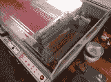](https://i0.wp.com/hackaday.com/wp-content/uploads/2018/03/img_20180324_123142.jpg?ssl=1) 

[斯科特]发现一个家伙卖几桶闪光粉，大约一美元一磅。令人惊讶的是，这种亮片主要是 PLA PET，还含有一点铝和一些聚酯。它用二极管激光熔化得很好，尽管生产出来的零件如果移动一下就会碎成碎片。[Scott]把他最好的印刷品包在环氧树脂里，虽然它不能创造功能性的印刷品，但它是一台用闪光打印的打印机。

该版本的详细记录将最终记录在[Scott]的网站上[。](http://scottziv.com/)

## 颗粒挤出机

如果你正在建造一台大型打印机，你将需要大量的塑料。如果你的打印机适合放在桌子上，标准的 1kg 卷轴是很好的，但是对于那些大批量生产的打印机来说，灯丝就变得太贵了。更好的方法是颗粒，塑料世界的原材料。然而，这样做，你需要一种挤压和熔化这些颗粒的方法。

 [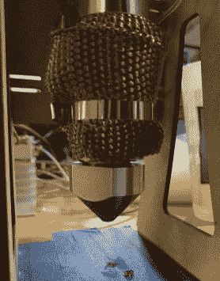](https://i0.wp.com/hackaday.com/wp-content/uploads/2018/03/extruder2.jpg?ssl=1)  [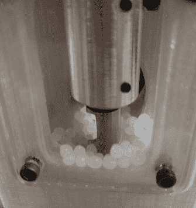](https://i0.wp.com/hackaday.com/wp-content/uploads/2018/03/extruder1.jpg?ssl=1)  [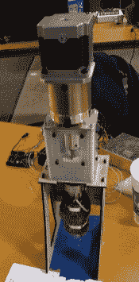](https://i0.wp.com/hackaday.com/wp-content/uploads/2018/03/extruder3.jpg?ssl=1) 

[haqnmaq]为大幅面打印机创造了一种颗粒挤出机，能够用非常便宜的塑料打印非常大的物体。挤出颗粒的关键部件是螺旋钻；商业和工业注射成型机使用非常聪明和非常昂贵的螺旋钻，但[haq]使用的是标准的现成的 1/2”木螺旋钻。这种钻头由 NEMA 23 电机驱动，配有 47:1 的变速箱，热量来自两个 300W 的加热带。

这个项目在 Hackaday.io 上，[你可以在这里查看](https://hackaday.io/project/100099-pellet-extruder)。[haqnmaq]正在用它挤压塑料，现在唯一要做的就是把它安装到打印机上。

## 普鲁莎的最新胜利

不久前，Prusa 推出了 Prusa i3 的多挤压升级。这是可行的，但也有不好的一面——你想要多重挤压的每根细丝都需要一个单独的步进电机。如果你想要四种颜色的灯丝，那就是四个马达。

有更好的做事方式。几周前就宣布了，但是在 MRRF 我们第一次看到了*新的*多材料升级。这不是一个用于不同细丝的步进器，而是一个奇怪的小机器，它取出五根细丝，选择一根，并将其推入 x-carriage 上的挤出机马达中。

 [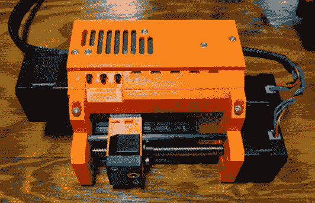](https://i0.wp.com/hackaday.com/wp-content/uploads/2018/03/extruderfrontorange.jpg?ssl=1)  [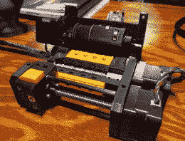](https://i0.wp.com/hackaday.com/wp-content/uploads/2018/03/extruderopen.jpg?ssl=1)  [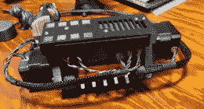](https://i0.wp.com/hackaday.com/wp-content/uploads/2018/03/extruderback.jpg?ssl=1)  [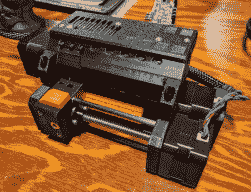](https://i0.wp.com/hackaday.com/wp-content/uploads/2018/03/extruderfront.jpg?ssl=1)  [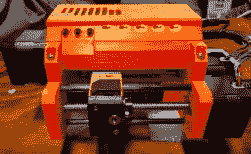](https://i0.wp.com/hackaday.com/wp-content/uploads/2018/03/extruderfronton.jpg?ssl=1)  [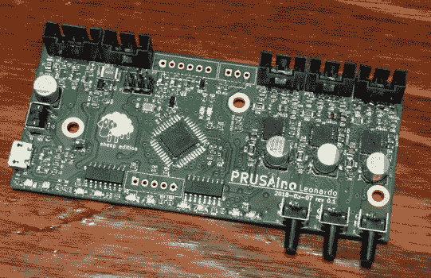](https://i0.wp.com/hackaday.com/wp-content/uploads/2018/03/prusaino.jpg?ssl=1) 

这是这台新挤压机的情况。“细丝选择盒”——或者我们叫它什么——由后面的五个孔和前面的一个孔组成，前者接受不同的细丝，后者接受 PTFE 管，直接进入 x 托架上的主挤出机。在前部和后部之间，长丝通过一系列辊喂入，这些辊选择性地将长丝喂入前部。当打印机要更换灯丝时，前面的可移动托架从一个输出移动到另一个输出。长丝在机器内自动切片。把它想象成我们这个周末看到的细丝切割机器人的打印机安装版本[，只是便宜得多，也聪明得多。](https://hackaday.com/2018/03/24/hands-on-with-filament-splicing-robots/)

整个装置由一个带有三个电机驱动器的小板子驱动。这是普鲁赛诺，当它自己出售的时候，会成为一个很棒的数控控制器。

这是多材料印刷领域的一大进步。它还没有发货，但我们已经等不及要拿到它了。

## 无限构建卷打印机和 Hurdy Gurdies

去年，MRRF 最好的东西，也可能是今年最伟大的 3D 打印创新，[是无限体积打印机](https://hackaday.com/2017/03/25/mrrf-17-the-infinite-build-volume-printer/)。是什么使它成为无限构建卷打印机？它可以打印出大约六英寸宽，六英寸高，几百万英里长的光束。你提供塑料、电力和时间。非常聪明的是，[另一家公司很快发布了他们的一个](https://hackaday.com/2017/05/12/another-printer-with-an-infinite-build-volume/)的计划，Printrbot 的【Brook】联系了【Bill Steele】，MRRF 的那个家伙用原型，[创造了一个看起来稍微专业一点的版本](https://hackaday.com/2017/06/30/printrbot-teases-infinite-build-volume-printer/)。

今年，原型机被运到了 MRRF。它成功了，它打印出了微小的飞机模型。

 [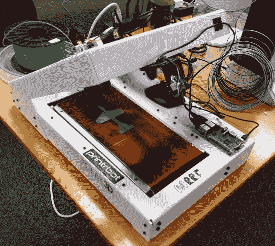](https://i0.wp.com/hackaday.com/wp-content/uploads/2018/03/img_20180324_082652.jpg?ssl=1) We had high hopes for the Printrbelt, but the company folded (no pun intended). [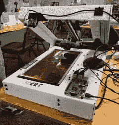](https://i0.wp.com/hackaday.com/wp-content/uploads/2018/03/img_20180324_082706.jpg?ssl=1)   

这台打印机有几个不明显的地方。只有 kapton 床的前几英寸被加热。这有道理；不管怎样，打印机只能在床的前几毫米打印。如果不加热床尾，指纹会立刻消失。床向一边偏移有一些问题，但未来的版本将在滚轴上有一个 1 毫米的顶部，使床保持居中。[Bill]正在使用树莓 Pi 将他的模型排列起来，并让所有东西从打印机上滑下来。不久前他带着这台机器去了奥什科什，一个周末就打印了 1500 架这样的小飞机。这是一台很棒的机器，我们迫不及待地想看到它投入生产。

想要些奇怪又诡异的东西吗？这是一把绞弦琴:

 [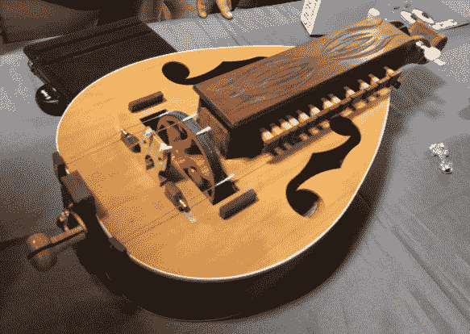](https://i0.wp.com/hackaday.com/wp-content/uploads/2018/03/img_20180325_110355.jpg?ssl=1)  [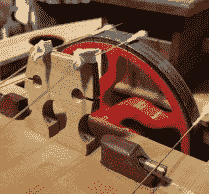](https://i0.wp.com/hackaday.com/wp-content/uploads/2018/03/img_20180325_110401.jpg?ssl=1)  [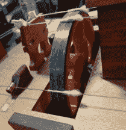](https://i0.wp.com/hackaday.com/wp-content/uploads/2018/03/img_20180325_112115.jpg?ssl=1) 

什么是绞弦琴？弦乐风笛。至少听起来是这样。这种绞弦琴有一对用琴键演奏的琴弦(给你一个特定的音符)，和两根低音琴弦…低音。转动曲柄，曲柄转动轮子，轮子振动琴弦。是的，有点奇怪，听起来像弦乐风笛。

这种绞弦琴是一套木制的工具，轮子通常由枫木制成。在这里，车轮是由红色 PLA 构成的，轮圈上有一条薄薄的碳纤维丝。虽然听起来如何很大程度上取决于听者，但效果还是不错的。

## 高金属含量灯丝

金属丝，或 PLA，有一点微小的金属颗粒嵌入其中，已经存在了一段时间。如果你的照片非常好，你可以把它们打磨得更亮。这些细丝的金属含量徘徊在 60-70%左右。很好，很重，但是这里有一些金属含量为 80%的细丝。是的，是有区别的，这个灯丝值这个价。

 [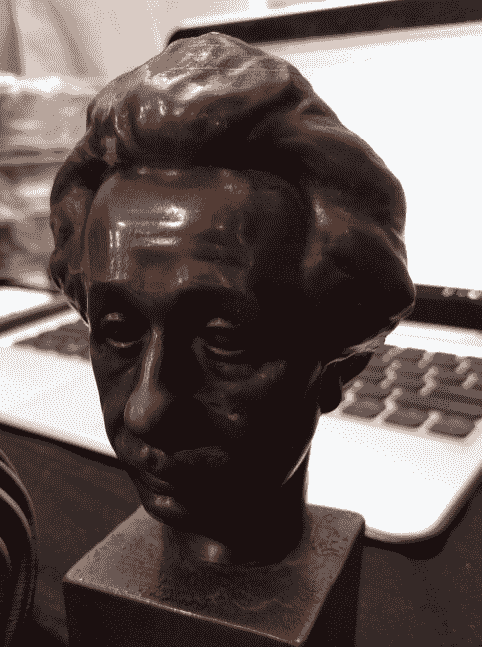](https://i0.wp.com/hackaday.com/wp-content/uploads/2018/03/ein.jpg?ssl=1)    [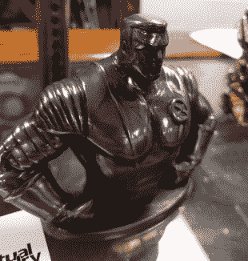](https://i0.wp.com/hackaday.com/wp-content/uploads/2018/03/xman.jpg?ssl=1)    [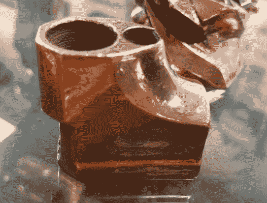](https://i0.wp.com/hackaday.com/wp-content/uploads/2018/03/part.jpg?ssl=1)  [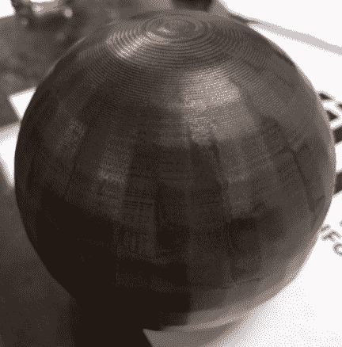](https://i0.wp.com/hackaday.com/wp-content/uploads/2018/03/sphere1.jpg?ssl=1)  [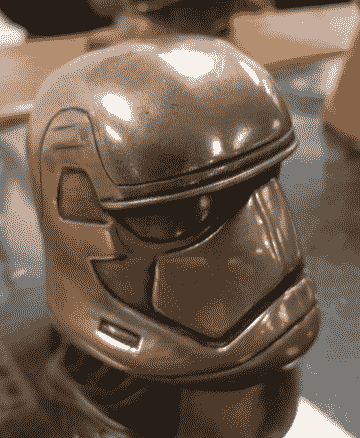](https://i0.wp.com/hackaday.com/wp-content/uploads/2018/03/sto.jpg?ssl=1)  [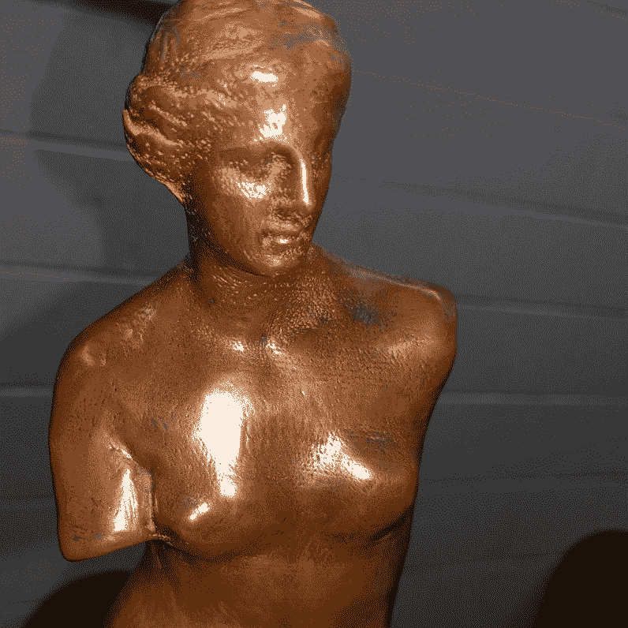](https://i0.wp.com/hackaday.com/wp-content/uploads/2018/03/venus1.jpg?ssl=1) 

这根灯丝来自虚拟代工厂[，图片永远不会公正地反映它。这摸起来像真的金属。就好像这些物品是用青铜铸造的，并镀上了铜或不锈钢。316L 不锈钢丝的规格是密度为 4.05，金属含量为 81%，在 210 摄氏度时打印效果很好。这是我见过的最棒的金属丝，如果你把印在这上面的东西扔进窑里，它会变成一个固体金属物体。](https://www.thevirtualfoundry.com/)

这要花多少钱？一公斤铜丝 100 美元。请记住，它比普通的“ol PLA”要重得多。

## 不能等到明年

MRRF 简直是这个星球上最伟大的 3D 打印大会。在场的每个人都想去。每个人都有很棒的东西可以炫耀。这是展示 3D 打印未来的地方，这一切都发生在印第安纳州的戈申，一个沃尔玛为马和童车牵线搭桥的小镇。不，我们无法解释，但我们明年还会去。