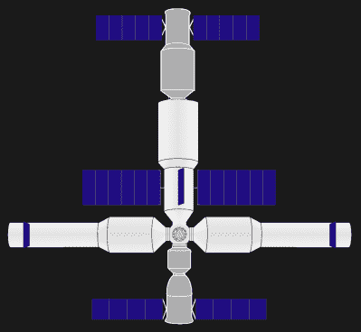
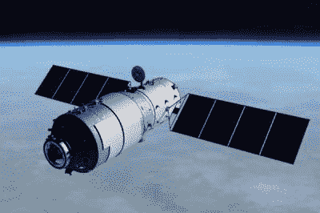
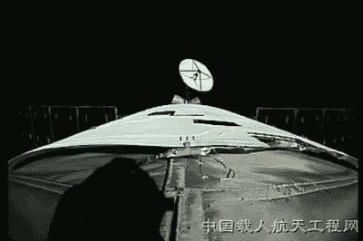
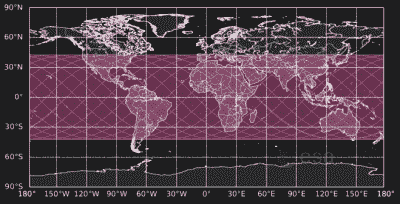
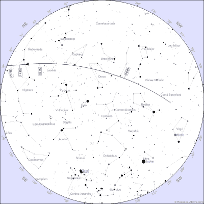

# 下雨了中国空间站:天宫一号

> 原文：<https://hackaday.com/2018/03/29/its-raining-chinese-space-stations-tiangong-1/>

中国首个空间站天宫一号预计将在 4 月 1 日+/- 4 天内不受控制地重返大气层，尽管误差线因来源不同而有所不同。不，这不是所有愚人节玩笑中最盛大的。天宫的意思是“天上的宫殿”，宫殿的这一部分只是一个更大的永久性装置的一个步骤。

但是，在详细说明到时候谁必须躲避，以及如何在夜空中找到它之前，让我们先了解一下中国的空间站计划，特别是天宫一号。

## 中国的空间站计划

Future Chinese permanent space station. Image by [Craigboy](https://commons.wikimedia.org/wiki/User:Craigboy) CC-BY-SA 3.0

目前正在返回地球途中的空间站是中国远程空间站计划的垫脚石。他们有望在 2022 年前建立一个永久的模块化空间站，第一个模块将于 2019 年升空。它的大小和俄罗斯和平号空间站差不多，设计寿命为十年。它的中心将是一个带有多个对接端口和一个 EVA 舱口的服务模块。与之永久相连的将是两个实验舱。载人的神舟飞船和无人的天舟补给船将能够根据需要对接。

然而，在建立永久空间站之前，他们首先要测试各种技术。2011 年 9 月，中国发射了天宫一号空间实验室，随后在 2016 年 9 月发射了天宫二号。这些初步步骤很像俄罗斯的礼炮号空间站项目。

天宫一号和天宫二号都是第一代空间站，因为它们是只有一个对接端口的单件。只有一个对接端口意味着当有船员在场时，它们不能被补给。这是因为唯一的对接端口已经有一艘飞船连接到它作为救生艇。第二代空间站也是一个单件，但有两个对接端口，允许中途补给和更长时间的任务。中国永久空间站将是第三代，定义为由多个模块组成的设计。

## 天宫一号

Tiangong-1 in orbit. Credit: CMSA

8500 千克(18750 磅)的天宫一号既是一个原型空间站，也是一个空间实验室。作为原型，它主要用于测试轨道会合和对接。它由两个圆柱形部分组成，一个带有推进系统和太阳能电池板的资源部分，以及一个可居住部分。

可居住体积为 15 米 ³ (530 英尺 ³ )，包括控制、通信和娱乐系统、锻炼设备和两个睡眠站。第三名宇航员睡在他们抵达的神舟飞船里。烹饪和厕所设施也在神舟号里。

## 任务

Exterior view of the resource module

天宫一号有两年的运行寿命，在此期间有三艘神舟飞船与它对接。第一个是无人驾驶的神舟八号，于 2011 年 11 月成功交会对接。第二次是神舟九号，于 2012 年 6 月 18 日发射，搭载三名宇航员。

神舟九号的首次对接是在自动控制下进行的，但六天后，宇航员进行了另一次测试，通过出坞，然后手动重新对接。这些实验围绕着机组人员的健康和微重力的影响。他们于 6 月 29 日返回地球。

第二年，2013 年 6 月 11 日，神舟十号又搭载了三名宇航员。他们进行了进一步的科学和技术实验，更多的对接测试，并通过更换内部包层和密封环来维护空间站。机组人员还向中国各地的学生进行了视频讲座和微重力演示。任务持续了 15 天。

神舟 10 号任务结束后，空间站进入休眠模式以节省电力，同时继续监测，以便在最终重返之前测试关键材料的寿命。

## 无控制重返

如上所述，天宫一号预计于 4 月 1 日+/- 4 天后再入地球大气层。天宫一号的大部分预计将在高层大气中烧毁，然而，一些碎片可能会到达地球表面。

通常在这种情况下，重返轨道被引导，以便这些碎片落在无人居住的地区。当俄罗斯和平号空间站于 2001 年脱轨时，俄罗斯使用进步号货运飞船确保其在太平洋上空重返。2016 年 3 月，[中国宣布](http://www.cnsa.gov.cn/n6443408/n6465652/n6465653/c6480412/content.html)已经停止为天宫一号提供数据服务，但仍处于持续密切的监控之下。然而，据[欧空局的博客](http://blogs.esa.int/rocketscience/2018/03/26/tiangong-1-frequently-asked-questions-2/)称，有人猜测空间站已经停止运行，地面工作人员不再有能力命令其引擎点火，因此，天宫一号将经历不受控制的重返。

## 碎片会落在哪里

Tiangong-1 re-entry area

任何碎片都会落在北纬 43 度和南纬 43 度之间。但是不用担心，根据 IADC(机构间空间碎片协调委员会)的说法，居住在该地区的任何人被闪电击中的可能性比被任何碎片击中的可能性高 1000 万倍。

## 当你能在你的天空中看到它

Star chart for Kansas City April 1st

在它重新进入之前，可能还有时间在夜空中看到它，有很多网站告诉你何时何地可以看到它。除了它易于使用和完成工作之外，没有特别的偏好，这里有一个到[heavens-above.com](http://www.heavens-above.com/)的链接。在它的列表中，点击“改变你的观察位置”告诉它你在哪里，然后点击“主页”再次获得列表。接下来，点击“天宫一号”。如果你足够幸运，在一个可以看到它的地方，你会看到一个观看时间列表。点击其中一个日期，会出现一个星图，告诉你在那个时间该往哪里看。希望它不会在 3 月 31 日之前再次出现，因为我的下一次观测机会是在那天早上 6:05 到 6:07 之间的南部天空。

如果你有自己喜欢的观影网站，甚至是手机 app，请在下面的评论中与我们分享。如果你真的看到它，或者你看到火球在那天划过天空，一定要让我们知道。