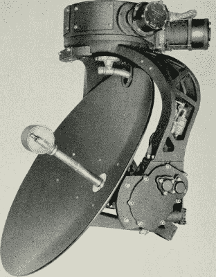
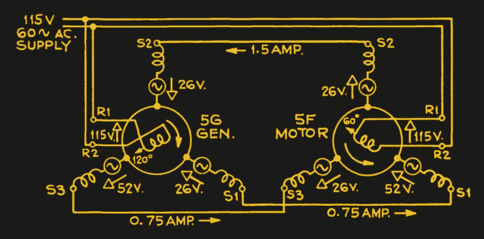
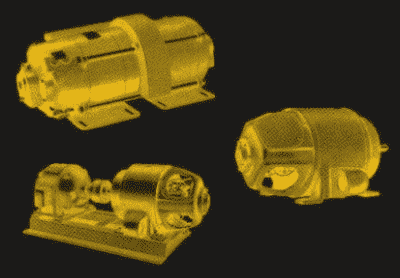

# 追溯技术:同步器走向战争(与和平)

> 原文：<https://hackaday.com/2018/04/25/retrotechtacular-synchros-go-to-war-and-peace/>

旋转。马达旋转。电位计和可变电容器经常旋转。不得不远程旋转某物或测量某物的旋转是一项常见的任务。例如，如果我今天让你远程旋转音量控制，你可能会提供一个开环步进电机或 RC 型伺服电机。如果你想测量旋转，你可能会使用某种光学或机械编码器。然而，有一种更古老的方法来完成同样的任务，这种方法仍然在一些设备中使用:同步器。

 同步机可以追溯到 20 世纪初，当时[巴拿马运河](https://archive.org/stream/panamacanalrevie1312pana#page/17/mode/1up)用它们来读取和控制阀门和闸门。这些设备在二战装备中也很常见。特别是，它们通常是设置和读取火炮方位角和仰角的机制的一部分，或者像左边的图片一样，是雷达天线的位置指示。甚至电影摄影机也使用这些设备很多年了。如今，有了更多的选择，除了在需要简单耐用的应用中，你看不到它们了。

## 它们是如何工作的？

自整角机看起来像一个马达，但它实际上是一个为特定应用而优化的变压器。例如，常见的是同步发射机和同步接收机，尽管通常这两种设备都可以工作。当连接在一起并被适当的交流电压激励时，转动一个同步轴将使另一个同步轴转动相同的量。一个发射器可以驱动多个接收器。例如，飞机驾驶舱可能有一个使用一个发射器和两个接收器的仪器，一个用于飞行员，另一个用于副驾驶。

基本的自整角机类似于电动机，它有一个转子和一个定子。然而，每个都有一个变压器绕组。有些设备使用单相，有些设备使用三相。此外，为车辆制造的设备可能使用 400 赫兹的交流电，而不是固定设备常用的 50 或 60 赫兹。通常，驱动指示器的轻型装置使用单相，但传递扭矩的同步装置将使用三相连接。

你可以把自整角机看作一个可变耦合变压器。旋转轴改变了初级和次级之间的磁耦合的大小。这意味着输出电压根据轴的位置而变化。如果你把两个同步器连在一起，电路就像一个桥。当两个器件处于相同位置时，系统处于平衡状态，即输出大小相等、方向相反的电压。但是，如果一个轴移动，不平衡会导致电流流过绕组，使另一个轴达到平衡。这种配置有时被称为旧的通用电气名称自动同步机。其他商标名包括 Teletorque 和 Autosyn，但你不会经常听到这些。

## 多样性和力量

有很多变化。一些同步器有刷，其他无刷。有些是为了精确而制造的。在高精度应用中，您可能有一个从属于精调变送器的粗调变送器，粗调轴每旋转一整圈，精调变送器就旋转多次，以读取更精确的值。你可以把它想象成一个时钟，在那里，小手每转一圈，大手就转 12 圈。通常，齿轮比是 36:1 或 72:1，使得细轴的每一次旋转对应于粗发送器的五度或十度。

让一个小把手变成一个巨大的炮架是有问题的。起初，接收器马达只是使用指示器告诉人类做什么，然后人类操作枪。然而，amplidyne 的发展使得放大同步输出以直接驱动更大的负载成为可能。

## 放大器

ampli dyne 在表面上与[发电机](https://hackaday.com/2016/07/04/retrotechtacular-dc-to-dc-conversion-by-vibrator/)相似——即由电动机带动的发电机。然而，在发电机中，你转动发电机来产生高电压。在 amplidyne 中，电动机仍然驱动发电机，但输入电压加在发电机的励磁绕组上。施加的电流越大，输出电压越高。这就产生了一个极低频放大器，它接收电流输入并产生电压输出。

Amplidynes 在其他领域也有应用。电梯，机车，甚至核潜艇。当然，今天，我们有更好的选择来做高功率放大，但可能有一些仍然藏在一些旧建筑的电梯里，在某个地方。

## 更多信息

因为这些在海军中被广泛使用，最好的信息来源之一是一本旧的[海军小册子](https://archive.org/details/UnitedStatesNavySynchrosOp1303)(如果你认为一本小册子有 166 页；如果消失了，搜索 OP 1303)。如果你想要更现代的东西，Moog(航空航天公司，而不是合成器公司，尽管这两家公司是由堂兄弟创建的)有一本[应用指南](http://www.moog.com/content/dam/moog/literature/MCG/SynchroApplGuide.pdf)和一本[手册](http://www.moog.com/content/dam/moog/literature/MCG/synchrohbook.pdf)，你可能会感兴趣。

今天你不会发现太多这些有趣的设备在使用，尽管有公司制造现代编码器[专门针对传统的同步应用](https://www.zettlex.com/products/synchro/)。当然，电子管卷土重来。也许有一天，秘密地下仓库里的那堆二战剩余同步机会值钱。

说到第二次世界大战，看看下面这段 1944 年的教学视频，视频中的飞机可以使用所有这些组件电动移动枪支。

 [https://www.youtube.com/embed/yABTembGYhg?version=3&rel=1&showsearch=0&showinfo=1&iv_load_policy=1&fs=1&hl=en-US&autohide=2&wmode=transparent](https://www.youtube.com/embed/yABTembGYhg?version=3&rel=1&showsearch=0&showinfo=1&iv_load_policy=1&fs=1&hl=en-US&autohide=2&wmode=transparent)

照片致谢:

MGeek 的同步机 [CC BY-SA-3.0](https://creativecommons.org/licenses/by-sa/3.0)