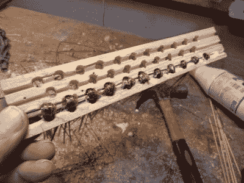

# 从塑料瓶到塑料刷

> 原文：<https://hackaday.com/2018/04/02/from-plastic-bottle-to-plastic-brush/>

大约四年前，我们第一次看到有人把塑料瓶变成了塑料带。从那时起，我们就想知道这种丰富、坚固的材料除了把东西绑在一起还能用来做什么。

[Waldemar Sha]用他那把由废木料和塑料瓶绳制成的精美画笔回答了这个问题。将七个 1 升的瓶子变成卷曲的猪鬃饲料很容易，但它们必须是直的才能有效地刷。对[瓦尔德马]来说没问题。他把这一切都缠绕在一个旋转的自制夹具上，夹具固定在一个  台钳上。夹具被设计成可以滑入他放在周围的一个小型电动三明治烤架中，他只是在一会儿后翻转它，这样绳子就会均匀地伸直。

我们非常喜欢他将刷毛固定在刷座上的方式。钻完孔后，他锯出纵向的通道，其深度足以容纳一根竹签。每组刷毛都挂在串肉扦上，向下穿过孔，在添加手柄之前，所有东西都粘在适当的位置。扫过去休息看他整理工作台，然后[学习如何自己做塑料绳](https://hackaday.com/2014/06/20/super-simple-way-to-re-use-plastic-bottles/)。

回收塑料有比制作工具更好的用途吗？看看这个由牛奶壶制成的木槌。

 [https://www.youtube.com/embed/7s7_afshTTs?version=3&rel=1&showsearch=0&showinfo=1&iv_load_policy=1&fs=1&hl=en-US&autohide=2&wmode=transparent](https://www.youtube.com/embed/7s7_afshTTs?version=3&rel=1&showsearch=0&showinfo=1&iv_load_policy=1&fs=1&hl=en-US&autohide=2&wmode=transparent)

