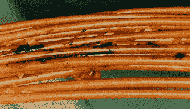

# Kapton:有着悲惨历史的奇迹材料

> 原文：<https://hackaday.com/2018/04/04/kapton-miracle-material-with-a-tragic-history/>

1998 年 9 月一个温暖的夜晚，瑞士航空公司 111 号航班遇到了大麻烦。驾驶舱天花板起火，起初浓烟使飞行员失明，他们不得不依靠仪器引导飞机从纽约飞往日内瓦，紧急降落在加拿大新斯科舍省的哈利法克斯机场。但是，在飞行员上方和后方肆虐的大火，强烈到足以熔化驾驶舱的铝，烧毁了一个又一个线束，切断了重要飞行控制系统的电源。由于无法控制飞机，这架 MD-11 飞机在距离海岸约 6 英里的大西洋上坠毁。所有 229 个灵魂都消失了。

恢复和确认受害者的身份需要几个月的时间。350 的撞击使飞机破碎成 200 万块，直到很久以后它们的秘密才会暴露。但最终，问题被追溯到由新的机上娱乐系统的故障线路引起的一连串故障，这些故障蔓延到驾驶舱并导致飞机失事。这些故障的一个原因是飞机线路上使用的绝缘材料，一些人指责这是问题的根本原因:太空时代的聚合物 Kapton。

无论我们在哪里，我们都被电线包围着。一束束电线承载着信息和电力，而保护我们的是导体上薄薄的一层绝缘层。我们信任这些绝缘体，总的来说，我们的信任是有回报的。但是像任何其他工程系统一样，失败总是一个选项。当时，Kapton 仍然是一种相对较新的神奇聚合物，有一个不幸的致命弱点，可以将绝缘体变成导体，至少在 111 航班的情况下，放火可以将飞机从空中击落。

## 太空时代的东西

电子爱好者一眼就能认出 Kapton。熟悉的琥珀色出现在如此多的设备中，从连接笔记本电脑显示器和主板的柔性 PCB 到看似神奇的胶带，可以承受焊接温度或衬在 3D 打印机的底座上以获得更好的粘附力。Kapton 已经成为电子制造业不可或缺的材料。

与尼龙、特氟隆、凯夫拉尔纤维、氯丁橡胶和许多其他聚合物一样，Kapton 是特拉华州威尔明顿的杜邦公司的化学家们的产品。Kapton 是一种芳香族聚酰亚胺，具有出色的热性能和介电性能。它可以做其他塑料很少能做的事情，比如承受从接近绝对零度到 400 摄氏度的温度。Kapton 形成了一层薄膜，一面镀铝，作为包裹阿波罗月球着陆器下降阶段的金色隔热毯，它很早就戏剧性地公开亮相。

没过多久，杜邦就发现了 Kapton 的各种用途，到 20 世纪 70 年代初，太空时代的材料被用于制造超薄超轻的电线绝缘材料。航空航天公司很快接受了这个想法；现代喷气式飞机有数百公里长的电线，从每根电线上减去几克重量就意味着重量大大减轻，从而节省燃料，增加航程，增加有效载荷。出于对利润的关注，Kapton 在整个 20 世纪 70 年代和 80 年代迅速进军客机和军用飞机，几乎出现在每一架大型飞机上。甚至航天飞机也配备了这种材料。

## 弧形而迷人

Degraded Kapton wires showing cracks and carbon charring due to arcing. Source: [Lectromechanical Design Company, LLC](https://www.lectromec.com/the-life-of-an-aircraft-wire-and-aircraft-wire-degradation/)

但是航空航天工业与 Kapton wiring 的爱情很快就要破灭了。早在 20 世纪 80 年代，美国军方就开始发现与电路短路有关的飞机起火和坠毁事件。研究表明，Kapton 远不是每个人都希望的理想绝缘体——它往往会从最轻微的刻痕开始产生环形裂纹，暴露出内部的导体。Kapton 也很容易因潮湿而降解，在潮湿的环境或飞机易受潮湿影响的区域，如厨房和厕所，问题会更加严重。

一旦绝缘受损，就会产生电弧，导致 Kapton 烧焦。这改变了绝缘体的介电特性，使其成为导体。在某些情况下，这导致过载电路无法被断路器检测到，因为绝缘层而不是导体承载着过量的电流。其他时候，断路器会跳闸以保护电路，但当工作人员重置断路器时，烧焦的绝缘材料会着火并像保险丝一样燃烧，火焰沿着远离原始电弧的电线传播。

 [https://www.youtube.com/embed/gGx76nVxF-4?version=3&rel=1&showsearch=0&showinfo=1&iv_load_policy=1&fs=1&hl=en-US&autohide=2&start=381&wmode=transparent](https://www.youtube.com/embed/gGx76nVxF-4?version=3&rel=1&showsearch=0&showinfo=1&iv_load_policy=1&fs=1&hl=en-US&autohide=2&start=381&wmode=transparent)

美国军方在 20 世纪 80 年代末封存了许多装备 Kapton 的飞机。1999 年，哥伦比亚号发射过程中的短路导致两台发动机控制计算机出现故障，美国宇航局停飞了整个航天飞机舰队，以修复卡顿绝缘故障。有人建议开发测试航天飞机上所有线路的方法，但是舰队退役了，Kapton 线路还在。

直到 1992 年，波音公司继续制造采用 Kapton 布线的飞机；事实上，瑞士航空公司的 MD-11 是最后一架装备 Kapton 的飞机。自那以后制造的飞机通常使用 TKT，这是一种带有两层薄聚四氟乙烯的 Kapton，可以更好地抵抗机械磨损和水的侵入。尽管如此，每天仍有数百架飞机起飞和降落，Kapton 绝缘电线穿过每一个角落和缝隙，有些几乎无法接近进行检查。即使可以接触到电线束，检查也只需要一个手电筒和一个眼球标记，寻找可能隐藏的裂缝。

特色图片鸣谢:来自瑞士苏黎世的伊卡洛斯航空公司(28as–瑞航 MD-11；h B- IWF @ ZRH；1998 年 7 月 14 日)[ [CC BY-SA 2.0](https://creativecommons.org/licenses/by-sa/2.0) ]， [via Wikimedia Commons](https://commons.wikimedia.org/wiki/File%3A28as_-_Swissair_MD-11%3B_HB-IWF%40ZRH%3B14.07.1998_(4713082874).jpg)