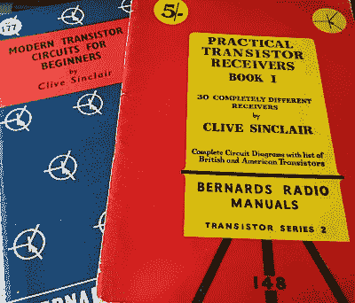
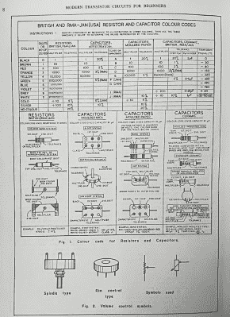
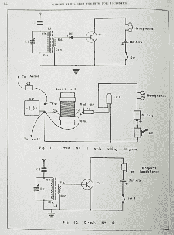
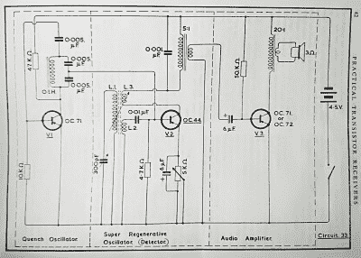

# 克莱夫·辛克莱，另一个作者

> 原文：<https://hackaday.com/2018/04/12/clive-sinclair-the-other-author/>

一个合理选择的 Hackaday 读者将有他们的第一次计算经验，在一个黑色的 8 位机器上，上面有单词“Sinclair”。即使你没有操作过这些机器，你也可能知道它们背后的人是有时很有趣的发明家克莱夫(现在是克莱夫爵士)辛克莱。

The finest in 1950s graphic design, applied to electronics books.

他是一家电子公司的创始人，该公司承诺从其相对便宜的电子产品中获得巨大收益。从 20 世纪 60 年代早期开始，可以装进火柴盒的无线电接收器、晶体管元件立体声系统、微型电视和可负担得起的计算器都受到了辛克莱待遇。但直到 20 世纪 70 年代末，他的一家公司才生产出第一台微型计算机。

20 世纪 50 年代末，十几岁的辛克莱已经是一名多产的电子产品生产商，并处于开创自己电子产品业务的早期阶段，他选择了一个资金紧张的工程师和企业家完全可以理解的路线，开始以写作为生。他为电子和无线电杂志撰稿，后来成为贸易杂志 *Instrument Practice* 的助理编辑，并为 Bernard's Radio Manuals 和 Bernard Babani Publishing 撰写电子项目书籍。正是他职业生涯的这一时期引起了我们今天的注意，不仅仅是因为辛克莱这个名字的著名关联，而是因为他的工作给我们提供了一个了解当时电子学状态的迷人窗口。

## 回到 AM 称王的时代…

How to identify a tip-body-dot resistor or a moulded mica capacitor.

稍加坚持，我们就能找到一些早期的[辛克莱尔]作品:1959 年的*实用晶体管接收器第一册*，以及 1962 年的*初学者现代晶体管电路*。它们都是细长的平装本，大约有 A4 或美国信纸大小，分别包含 36 个和 35 个不同的电路。

《实用晶体管接收器》是该出版社出版的第一本关于晶体管电路的书，显然是为了给从未使用过这种新设备的建筑商们做一本晶体管入门书。在 1958 年写这本书的时候，有一个关于晶体管和二极管范围的广泛章节。这本身就是一个有趣的阅读，因为它包含了大西洋两岸行业中许多消失已久的名字。所有的半导体都是锗，二极管是点接触的，除了少数几个晶体管外，所有的晶体管都是 PNP 的，尽管在这十年的这个阶段还没有点接触晶体管，但除了少数几个表面势垒器件外，所有的器件都使用合金扩散结构。以今天的标准来看，增益和截止频率数字非常低，这些器件仍然是这种类型的最早的例子。

《面向初学者的现代晶体管电路》面向不熟悉电子学的人，其中有一章介绍了当今的元件。有 2017 年读者将会熟悉的分立元件，但也有一个颜色代码表，其中有一些你可能从未遇到过的使用它们的设备示例。你知道带彩色条带的电阻器，但你见过尖端体和点的电阻器吗？

Probably the simplest possible transistor radio circuits.

特别有意思的是，尽管《现代晶体管电路》的标题让读者产生了相反的想法，但这两本书都涉及了简单调幅收音机的相同主题。在当时的业余水平上，电子学完全是无线电和音频的同义词，这本书遵循了一种趋势，从封底上同一出版商的其他书籍列表中可以明显看出这一点。

电路从最简单的接收器开始，这些接收器只不过是一个添加了音频级的晶体，然后通过调谐射频设计，发展到再生和超再生接收器。*现代晶体管电路*有一些布局图，可以帮助初学者识别晶体管引线。

这些电路的另一个特点是，它们明显继承了电子管电路，这在当时是任何从事电子学的人都熟悉的。变压器用作级间耦合，我们现在使用电容或电平转换电路，功率放大器采用高阻抗单端设计。超再生电路有一个使用大型 LC 调谐电路的失超振荡器，其中某种类型的 RC 振荡器几乎肯定会以相同设计的现代形式放置。

## …晶体管价格昂贵。

This simple three-transistor radio wouldn’t cost much with today’s equivalents, but back in 1960 it could have been a major outlay.

大约 60 年前，晶体管还是一种奇特而昂贵的设备。OC71 音频晶体管的等价物出现在*现代晶体管电路*后面的广告中，价格为 5 先令 9 便士，稍微转换成十进制货币，并考虑到中间几年的通货膨胀，相当于 6.03 英镑，或 2018 年的 8.45 美元。今天，我可以从零售供应商那里买到 40 个 2N3904 硅晶体管的磁带，其增益系数为数百，截止频率在高 VHF 范围内，当然，以类似的价格，我也可以从 50 年的集成电路发展中受益。当时，无线电电路可能是电子爱好者的主要出路，因为它们可以通过相对较少的元件提供合理的结果，任何需要多个器件的东西都会很快让任何想尝试它们的人破产。

[![A Sinclair miniature radio in the Science Museum, London. Frankie Roberto [CC BY 2.0].](img/4e510449e4794ddf5c7906b0a8cf6092.png)](https://hackaday.com/wp-content/uploads/2018/03/sinclairmicromatic.jpg) 

伦敦科学博物馆里的一台辛克莱微型收音机。弗兰基·罗伯托[ [CC 乘 2.0](https://commons.wikimedia.org/wiki/File:SinclairMicromatic.jpg) 。

【Sinclair】的业务在过去十年中随着收音机套件的发展而发展，这凸显了他对小型化的热爱，这将成为以其名字命名的产品的标志。你可以在这些书中看到一些收音机的进一步发展，他通过设计成适合火柴盒的小型收音机的长期发展而成为公众的焦点，这是他在 20 世纪 90 年代带着耳机的调频收音机回归的主题。20 世纪 70 年代出现了计算器和微型电视，20 世纪 80 年代，通过辛克莱的一家独立公司，家用电脑最终被卖给了阿姆斯特拉德公司。他因 20 世纪 80 年代中期的 C5 三轮电动童车而声名狼藉，但他在 20 世纪 90 年代继续追求他对替代交通工具的兴趣，推出了一系列设计独特的折叠自行车，以及传统自行车的电动附件。

脚注:尽管克莱夫·辛克莱爵士是一位出版作家，在家用电脑领域也很有名，但公平地说，他不是第一个克莱夫·辛克莱作家。这一荣誉必须归于[克莱夫·辛克莱](https://en.wikipedia.org/wiki/Clive_Sinclair_(author))，这位多产的英国小说家于 2018 年 3 月初不幸去世。