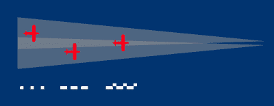
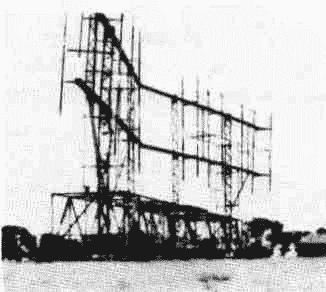

# 用哔哔声使敌人屈服

> 原文：<https://hackaday.com/2018/04/17/beeping-the-enemy-into-submission/>

1940 年 7 月，德国空军开始轰炸英国。这遭到了英国方面礼貌性的反对——以及高科技、独创性和即兴创作。德国人的失败与高射炮和战斗机有关，但无线电的使用避免了大量的潜在损害。

夜间轰炸在当时是一个相对较新的想法，每个人都认为这很难。在黑暗中以每小时 200 英里的速度驾驶一架飞机，并可能遭到枪击，用传统的方法是行不通的。所以德国人发明了非传统手段。这是一场技术竞赛的开始，双方都在努力实现新的和新颖的无线电技术来引导轰炸，并扰乱这些引导系统。

## 寻找跑道就像寻找轰炸目标

在战役的前四个月，德国使用了一种叫做“尼克贝因”的制导系统。这翻译过来就是“弯曲的腿”，据说是从发射天线的形状得来的。在 1940 年，无线电导航是几十年前的老技术，并被广泛使用。例如，洛伦兹系统 T1 是一种着陆辅助设备，它允许飞行员在 30 英里外精确地对准跑道。这种系统自 30 年代中期开始在国际上使用。

Lorenz beam illustration
by [Anders Dahnielson](https://commons.wikimedia.org/wiki/File:Lorenz_beam.svg) CC-BY-SA 3.0

洛伦兹波束的工作原理是从一组垂直于跑道放置的天线发射窄聚焦的无线电信号。正在接近的飞行员将使用他的无线电收听信号，当在跑道左侧排成一行时，该信号由带有较长停顿的短音调(点)组成，当在右侧时，该信号由带有短停顿的长音调(破折号)组成。当与跑道对齐时，飞行员听到连续的音调，因为点号和破折号信号在中间重叠。该系统易于使用，所需的设备也很便宜，甚至已经到位，因此传播很快。

尼克贝因比两个洛伦兹光束多一点变成了十一个。基站功率更大，波束聚焦更窄，但原理是一样的。两个站通过交叉波束来标记轰炸目标。然后，一个轰炸机机组人员沿着一条波束飞行，当他们穿过第二条波束时，就投下炸弹。

尼克贝因天线
【图片来源:【pa0pzd.com】T4

该系统有几个优点:易于使用，依赖于已经在船上的设备。这意味着大量生产的成本很低，而且被敌人发现后也无法识别。一个或多个洛伦兹接收器正是你期望在一架大飞机上找到的。此外，即使在得到其基本原理的暗示后，该系统仍被部分英军认为是不可能的。反对的理由是用于洛伦兹光束的频率太高，无法传播到地平线以外，因此从德国或被占领的土地上发射的信号无法标记英国的目标。

证明尼克贝因存在的试飞几乎没有发生。由于飞机供不应求，搜寻信号的工作从一架即将退役的旧教练机开始。飞机上没有合适的无线电，只安装了一台从伦敦一家商店买来的美国制造的业余无线电接收机。6 月 21 日，一次成功的飞行接收到了信号，证明了远距离使用洛伦兹是可能的。接收起作用是因为在远程轰炸机的工作高度，地平线足够远，可以接收到来自北海的高频信号。

## 伸直弯曲的腿

英国人已经发现了德国人是如何引导他们的轰炸机的，并且需要一个立即的解决方案来阻止它。一个显而易见的选择是干扰信号，但实现这一壮举所需的无线电发射机很难获得。新成立的电子对抗部队与黑客一拍即合。该单位的负责人了解到，医疗透热机——用于高频治疗热——与尼克贝因的无线电波段相同。这些机器是从全国各地的医院征用来的，当一场突袭即将来临的时候，它们被移动到光束的路径上。透热设备产生了大量的无线电噪音，抑制了光束。更复杂的方法很快被开发出来，但是重新设计的医疗设备提供了关键的急救。

后来，广播“多余点”的发射机被推出。他们在进攻的机组人员中制造了巨大的混乱，并成功地使他们偏离了轨道。使尼克贝因失去作用的努力最终达到了使假目标信号与德国信号同步，从而“弯曲”波束，使炸弹远离预定目标。

这些多余的点是否真的被使用还有待商榷。维基百科说是的，而该行动的负责人接受了 [BBC 的采访](https://www.dailymotion.com/video/x123i1g)，他在采访中称该能力已经到位，但从未用于无关的行动原因。这并不重要，因为德国人已经意识到尼克贝因已经变得毫无用处，并提出了一个新的想法。

## 愚弄全自动系统

继任者是 X-Gert 或 X-device。在传输方面，它只不过是一个更精致的版本。x-Gert 再次使用一个洛伦兹光束来设定轰炸机的航线，然后使用三个交叉光束来确定投放时间。早期英国的对抗措施包括像以前一样发射多余的点，这次效果甚微。出现这种情况的原因可能是傲慢。在分析德国信号时，其音调的调制频率被错误地测量为 1.5 kHz。正确的频率是 2 千赫。当这一错误为人所知时，英国人认为它无关紧要，认为噪音飞机中的无线电操作员无法分辨这种差异。

他们花了几个星期和一架被击落的德国轰炸机才意识到 X-Gert 没有无线电操作员参与。该系统使用光学指示器来保持飞机在轨道上，并使用机电计算器来自动释放炸弹负载。这些装置的特点是电子过滤器可以完全去除接收信号中多余的点。有了这个新的认识，多余的点就可以发挥作用了。

此外，另一个系统被推出，“假易北河”(德国方面使用的四个梁都带有河流的名称)。跨越最后两个“奥得河”和“易北河”信号之间的时间设置炸弹定时器。这是完全自动化的，不允许人为操作。因此，为了保护高价值目标，英国人操作他们自己的站，投射一束将被解释为“易北河”信号的光束，就在“奥得河”后面。结果是早期下降，英国工业中心以南的乡村被彻底犁过。

## 名称又能代表什么呢

此时，基于洛伦兹光束的方法显然已经过时了。德国人必须想出一个完全不同的解决方案。虽然该系统被正式命名为“Y-Gert ”,但这一创造性命名的巅峰并没有得到其背后的人的认可，因此它也得到了代号“沃坦”。这一信息泄露给了英国人，而沃坦是独眼神奥丁的另一个名字，这一事实使他们怀疑 Y-Gert 只能使用一束光束，而不是像它的前辈那样使用多束光束。

知道沃坦是个独眼神，帮助 zero 了解新系统是如何运作的。[图片来源:[迪士尼维基](http://disney.wikia.com/wiki/File:Odin_with_Helmet.jpg) ]

根据他们对雷达技术的了解——这在当时是很多的，因为英国人是第一个大规模使用雷达的人——以及对方的能力，英国人确定沃坦很可能是一个主动雷达系统。为了跟踪一架飞机，它将安装一个自动应答器。地面站将发射一个脉冲，当接收到脉冲时，机载设备将自动发送其响应。通过测量脉冲和响应之间的时间，可以精确地确定行进的距离。根据应答信号的方位，地面小组能够确定飞机的位置，并通过无线电将其导向目标。

Y-Gert 优于 Knickebein 和 X，因为它不会在袭击发生前暴露预定目标的位置。另一方面，它不能同时指挥大量的飞机。也是从一开始就注定的。由于事先对新系统有所了解，再加上纯粹的运气，英国人从第一天起就能和沃坦捣乱。另一方使用的载波频率与战争爆发时被封存的一个电视台的载波频率相吻合。为了对抗沃坦，英国人在接收到脉冲时会传送自己的反应，并随着时间的推移慢慢增加传送功率。

由于该系统是新的，导致的不准确性被归咎于初期问题和缺乏培训。机组人员和雷达操作员不知道沃坦受到干扰，相互指责对方无能。Y-Gert 是德国人在不列颠之战中使用的最后一种轰炸机导航系统。