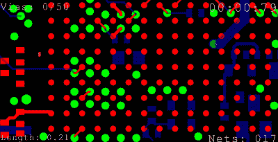

# Autodesk 为 Eagle 推出蛇形路由器

> 原文：<https://hackaday.com/2018/04/01/autodesk-introduces-serpentine-router-for-eagle/>

自从几年前 Autodesk 收购 Eagle 以来，他们已经竭尽全力。现在 Eagle 中有一个按钮可以将你的冲浪板从前面翻到后面——这个功能在 20 年前就应该有了。[参数化零件生成](https://hackaday.com/2018/03/08/autodesk-introduces-parametric-part-generation/)、推推式布线、[与 Fusion 360](https://hackaday.com/2017/08/09/new-release-makes-eagle-and-fusion-360-besties/) 的集成，以及一系列其他功能使 Eagle 成为最佳 PCB 布局工具之一。

今天，Autodesk 推出了革命性的产品。最新版本的 Eagle(版本 8.7.1)带有手动蛇形路由模式，为任何人提供了与 20 年前诺基亚的天才们相同的工具。

An exclusive first look at Eagle’s new serpentine routing mode

通过`SNAKE`命令调用新的蛇形布线模式。这将打开蛇形路由接口，您可以在其中添加网络并放置蛇形路由器。点击屏幕上的任何地方，你可以绕过焊盘和走线收集所有的过孔，希望得到高分。

这种新模式有一些窍门。Control 和 Shift 键改变蛇形路线的速度，当前缩放级别改变初始速度。当你在过孔之间布线时，蛇形布线器变得更长，使布线变得更加困难，但是如果你准备好了，你最终会得到一个“你是赢家”的屏幕。

这正是自从欧特克收购 Eagle 以来，我们一直在寻找的创新。它不是推推式布线，也不是参数化零件生成。蛇形布线是 EDA 工具中的下一件大事，这种布线模式[已经出现在 KiCad](https://github.com/KiCad) 即将推出的特性列表中。蛇形路由的 KiCad 版本将被读作“潜行”。