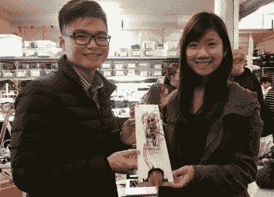
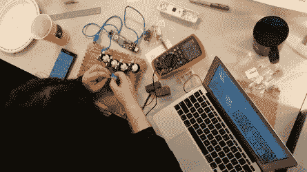
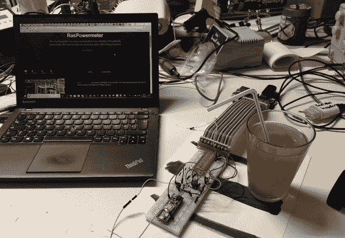
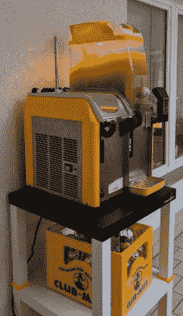
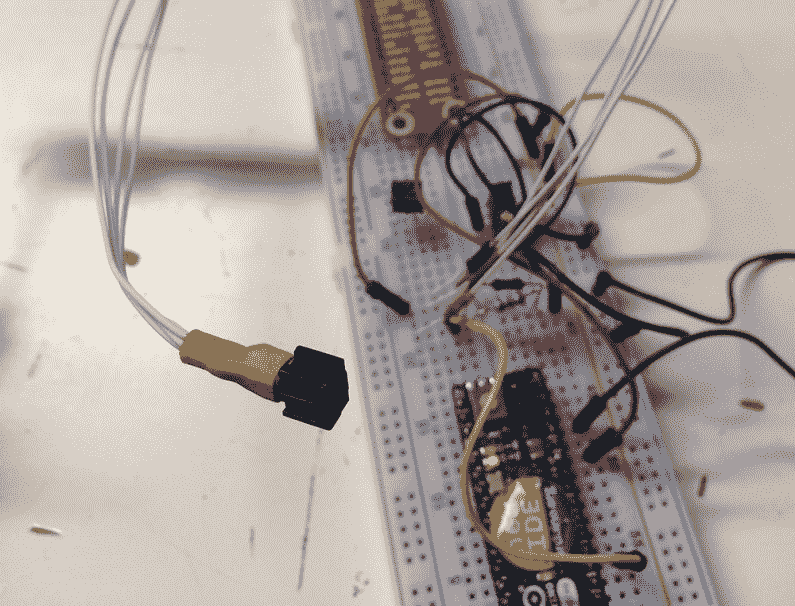
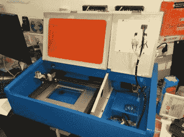
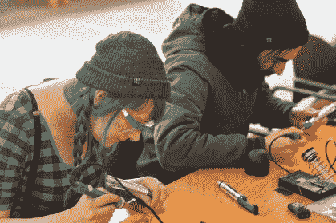

# 世界创造日的惊人黑客

> 原文：<https://hackaday.com/2018/04/04/the-amazing-hacks-of-world-create-day/>

为了今年的 Hackaday 奖，我们开始了一项惊人的实验。[世界创造日](https://hackaday.io/meetup/4-world-create-day-2018)组织了世界各地的数百名黑客空间聚集在一起，为未来构建希望。这是一个实验，将社区商店和工作场所结合在一起，为 Hackaday 奖设计他们的参赛作品，天哪，这太成功了。我们有从波特兰到巴基斯坦的黑客空间参与其中，这些只是他们实现的惊人黑客行为中的一部分。

## 加拿大学生修假唇！

今年 Hackaday 奖的主题是建立希望，不列颠哥伦比亚省伯纳比的学生们做了一些非常酷的项目来实现这个目标。他们创造了定制的视频游戏控制器，制作了几个外骨骼手臂的原型，并修复了[假动作](http://www.neilsquire.ca/research-development/projects-activities/lipsync/)。LipSync 是一种用嘴操作的操纵杆，允许人以最小的头部和颈部运动来控制计算机上的光标。LipSync 背后的想法是让坐轮椅的人可以使用电脑。这很重要，因为在加拿大和美国估计有一百万人限制或不使用他们的手臂，使得触摸屏无法操作。

LipSync [是 2016 年黑客日奖](https://hackaday.io/project/13424-lipsync)的参赛作品，虽然它没有赢得大奖，但它确实将一款通常售价 3000 美元的设备降到了 300 美元左右。这是一个数量级的成本降低，为未来带来了希望。太神奇了！

    

## 覆盆子馅饼和巧克力冰沙！

你可能会认为把酒精和电子产品混在一起可能很危险，但德国耶拿的黑客空间 kraut space 的人们却不这么认为。为了他们的世界创造日冒险，他们做了 Tschunk 冰沙！ts chunk 是什么？这是朗姆酒和俱乐部队友，权威的黑客饮料！你甚至可以说，乙醇的加入让它更像是一种黑客饮料*。哈哈。*

当 Tschunk Slushies 混合在一起的时候，Jena Hackerspace 的团队开始着手他们的世界创造日项目，一个记录他们用电量的界面。事实上，这只是一个贴在电表上的光电传感器，但他们已经将所有东西都连接到树莓 Pi 上，使他们能够通过互联网监控电力消耗。太神奇了。政府和公用事业公司已经花费数十亿美元开发“智能”电表，但一些“黑客”在短短几小时内就创造出了自己的电表！就好像“黑客”这个头衔一点也不坏，成为“黑客”是一件好事！

      

## 确保激光切割机的安全和焊接钥匙链

你会把眼睛射出来的，孩子！或者，如果你在开着盖子的情况下使用激光切割机，至少你很有可能遭受不可逆的眼睛损伤。出于某种原因，大多数便宜的激光切割机都没有安全联锁装置，如果你能相信的话。为了他的世界创造日项目，[roboter break][让激光切割机更加安全](https://twitter.com/RoboterFreak/status/975039666348068865)。通过在激光管上安装继电器、微动开关和 Arduino，您可以安全地改装现成的激光切割机，使其更加安全。

这并不多，但它对使激光切割机*安全*大有帮助。只需简单地增加一个开关，这台激光切割机就可以在距离儿童四分之一英里的范围内使用。这是你应该在自己的黑客空间做的简单的事情。

但是世界创造日和黑客日奖不仅仅是担心安全问题。Thimble.io 公司的人很喜欢焊接他们自己的钥匙链手电筒。这是一个学习如何焊接和硬件开发的好方法。顺便说一句，这正是我们在今年的 Hackaday 奖中寻求的。我们需要制造硬件来改变世界的人。

    

Hackaday 奖一直持续到 11 月，还有足够的时间让你参赛。它甚至不必与世界创造日相关，这是世界上有史以来最令人惊叹的黑客空间虚拟聚会。[您可以从这里开始参加 Hackaday 大奖的角逐](https://hackaday.io/project/add?light&tag=2018HackadayPrize)，建立一个能够带来希望的项目，并有望赢得数万美元的奖金。这是一个令人惊叹的比赛，如果没有我们令人惊叹的在线社区的支持，我们不可能做到这一点。

The [HackadayPrize2018](https://hackaday.io/prize) is Sponsored by:     