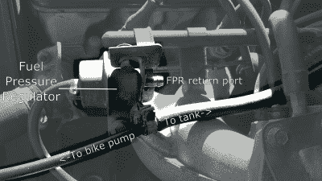

# 懒惰的黑客检查燃料系统泄漏，简单的方法

> 原文：<https://hackaday.com/2018/04/05/lazy-hacker-checks-fuel-system-for-leaks-the-easy-way/>

旧车很棒。它们代表了一个不同的时代，反映了设计和制造时的社会状况，在提供有用的交通工具的同时，也能给人以魅力和愉悦。除了，嗯……老爷车很棒，除了当他们不在的时候。

我的沃尔沃 740 已经过了 30 岁生日，行驶里程超过 200，000 英里，说它磨损有点严重是一种保守的说法。turbo dadwagon 遭遇了传输问题和冷启动灾难…但最令人沮丧的是燃料使用的突然激增。经过一些工作后，我卑微的日常司机已经从使用可接受的 21 英里每加仑下滑到只有 15 英里。再加上涡轮增压发动机需要优质燃料，你可以理解我的惊愕。

既然我每周都要为巨额的燃料账单大出血，我就有足够的动力去追查这个问题。我很忙，渴望快速解决问题，于是听从了一位机械师的建议，这位机械师被推荐为沃尔沃的本地专家。遗憾的是，结果并不确定——最初的迹象是，发动机的所有电子控制功能都符合规格，我被告知“可能是一批劣质燃料”。

不幸的是，几个昂贵的坦克后，来源于整个城镇，揭示了这个问题实际上是真实的。有了一份据称可靠的报告，证明燃料混合物是正确的，从而排除了像氧传感器这样的罪魁祸首，我开始怀疑，我只是把燃料倒出油箱吗？

## 一次安全实践开始了我的问题

我之所以会产生这种令人担忧的怀疑，是因为几周前我在更换变速器过滤器时犯了一个业余错误。工作完成后，我开始用千斤顶把汽车顶起，以便移走支撑它的轴架。放下汽车时，发出响亮的嘎吱声。

我通常会在车底留下轮胎、砖块，或者在这种情况下留下坡道，作为备用，以防支架出现故障。这次我愚蠢地忘记把它们拿掉，车的全部重量现在都在我放在油箱正下方的坡道上。我急忙把车顶起，移开坡道，检查损坏情况。没有什么明显的，但在接下来的几周里，我的燃油经济性变得很糟糕。

这让我相信，我可能损坏了燃油管或其他油箱配件，当我转弯时，我正在从油箱中倒出汽油。这需要检查，但是怎么检查呢？卸下油箱进行检查是一项艰巨的任务，理想的情况是在油箱空的时候完成，以避免被 50 升燃油的重量压垮。一定有更好的解决方案。

我的一位有成就的同事问我是否考虑过对系统进行压力测试。当然啦！太简单了。我所要做的就是想办法用空气给燃料系统加压，看看它是否能保持压力，或者我是否能听到泄漏的声音。轻松点。

## 自行车打气筒:黑客工具包中的必备工具

A bike pump, which can be used to pressurize the fuel system. I scored mine for $20.

我在房子里四处搜寻，想出了一个计划。首先，我打开了汽车的引擎盖。看了一下燃油轨，我确定最简单的方法是从燃油压力调节器上拆下回油管，它是用一个简单的软管夹固定的。这将因车而异；我很幸运，这是相当容易获得的。然后，我抓起我信赖的自行车打气筒，从末端取下阀门适配器，只留下空气软管。幸运的是，它正好安装在燃料回流管内。由于燃料输送管线仍在原位，任何流动都被调节器阻断，现在可以将空气泵入燃料箱。

这里的目的不是让燃料系统承受巨大的压力；高于环境压力几磅/平方英寸是正常的。不幸的是，我的 K-mart 泵上的压力表在 20 磅/平方英寸以下不准确，但我能够开始给油箱和管线加压。吸了几口后，我听到了一种声音，我只能用不满的呻吟来形容。这是燃料盖释放多余的压力。又打了几下泵(还有尴尬的声音)，我查看了车底，检查有没有漏油，谢天谢地，什么也没发现。出于兴趣，我打开了油箱盖，嘶嘶声释放了最后的压力。如果没有做到这一点，当空气软管被拆除时，回流软管会将燃油喷到发动机舱内，这可能会有点麻烦。

The pump was hooked up by inserting its output air line into the tank return line. Various cars use different setups which may make this test easier or harder depending on how the fuel lines are set up.

最后，看起来根本没有泄漏。我对燃油经济性问题的探索还在继续。但这项技术的伟大之处在于，它很容易实现，不需要特殊的工具——只需要巧妙的将几根软管连接起来。它可以很容易地帮助你确定你的燃油系统是否有严重的泄漏。[如果你想看视频，我们会帮你搞定](https://youtu.be/hHhrSNtoJM8?t=1m14s)——尽管我把退货和送货的线路搞混了。然而，如果你有一个较慢的泄漏，比如一个失效的燃料喷射器，或者你正试图诊断一个燃料泵中的一个失效的止回阀，你可能很难用这种技术找到它。在这种情况下，你会想要找到“正确的工具”，即燃油压力测试套件，并进行更深入的调查。[【EricTheCarGuy】有一个很好的指导如何做到这一点，尽管它确实需要一些更专业的设备。](https://www.youtube.com/watch?v=AeVTZz0od7Y)

总的来说，这是一个简单的检查，shadetree 机制可以帮助您在问题失控之前发现问题。我们很乐意报道更多的车库黑客。您如何诊断燃油喷射汽车的燃油经济性问题？这些年来，你还参与了哪些汽车行业的黑客活动？

 [https://www.youtube.com/embed/hHhrSNtoJM8?version=3&rel=1&showsearch=0&showinfo=1&iv_load_policy=1&fs=1&hl=en-US&autohide=2&wmode=transparent](https://www.youtube.com/embed/hHhrSNtoJM8?version=3&rel=1&showsearch=0&showinfo=1&iv_load_policy=1&fs=1&hl=en-US&autohide=2&wmode=transparent)

