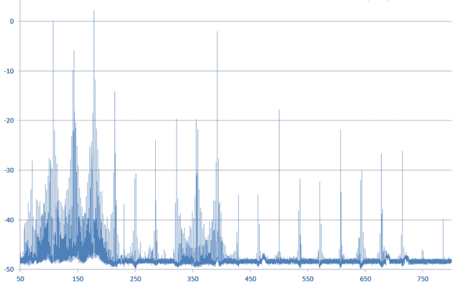

# 过滤你的 Pi，做一个负责任的海盗

> 原文：<https://hackaday.com/2018/04/03/filter-your-pi-and-be-a-responsible-pirate/>

在这一点上，众所周知，你可以在 Raspberry Pi 的 GPIO 上钉一根长电线，安装一些软件，你就拥有了世界上最简单的海盗调频广播电台。我们说这是一个“盗版”电台，因为尽管做起来简单得可笑，但在没有许可证的情况下在这些频率上广播是非法的。即使你有许可证，挂着一根电线的树莓派也会发出各种无意的噪音，使它无法用于任何合法目的。

Unfiltered output of Pi broadcasting on 107.3 MHz

为了解决这个问题，[Naich]在他的博客上写了几篇文章，不仅讨论了为什么 Pi 是如此糟糕的传输器，还展示了如何建立一个过滤器来帮助改善这种情况。如果你用你的 Pi 在调频电台上传输，你仍然是一个无法无天的海盗，但你不会是一个*肮脏*无法无天的海盗。

在第一篇文章中，[Naich] [向我们展示了当 Pi 在默认的 107.3 MHz 上广播一些歌曲时，有线天线](http://naich.net/wordpress/index.php/taming-the-pifm-transmitter/)会发出什么，这并不美妙。Pi 在 50 MHz 至 800 MHz 的频谱范围内上下发射信号，令人难以置信的是，这些谐波在某些情况下比有意广播还要强。肯定不是理想的发射机。

[Naich]然后继续展示如何为 Pi 构建一个 DIY 滤波器“帽子”,它不仅可以减少许多不必要的干扰，甚至还可以稍微增强想要的信号。该设计出奇的简单，只需几美元的元件成本，并且方便地直接由 Pi 的 GPIO 供电。它甚至为您提供了一个合适的天线插孔，而不是缠绕在插头引脚上的裸线。

[我们已经看到很多项目](https://hackaday.com/2015/11/04/rpitx-turns-rasberry-pi-into-versatile-radio-transmitter/)利用了[树莓 Pi FM 传输黑客](https://hackaday.com/2014/06/15/easily-turn-your-raspberry-pi-into-an-fm-transmitter/)，虽然这个 mod 仍然没有使它变得完美，但看到一个令人敬畏的黑客变得更好总是令人高兴的。