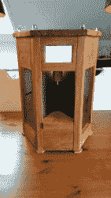

# 美丽的 Pi 动力鸡尾酒机

> 原文：<https://hackaday.com/2018/04/09/beautiful-pi-powered-cocktail-machine/>

科幻小说长期以来一直认为，一杯好喝的饮料应该从墙上的滑动面板中出现。调酒将是机器人和人工智能的专属——手动控制已经成为过去，为了继续我们朝着科幻未来的进步，Reddit 用户[HighwingZ]建造了一台[漂亮的机器，可以混合和提供饮料](https://imgur.com/a/Ow600)。

代替滑动墙板，[HighwingZ]建造了一个六边形容器。六个面中的五个面包含用来装饮料的瓶子，最后一个面包含龙头和放玻璃杯的地方。该机器的工作原理是使用连接到 HX711 称重传感器放大器的称重传感器对倒入玻璃杯的液体进行称重。一个水族箱泵被用来通过一些磁性阀门将空气压入任何一个被选中的瓶子，迫使液体沿着管子向上进入玻璃杯。使用一个简单的触摸屏用户界面，这样用户可以选择哪种饮料和倒多少。所有这些都连接到一个树莓派来控制这一切。

整件东西都放在一个看起来很棒的木质陈列柜里，侧面可以透视，所以你可以看到用来制作饮料的瓶子。[HighwingZ]将控制一切的 Python 代码放到 github 上，供任何想自己开发的人使用。网站上有一些制作鸡尾酒的方法，比如[这个](https://hackaday.com/2014/05/20/barobot-serves-cocktails-while-using-open-design-the-right-way/)，或者[这个](https://hackaday.com/2014/03/08/a-cocktail-shaker-with-android-and-arduino/)，如果你需要一些灵感的话。

 <https://i.imgur.com/x2UizB2.mp4?_=1>

[https://i.imgur.com/x2UizB2.mp4](https://i.imgur.com/x2UizB2.mp4)

via [Reddit](https://www.reddit.com/r/raspberry_pi/comments/89fejr/i_built_a_raspberrypi_powered_cocktail_machine/?st=jfjwng81&sh=e4f0fc47) 。