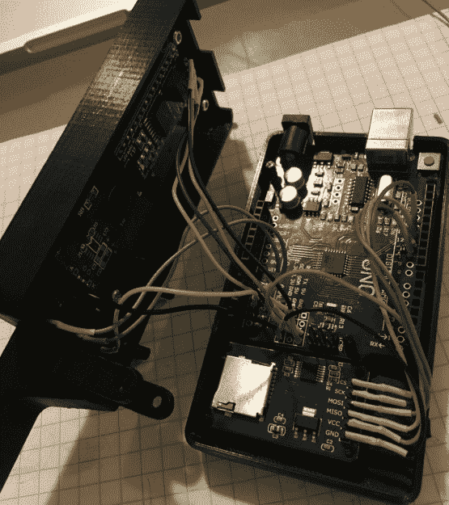

# 手持式 Arduino 灯光画师

> 原文：<https://hackaday.com/2018/04/06/handheld-arduino-light-painter/>

光绘是一种技术，它允许你在长时间曝光拍摄期间，通过移动光线穿过相机，在照片上“绘画”。虽然很难掌握，但光绘可以产生一些令人难以置信的效果，如文本和图像似乎在半空中盘旋。把它想象成一个非常慢但更酷的增强现实应用程序版本。

【Reven】最近写信给[告诉我们关于他组装的 Arduino 光绘器](https://en.reven.org/2018/04/04/light-painter/)，虽然 DIY(甚至商业)光绘设备在这一点上并不新鲜，但我们认为他的设计提高了一点。通过添加一个光滑的 3D 打印外壳和板上显示和菜单系统，他的 light painter 看起来非常专业，因为他是用手头的硬件建造的。

在他的博客上，[Reven]做了一件了不起的工作，从头到尾记录了构建过程。他不仅包括详细的材料清单和 [STL 文件，这样你就可以构建自己的](https://www.thingiverse.com/thing:2849881)版本的光画师，他还向读者介绍了他的设计过程，并解释了*为什么*他做了他所做的事情。即使你对建造一个光画师不感兴趣，几乎可以肯定的是，任何曾经看着他们工作台上的一堆零件并想知道他们如何将它变成一个功能设备的人都会感兴趣。

light painter 由 Arduino Uno 驱动，在 16×2 LCD 上提供用户界面，不仅可以控制 WS2812 LED 灯条的亮度，还可以从 micro SD 卡中选择和加载不同的图像。该案例是在 FreeCAD 中设计的，虽然[Reven]提到有许多问题可以改进，但满足了他的所有设计目标。

我们介绍了最初的 Adafruit 项目，这个项目是[Reven]在 2013 年基于他的代码开发的，尽管从那以后这个想法肯定有了[更多的现代解释。](https://hackaday.com/2015/06/26/color-light-painting-with-a-3d-printer/)