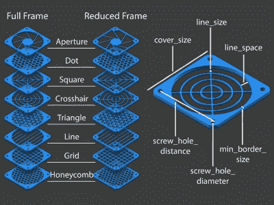

# 定制所有你从来不知道你需要的风扇罩

> 原文：<https://hackaday.com/2018/04/13/customize-all-the-fan-covers-you-never-knew-you-needed/>

 你是否需要一个具有精确指定属性的花哨粉丝封面，却没有从头开始设计的欲望？如果你回答是(或不是)，那么[mightynozzle]有答案。[可定制的风扇护栅](https://www.thingiverse.com/thing:2802474)是 OpenSCAD 中的一个参数化设计，允许为任何可能需要的风扇护栅调整框架样式、尺寸和护栅图案。[mightynozzle]还额外提供了大量预制的 STL 文件，用于各种尺寸的各种设计，因此那些不想在定制方面大惊小怪的人可以简单地下载和打印。

通常 Thingiverse 允许用内置的定制器定制这个模型的属性，但是这个特性的功能和可用性是不稳定的。幸运的是，下载源代码并在 [OpenSCAD](http://www.openscad.org/) 中直接定制总是一个选项。对于那些可能感兴趣但不知道从哪里开始的人，这里有一个提醒，我们讲述了[如何用 OpenSCAD](https://hackaday.com/2013/12/11/3d-printering-making-a-thing-with-openscad/) 制作一个演示整个过程的东西。