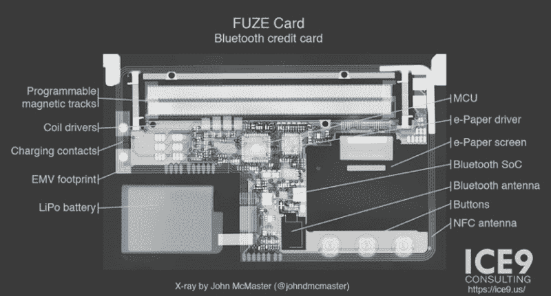

# 破解蓝牙信用卡

> 原文：<https://hackaday.com/2018/04/08/cracking-a-bluetooth-credit-card/>

你可能会惊讶地发现，把你所有的信用卡信息放在你口袋里的一个小小的蓝牙设备上并不是一个好主意。哦，那是什么？你已经知道了？在这种情况下，你不会发现下面的信息非常令人震惊，但它仍然是一个有趣的视角，看看安全研究人员如何系统地破坏一个设备，以找到它的漏洞。

ICE9 咨询公司的  【迈克·瑞安】最近发表了一篇文章，详细介绍了为[检查并最终击败引信卡](https://blog.ice9.us/2018/04/stealing-credit-cards-from-fuze-bluetooth.html)上的安全性所做的工作。从使用 x 光机对设备内部进行非破坏性侦察，到有条不紊地发现它通过蓝牙响应的所有命令，可以肯定地说，引信卡在这一点上已经完全打开了。

需要明确的是，攻击者仍然必须与 FUZE 配对，因此需要物理访问。但正如[Mike]在博文中指出的，在许多情况下，将您的卡交给商家是标准操作程序。似乎很难在一两分钟内得到一张这样的引信卡而不引起主人的怀疑。将 FUZE 与 Linux 设备配对以继续下一步的攻击只需要几秒钟，正如中断后的视频所示。

一旦配对成功，攻击者只需向 FUZE 发送一个 BLE 命令，就可以禁用锁屏。真的就这么简单。攻击者还可以通过蓝牙发送命令来转储信用卡信息，这意味着他们可以下载您的信息，即使卡已经“安全地”回到您的口袋中。FUZE 设计的固有缺陷是，你不需要提供任何类型的认证来将其与新的蓝牙设备配对。它做了一个(非常危险的)假设，即持有它的人有权这样做。

即使你知道不该买这样的设备，但[迈克]写的这篇文章确实是任何看过一台设备并试图弄清楚它的小硅脑中发生了什么的人的必读之作。我们尤其喜欢他的论断，即逆向工程一个设备本质上可以归结为:“凝视，思考，一点点实验，但主要是凝视和思考。”我们在 Hackaday 总部正在进行一场关于把它作为网站标语的内部辩论。

顺带一提，这和不久前被破解的[蓝牙枪“保险箱”](http://hackaday.com/2017/12/13/bluetooth-gun-safe-cracked-by-researchers/)很像。在这一点上，如果你打算用你的身份和/或致命武器来信任它，那么远离任何带有蓝色小标志的东西可能是明智的。

 [https://www.youtube.com/embed/VGMwxSqZczE?version=3&rel=1&showsearch=0&showinfo=1&iv_load_policy=1&fs=1&hl=en-US&autohide=2&wmode=transparent](https://www.youtube.com/embed/VGMwxSqZczE?version=3&rel=1&showsearch=0&showinfo=1&iv_load_policy=1&fs=1&hl=en-US&autohide=2&wmode=transparent)

