# 都柏林知道如何带来一个黑客

> 原文：<https://hackaday.com/2018/04/09/dublin-knows-how-to-bring-a-hack/>

在旅途中，我们喜欢在当地的黑客空间停下来，与黑客社区联系。周五，爱尔兰都柏林的 TOG Hackerspace 开门迎客，与 Hackaday 和 Tindie 一起举办了一场黑客大会。

都柏林的市中心绝不是一个网格。鹅卵石路蜿蜒曲折，是一个单向和令人惊讶的建筑的谜，没有一个似乎困扰谷歌的导航算法。我很高兴能操作智能手机而不是租车。非常感谢 Jenny List 在我们的茶点之旅中承担了驾驶的压力，没有与人或车接触。

你可能想知道为什么城市的街道布局值得如此关注。我习惯了位于中心的黑客空间空间紧张，事实上 TOG 的成员警告我们 50 个人会感到拥挤。恰恰相反，酒吧、餐馆、旅馆和表演艺术中心并不小，也不是弯弯曲曲的，也不是用鹅卵石建成的。都柏林是一个聚会的好地方，有足够的空间让我们这些硬件爱好者聚集在一起。TOG 本身距离中央圣殿酒吧区(拍摄这张照片的地方)步行约 20 分钟，甚至有一个小停车场，让我们的啤酒下车和披萨外卖变得轻而易举。

## TOG Hackerspace 之旅

TOG 是一个盖尔语单词，大致翻译为“制造”。Declan 和我们一起喝啤酒，并在我们回来参加晚上的活动时带我们参观了一番。建筑被分成几个不同的空间，从入口区域开始，作为会议空间、游戏室和项目展示区。

你可能会在公寓大楼上看到悬挂的经幡，我们会在会议区看到悬挂的软盘(包括硬磁盘和软磁盘)。Declan 有一个 K'nex 部件的三叶草，用麦克风控制的 RGB LED 条连接起来——这就像一个测试你力量的游戏，看谁能喊出最酷的颜色。

  3.5″ Floppies [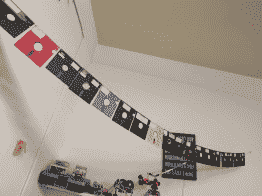](https://hackaday.com/2018/04/09/dublin-knows-how-to-bring-a-hack/tog-floppies-2/) 5.25″ Floppies [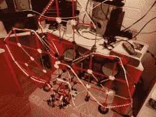](https://hackaday.com/2018/04/09/dublin-knows-how-to-bring-a-hack/tog-shamrock-red/) Sound-activated shamrock [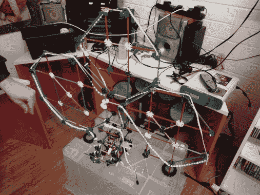](https://hackaday.com/2018/04/09/dublin-knows-how-to-bring-a-hack/tog-shamrock-green/) Shamrock is RGB [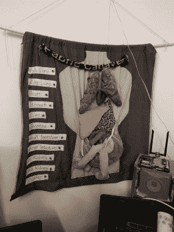](https://hackaday.com/2018/04/09/dublin-knows-how-to-bring-a-hack/tog-fabrick-anatomy/) How would you do on fabric anatomy?

我也很喜欢织物解剖展示，每个器官上都有搭扣，只有在正确的位置完成回路时，标签才会发光。

这些只是冰山一角。休息之后还有更多，所以请和我一起参加剩下的巡演，以及周五晚上出现的一些著名的黑客。

 [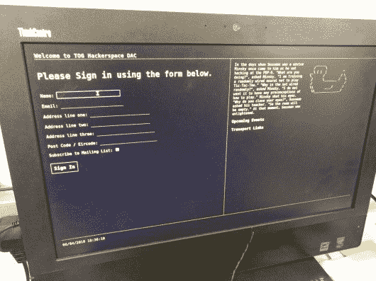](https://hackaday.com/2018/04/09/dublin-knows-how-to-bring-a-hack/tog-checkin/) Visitor sign-in is retro-themed web app [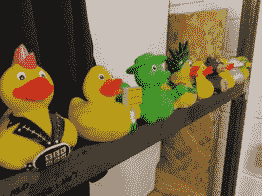](https://hackaday.com/2018/04/09/dublin-knows-how-to-bring-a-hack/tog-duckies-2/) Duckies [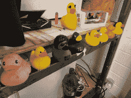](https://hackaday.com/2018/04/09/dublin-knows-how-to-bring-a-hack/tog-duckies-1/) More duckies [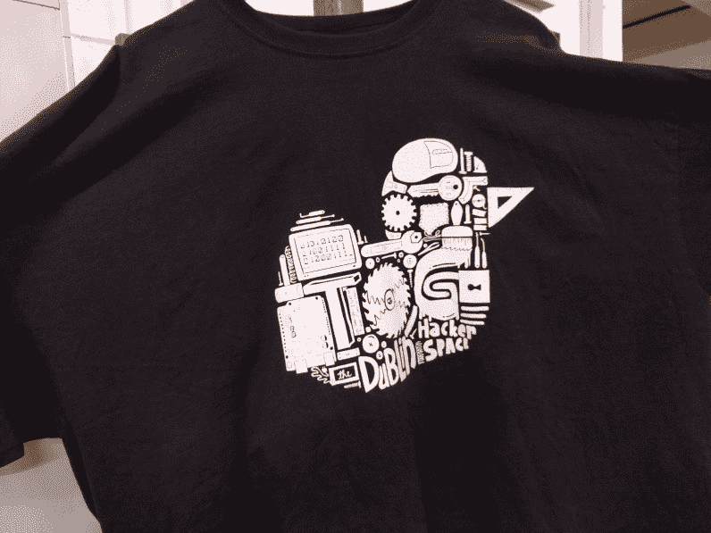](https://hackaday.com/2018/04/09/dublin-knows-how-to-bring-a-hack/tog-ducky-shirt-1/) T-shirt is ducky shaped

穿插着两个不同的充满模拟器的拱廊橱柜，你会发现一个基于荣誉支付系统的礼品和点心摊位。在真正的黑客形式中，TOG 为其成员导入 Club Mate(稍后您将看到这方面的证据)。

当你第一次走进这个房间时，最显眼的是一台注册计算机。正如任何处理黑客空间保险的人可以告诉你的，让访客在到达时登记是欢迎舞蹈的一部分。TOG 在这个区域也展出了相当多的橡胶鸭子(bathtime fun 那种，infosec 那种)。鸭子的形象出现在整个空间的项目中，是他们 t 恤设计的轮廓。这可以追溯到多年前都柏林的一条橡皮鸭河。

## 项目演示

 [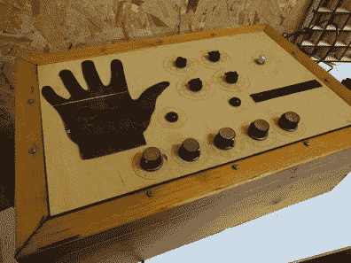](https://hackaday.com/2018/04/09/dublin-knows-how-to-bring-a-hack/tog-palm-reader-2/) Palm-reading flatbed scanner conversion [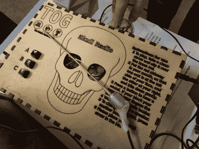](https://hackaday.com/2018/04/09/dublin-knows-how-to-bring-a-hack/tog-skull-radio/) Bone-conducting radio

还记得珍妮·李斯特几年前报道的那个神奇的骨传导收音机吗？这直接来自 TOG，并在我们经过会议区进入项目空间时展示出来。同时展出的还有一台可以阅读你的手掌来预测你的未来的机器，以及大量的激光切割项目实例。

这里的黑客空间成员中有一个很大的开锁队伍，碰巧都柏林有一座桥，在那里很流行把锁留在扶手上。这实际上是一些城市的一个问题，因为锁很重，数以千计的锁会导致基础设施超重。TOG 正在通过开锁“涂鸦”来做他们的工作，他们收集了相当多的抢救物品。我认为他们应该与城市合作，使它成为每年的公开活动，让人们在每年美丽的秋季周末学习挑选和回收锁。

 [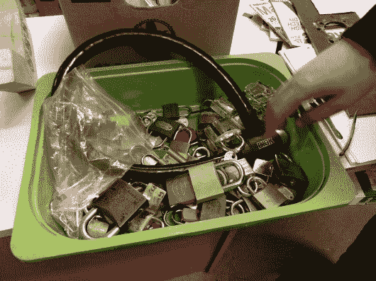](https://hackaday.com/2018/04/09/dublin-knows-how-to-bring-a-hack/tog-locks-1/) Lots of locks [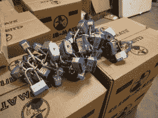](https://hackaday.com/2018/04/09/dublin-knows-how-to-bring-a-hack/tog-locks-2/) Locks on imported Mate [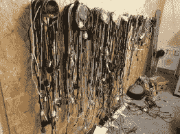](https://hackaday.com/2018/04/09/dublin-knows-how-to-bring-a-hack/tog-need-a-cable-1/) Tin cans on the wall for cable storage [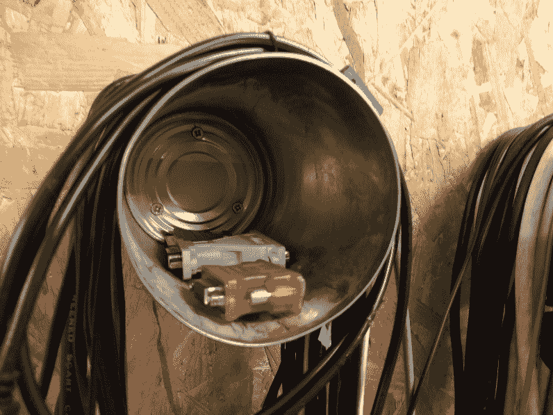](https://hackaday.com/2018/04/09/dublin-knows-how-to-bring-a-hack/tog-need-a-cable-2/) adapters in the cans

我已经提到了 TOG 的俱乐部伙伴进口习惯，但我掩盖了他们的规模。我不确定这种情况已经持续了多长时间，但这里有几十个这样的盒子——上面的盒子装满了 Mate，下面的盒子用于整个空间的项目和零件存储。如果你有饮酒问题，这种装在标志性瓶子里的碳酸和含咖啡因的茶饮料是让黑客攻击持续下去的一个原因。

对于线缆储物，用作搁板的锡罐是存放线缆和适配器的巧妙方法。这就在电子室外面。

## 专用房间

 [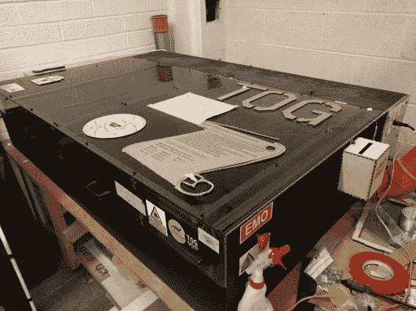](https://hackaday.com/2018/04/09/dublin-knows-how-to-bring-a-hack/tog-lasersaurus/) Lasersaur [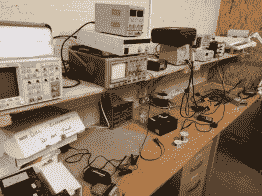](https://hackaday.com/2018/04/09/dublin-knows-how-to-bring-a-hack/tog-soldering-area/) Soldering desks [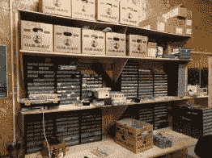](https://hackaday.com/2018/04/09/dublin-knows-how-to-bring-a-hack/tog-component-storage/) component storage (note the Club Mate boxes)

激光切割室和电子室合二为一。在门的远处角落里是一个使用 [Lasersaur](https://hackaday.com/2015/06/04/lasersaur-that-cuts-12-plywood-and-10mm-acrylic-pew-pew/) 开源计划建造的大型切割机。据说切割机有点慢，但做得很好。电子产品区沿着一面墙有几个非常有序的焊接位置，还有用于其他电子工作的工作台，以及沿着另一面整齐的元件存储。

 [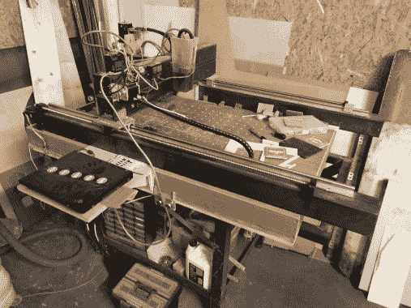](https://hackaday.com/2018/04/09/dublin-knows-how-to-bring-a-hack/tog-diy-cnc-router/) DIY CNC router (heavy metal!) [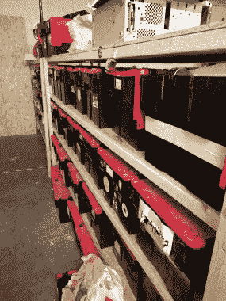](https://hackaday.com/2018/04/09/dublin-knows-how-to-bring-a-hack/tog-member-storage/) Member project storage [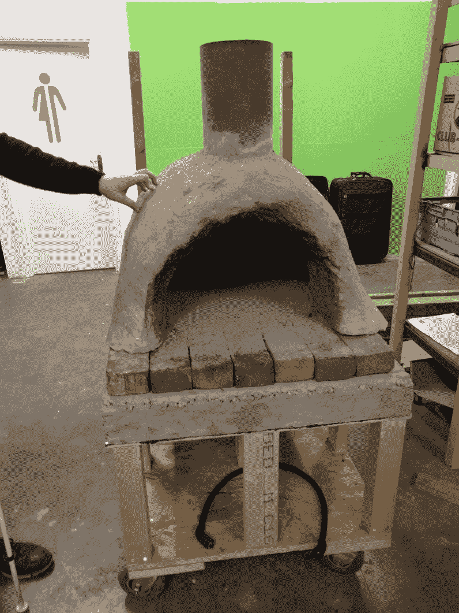](https://hackaday.com/2018/04/09/dublin-knows-how-to-bring-a-hack/tog-pizza-oven/) Roll-away pizza oven

令人惊讶的是，木工车间没有灰尘，并且有各种各样的木工工具。一名成员建造了一台强大的数控镂铣机，这听起来像是通过铣削自己的木制饮料杯垫来让自己接受设备培训的仪式。

就在 woodshop 入口的外面是一大片公共区域。其中大约 1/3 是项目存储，使用大型重型塑料存储箱。另外 2/3 的区域是大型项目原材料区。德克兰称之为“不断减少的一堆东西”，这对我们来说似乎是倒退。大多数空间积累的方式太多了，但 TOG 通过清理未使用的材料赢得了垃圾战争。

 [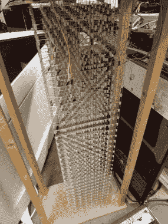](https://hackaday.com/2018/04/09/dublin-knows-how-to-bring-a-hack/tog-led-tower/) LED Cube extruded into a tower [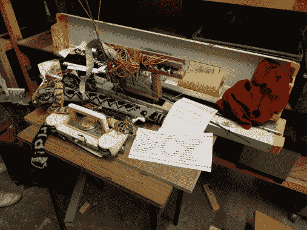](https://hackaday.com/2018/04/09/dublin-knows-how-to-bring-a-hack/tog-punchcard-knitter-conversion/) Punch-card loom automated with servos

后面两个非常棒的成员项目是 LED 塔和自动织布机。织布机最初是设计成由穿孔卡片驱动的。这是一个数字化的业余爱好伺服的每一个棒，跟随孔。LED 塔很像一个 LED 立方体，如果你把 7 个 LED 塔堆叠在一起的话！

## 黑客们

这次我把名字和黑客放在一起做得很糟糕，所以请在下面的评论中自我识别(如果你已经发表了它们，请链接到更多细节)。

 [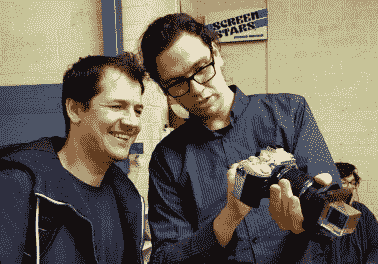](https://hackaday.com/2018/04/09/dublin-knows-how-to-bring-a-hack/tog-prism-camera-1/) Assembled prism camera [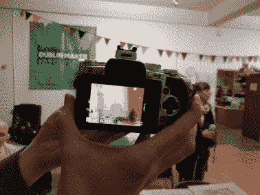](https://hackaday.com/2018/04/09/dublin-knows-how-to-bring-a-hack/tog-prism-camera-2/) What the camera sees through the prism [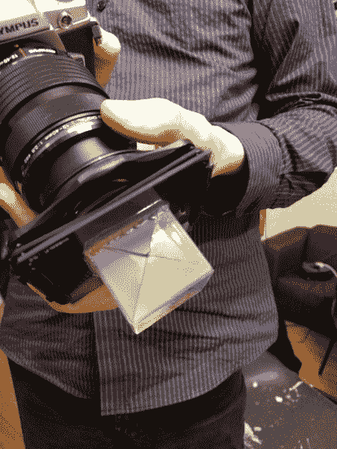](https://hackaday.com/2018/04/09/dublin-knows-how-to-bring-a-hack/tog-prism-camera-3/) The prism from the edge.

在*让你挠头的事情*类别中，你知道吗，一些真正的大型 DLP 投影仪使用三向棱镜来组合三种颜色的光，以实现全色投影？我不知道它，当然也从来没有见过真正可怕的棱镜，这是在这个黑客反向使用。它安装在镜头适配器上，DSLR 中的传感器正在获得 3 种不同颜色的合成图像——一种来自前方，另外两种以 90 度角(彼此相反)进入。效果超现实，很美。[看看 Sebastian Dooris 用这种方式制作的专辑](https://www.flickr.com/photos/sebastiandooris/sets/72157673377574816)。他甚至在[上发布了这次聚会的相册](https://www.flickr.com/photos/sebastiandooris/sets/72157694612110884)！

 [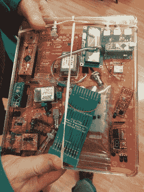](https://hackaday.com/2018/04/09/dublin-knows-how-to-bring-a-hack/tog-tindie-calibration-hardware/) IR and calibration boards [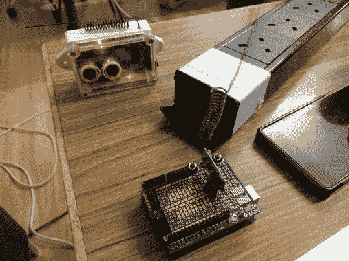](https://hackaday.com/2018/04/09/dublin-knows-how-to-bring-a-hack/tog-parking-spot-notifier-2/) Parking spot notifiers

这个无线停车通知系统很巧妙。这个黑客和他的邻居共用一个停车位。如果这个车位已经被占用了，那就很难倒车(记得那些狭窄的道路)去停车场的另一边。这个硬件让他可以快速查看智能手机应用程序，看看他应该去哪里停车。它使用超声波探测车辆，使用 433 MHz 进行无线通信。

我们有一个 Tindie 卖家带着他为商店开发的各种产品出现了。他是 AnalysIR 商店的老板，从一些红外“玩具”开始——与 38 kHz 信号交互的有趣方式，并取得了如此大的成功，他一直在疯狂地梦想新的电路板。[你看到的金属罐](https://www.tindie.com/products/AnalysIR/10mhz-ocxo-frequency-standard-module-or-kit/)是校准红外载波信号的频率标准。有趣的是，这些是从中国回收的电子产品中回收的，并在通常的地方出售。

 [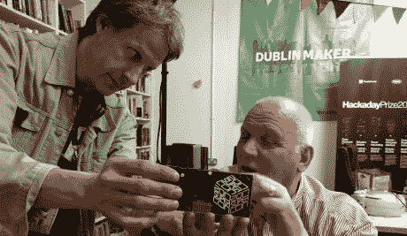](https://hackaday.com/2018/04/09/dublin-knows-how-to-bring-a-hack/tog-harrison-confernce-badge/) Supercon Badge [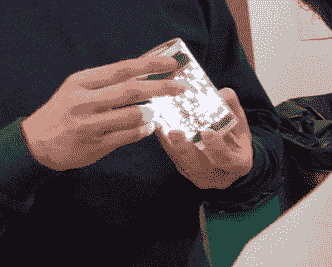](https://hackaday.com/2018/04/09/dublin-knows-how-to-bring-a-hack/tog-flexible-led-hack/) Curved LED matrix

当我们要求回复时，我通常会注意名单，但不知何故我漏掉了迈克·哈里森的名字，当他出现时我欣喜若狂。你可能通过他的 YouTube 频道[mikeselectricsuff](https://www.youtube.com/channel/UCcs0ZkP_as4PpHDhFcmCHyA)认识他，但你也应该通过[他为 2017 年黑客日超级大会](https://hackaday.io/project/27427-camera-badge-for-supercon-2017)设计的令人惊叹的徽章来认识他。他展示了那个徽章以及一个柔性印刷电路板，电路板上有数十亿个小间距的白色发光二极管组成一个矩阵。

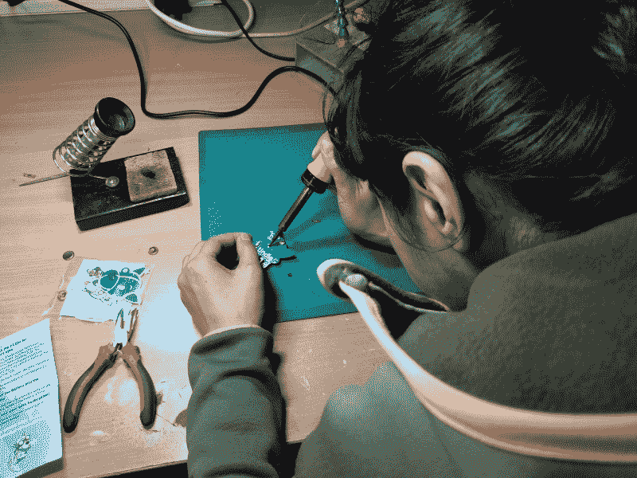

Tindie 最近最受欢迎的礼物是我们开发的硬件徽章。贾斯敏·布雷克特不仅将它们分发给所有感兴趣的人，参加聚会的人还加热了 TOG 的焊接站，并举办一个徽章填充派对。

我们在这次聚会上玩得很开心。感谢 TOG Hackerspace 的所有成员，他们为这次活动敞开大门，让每个人都为第二天的都柏林黑客日大会感到兴奋。我们将在本周发布关于 Unconference 的文章，所以请关注 Hackaday。

无论你错过了这次聚会，还是玩得很开心，想要参与下一件大事，请查看下周末在 TOG 举办的科学黑客日。