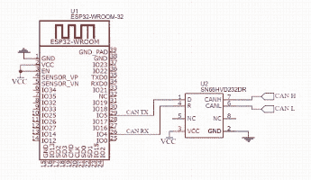

# 在 ESP32 上模拟 OBD-II

> 原文：<https://hackaday.com/2018/04/11/emulating-obd-ii-on-the-esp32/>

过去，你可以打开引擎盖，只需平头螺丝刀、一些打包钢丝和处于最佳角度的舌片，就可以修复汽车的任何故障。但是今天，不管是好是坏，普通的汽车是一台靠汽油和希望运行的滚动电脑(如果它甚至还有汽油发动机的话)。当然，现代汽车的 DIY 维修和保养仍然是可能的，但是家庭机械师的工具箱需要与时俱进。如果你想做比换轮胎更高级的事情，你真的想通过 OBD-II 端口与车辆的计算机连接。

 但对一些人来说，即使这样也不够。[limiter121]最近写信告诉我们一个有趣的项目，它不*读取*车辆中的 OBD-II 端口[，而是实际模拟一个](https://github.com/limiter121/esp32-obd2-emulator)。像许多其他人一样，这个黑客是出于需要而诞生的，作为一种测试 OBD-II 项目的方式，而不必整天坐在车道上。它允许你为 OBD-II 设备或测试中的软件创建虚构的速度和发动机转速值，并通过一个光滑的网络界面来控制“汽车”。

那么是什么让它滴答作响呢？实际上，少得惊人。在最基本的层面上，ESP32-WROOM-32 连接到 SN65HVD230 CAN 收发器芯片。您还需要一个 3.3V 电源以及一个 USB 转串行适配器，以便在 ESP32 上进行初始编程。从那以后，只需要编译和刷新[limiter121]在 GitHub repo 中提供的代码。

如果你想知道这样的产品是否已经在商业市场上存在，它们是存在的。但像其他许多利基项目一样，价格对家庭黑客来说有点难以下咽。与 Freematics OBD-II 仿真器等商业产品近 300 美元的标价相比，构建一个基于 ESP32 的仿真器应该只需要 20 美元左右。

除非你正在[开发一个 OBD-II 阅读器](https://hackaday.com/2016/03/27/open-source-obd-ii-adapter/)，否则你可能对 OBD-II 模拟器没有多大用处。但是这个项目对于那些想舒舒服服地坐在沙发上[了解更多 OBD 的人来说还是很有用的。](https://hackaday.com/2017/01/04/on-board-diagnostics/)