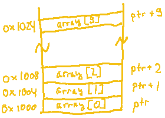
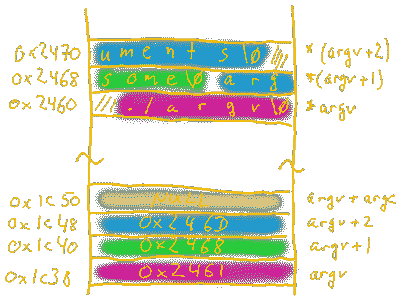

# 当 4 + 1 等于 8 时:对 C 语言中指针的高级理解

> 原文：<https://hackaday.com/2018/04/19/when-4-1-equals-8-an-advanced-take-on-pointers-in-c/>

在我们关于指针的第一部分[中，我们介绍了 c 语言中指针的基础知识和常见陷阱。如果我们必须将其分解成一句话，指针的主要原则是它们只是存储内存地址的数据类型，只要我们确保在该地址分配了足够的内存，一切都会好的。](https://hackaday.com/2018/04/04/the-basics-and-pitfalls-of-pointers-in-c/)

在第二部分中，我们将继续讨论一些更高级的指针主题，包括指针算法、使用另一个指针作为底层数据类型的指针，以及数组和指针之间的关系。但是首先，有一个特别的指标我们还没有谈到。

指针只是内存地址这一规则的一个众所周知的例外是所有指针中最著名的:`NULL`指针。通常定义为预处理宏`(void *) 0`，我们可以像分配其他指针一样分配`NULL`。

```

// regular referencing, ptr1 points to address of value
int *ptr1 = &value;
// regular pointer, ptr2 points to address of value as well
int *ptr2 = ptr1;
// uninitialized pointer, ptr3 points to unknown location
int *ptr3;
// NULL pointer, ptr4 points to (void *) 0
int *ptr4 = NULL;

```

虽然看起来`NULL`只是指向地址零，但实际上，它是编译器的一个特殊指示器，表明指针没有指向任何有效数据，而是直接指向 *nothing* 。取消对这样一个指针的引用肯定会失败，但是失败是可以预见的。如果我们保持指针未初始化，那么当我们取消对它的引用时，任何事情都可能发生，最好的结果之一就是出现分段错误。

用`NULL`初始化未初始化的指针让编译器知道总是好的做法，但它也帮助了我们。检查`if (ptr != NULL)`让我们很容易确定指针是否有有效值。而且由于在 C 中除了`0`之外的任何值都被求值为`true`，所以我们可以把它写得更短，如`if (ptr)`。

## 指针算法

除了`NULL`，指针的概念仍然是简单的内存地址——换句话说:数字。和其他数字一样，我们可以用它们进行一些基本的算术运算。但是如果没有更多的内容，我们就不会谈论它，所以让我们自己来看看当我们将`1`添加到几个不同的指针类型时会发生什么。

```

char *cptr = (char *) 0x1000;
int *iptr  = (int *) 0x2000;
struct foo *sptr = (struct foo *) 0x3000;

printf("char   0x%02lx %p %p\n", sizeof(char), cptr, (cptr + 1));
printf("int    0x%02lx %p %p\n", sizeof(int), iptr, (iptr + 1));
printf("struct 0x%02lx %p %p\n", sizeof(struct foo), sptr, (sptr + 1));

```

我们有三种不同的指针类型，我们将每种类型的大小打印为十六进制数，它的指针变量的当前地址，以及指针变量的地址递增 1:

```

char   0x01 0x1000 0x1001
int    0x04 0x2000 0x2004
struct 0x10 0x3000 0x3010

```

与常规数字不同，将`1`加到一个指针上会使它的值(一个内存地址)增加其底层数据类型的大小。为了简化这背后的逻辑，可以像考虑数组索引一样考虑指针算法。如果我们声明一个由十个整数组成的数组`int numbers[10]`，我们就有了一个保留了足够内存来保存十个`int`值的变量。`int`占用 4 个字节，`numbers`共 40 个字节，每个条目相隔 4 个字节。要访问第五元素，我们只需编写`numbers[4]`，不需要担心数据类型大小或地址。使用指针算法，我们做完全相同的事情，除了数组索引变成我们加到指针上的整数，`(numbers + 4)`。

除了把整数加到一个指针上，我们还可以把它们减去，只要它们是同一类型，我们就可以把一个指针从另一个指针上减去。在后一种情况下，结果将是指针的基础数据类型中完全适合两个指针之间的内存区域的元素的数量。

```

int *iptr1 = 0x1000;
int *iptr2 = 0x1008;
printf("%ld\n", (iptr2 - iptr1));
printf("%ld\n", sizeof(iptr2 - iptr1));

```

由于一个`int`是四个字节，我们可以将其中的两个完全放入 8 个字节的偏移量中，因此减法将输出`2`。~~注意，`sizeof`操作符是一个例外，它不遵循指针算术规则，只处理字节。因此，第二个输出将显示偏移量的完整`8`字节。~~这种减法的结果将是类型 [`ptrdiff_t`](http://www.gnu.org/software/libc/manual/html_node/Important-Data-Types.html) ，一种在`stddef.h`中定义的平台相关整数类型。`sizeof`操作符将相应地输出其大小，例如`8`字节。

这就是关于指针算法的基本知识。尝试除了用整数做加法，或者用整数或另一个相同类型的指针做减法之外的任何操作都会导致编译器错误。

## 指针转换和算术

指针的美妙之处在于，我们可以将它们转换成任何其他类型的指针，如果我们在算术运算期间这样做，与数组索引相比，我们增加了很多灵活性。如果我们将一个`int *`赋给一个`char *`并给它添加`3`，让我们看看规则是如何应用的。

```

int value = 123;
int *iptr = &value;
char *cptr1 = (char *) (iptr + 3);
char *cptr2 = (char *) iptr + 3;
printf("iptr  %p\ncptr1 %p\ncptr2 %p\n", iptr, cptr1, cptr2);

```

为简单起见，我们假设`value`位于地址`0x1000`，因此我们将得到以下输出:

```

iptr  0x1000
cptr1 0x100c
cptr2 0x1003

```

我们可以看到这两个加法之间的明显差异，这是由 C 的[运算符优先级](http://en.cppreference.com/w/c/language/operator_precedence)造成的。当我们分配`cptr1`时，`iptr`在相加时仍然是一个`int *`，导致地址偏移以适合三个`int`，即 12 个字节。但是当我们赋值`cptr2`时，我们不使用圆括号，操作符优先级导致强制转换操作有更高的优先级。到执行加法时，`iptr`已经是一个`char *`，导致三个字节的偏移。

请记住，我们没有任何超过`value`大小的分配内存，所以我们不应该取消引用`cptr1`。另一方面，解引用`cptr2`就没问题了，并且会从本质上提取`value`的第四个字节。如果出于某种原因，您想将 11 个字节中的任何内容提取到一个`struct`数组的第三个元素中，并将其转换为一个`float`，`*((float *) ((char *) (struct_array + 2) + 11))`将帮助您实现这一目标。

### 取消引用时递增

我们对指针做的另一个典型的事情是取消引用。但是如果我们在同一个表达式中递增和取消引用一个指针会发生什么呢？再说一次，这主要是一个运算符优先级和我们对括号有多宽容的问题。考虑到前缀和后缀增量，我们最终有四个不同的选项:

```

char buf[MUCH_BYTES];
char *ptr = buf;

// increment ptr and dereference its (now incremented) value
char c1 = *++ptr;   // ptr = ptr + 1; c1 = *ptr;
// dereference ptr and increment the dereferenced value
char c2 = ++*ptr;   // *ptr = *ptr + 1; c2 = *ptr;
// dereference current ptr value and increment ptr afterwards
char c3 = *ptr++;   // c3 = *ptr; ptr = ptr + 1;
// dereference current ptr value and increment the dereferences value - now we need parentheses
char c4 = (*ptr)++; // c4 = *ptr; *ptr = *ptr + 1;

```

如果您不完全确定操作符的优先级，或者不想在每次阅读代码时都想知道它，那么您可以添加括号来避免歧义，或者像我们在第四行中所做的那样强制执行顺序。如果您想将细微的错误隐藏到代码库中，省去括号并测试读者对运算符优先级的注意是一个不错的选择。

解引用时递增的一个常见用例是迭代一个“字符串”。c 并不真正了解实际字符串数据类型的概念，但是通过使用一个以 *null 结尾的* `char`数组作为替代来解决这个问题。Null-terminated 意味着数组的最后一个元素是一个额外的`NUL`字符，用来表示字符串的结束。`NUL`，不要与`NULL`指针混淆，它只是 ASCII 字符`0x00`或`'\0'`。因此，长度为 *n* 的字符串需要一个大小为 *n + 1* 字节的数组。

因此，如果我们浏览一个字符串并找到`NUL`，我们知道我们到达了它的结尾。由于 C 将任何值`0`计算为`false`，我们可以实现一个函数，用一个简单的循环返回给定字符串的长度:

```

int strlen(char *string) {
    int count = 0;
    while (*string++) {
        count++;
    }
    return count;
}

```

在每次循环迭代中，我们取消对`string`当前内存位置的引用，以检查其值是否为`NUL`，之后递增`string`本身，即将指针移动到下一个`char`的地址。只要解引用产生一个非零值的字符，我们就递增`count`并在最后返回它。

顺便提一下，字符串操作发生并停留在该函数中。c 在向函数传递参数时总是使用*通过值*调用，所以调用`strlen(ptr)`会在向函数传递时创建一个`ptr`的副本。因此，它引用的地址仍然相同，但原始指针保持不变。

## 指针和数组

回到数组，我们之前已经看到了指针算法和数组索引是如何紧密相关的，以及`buf[n]`如何等同于`*(buf + n)`。两个表达式相同的原因是在 C 中，数组*在内部将*衰减为指向其第一个元素`&array[0]`的指针。所以每当我们传递一个数组给一个函数时，我们实际上只是传递一个数组类型的指针，这意味着下面两个函数声明是相同的:

```

void func1(char buf[]);
void func2(char *buf);

```

然而，一旦数组衰减为指针，它的大小信息就消失了。在这两个函数中调用`sizeof(buf)`将返回`char *`的大小，而不是数组的大小。一个常见的解决方案是将数组大小作为附加参数传递给函数，或者指定一个专用的分隔符，如`char[]`字符串。

### 多维数组和指针

请注意，数组到指针的衰减只在数组的最外层发生一次。`char buf[]`衰变到`char *buf`,`char buf[][]`衰变到`char *buf[]`，但`char **buf`没有。然而，如果我们有一个指向指针的数组，首先声明为`char *buf[]`，那么它将衰减为`char **buf`。例如，我们可以用`char *argv[]`或`char **argv`参数声明 C 的`main()`函数，没有区别，选择哪一个主要是个人喜好的问题。

注意，所有这些只适用于已经声明的数组。一旦数组被声明，指针就给了我们一个访问它们的替代方法，但是我们不能用一个简单的指针代替数组声明本身，因为数组声明也保留内存。

## 指针对指针

正如我们已经确定的，指针可以指向任何类型的数据类型，包括其他指针类型。当我们声明`char **ptr`时，我们只声明了一个指针，它的底层数据类型只是另一个指针，而不是常规的数据类型。因此，解引用这样一个双指针会给我们一个`char *`值，解引用两次会让我们得到实际的`char`。

反过来，`&ptr`给出了指针的地址，就像其他指针一样，只是地址的类型是`char ***`，如此循环往复。如前所述，C 在向函数传递参数时使用*按值调用*，但是添加一层额外的指针可以用来模拟*按引用调用*。

### 双指针存储装置

返回到`main()`的`argv`参数，我们用它来检索传递给可执行文件本身的命令行参数。在内存中，这些参数被一个接一个地存储为空终止的`char`数组，还有一个额外的`char *`值数组，用于存储每个`char`数组的地址。为了说明这一点，让我们打印出所有与`argv`相关的地址。

```

int main(int argc, char **argv) {
    int i;

    for (i = 0; i < argc; i++) {
        printf("&argv[%d] %p with argv[%d] at %p len %ld '%s'\n",
                i, &argv[i], i, argv[i], strlen(argv[i]), argv[i]);
    }
    // print once more to see what is stored after the arguments -- better not dereference it
    printf("&argv[%d] %p with argv[%d] at %p\n", i, &argv[i], i, argv[i]);

    return 0;
}

```

除了`argv`，我们还将`argc`传递给`main()`，后者告诉我们`argv`中的条目数。作为对数组衰减的提醒，`argv[i]`等于`&argv[i][0]`。

简化地址后，输出如下所示:

```

$ ./argv some arguments
&argv[0] 0x1c38 with argv[0] at 0x2461 len 6 './argv'
&argv[1] 0x1c40 with argv[1] at 0x2468 len 4 'some'
&argv[2] 0x1c48 with argv[2] at 0x246d len 9 'arguments'
&argv[3] 0x1c50 with argv[3] at (nil)
$

```

我们可以看到`argv`本身位于地址`0x1c38`，指向自变量字符串，从地址`0x2461`开始依次存储。因为递增指针总是相对于其底层数据类型的大小，所以递增`argv`会将指针的大小添加到内存偏移量，这里是 8 个字节。

我们可以看到的另一件事是在`argv`的末端有一个`NULL`指针。这与字符串的空终止遵循相同的原则，表示数组的结束。这意味着我们不一定需要参数计数器参数`argc`来遍历命令行参数，我们也可以直接遍历`argv`直到找到`NULL`指针。

让我们通过相应地重写前面的例子来看看这在实践中是怎样的。为了让`argv`本身不受影响，我们将它复制到另一个`char **`变量。

```

int main(int argc, char **argv) {
    int i;
    char **ptr = argv;

    for (i = 0; *ptr; i++, ptr++) {
        printf("&argv[%d] %p with argv[%d] at %p len %ld '%s'\n",
                i, ptr, i, *ptr, strlen(*ptr), *ptr);
    }
    printf("&argv[%d] %p with argv[%d] at %p\n", i, ptr, i, *ptr);
    return 0;
}

```

无论我们是通过数组索引还是指针算法访问`argv`，输出都是一样的。

## 待续

总结一下我们关于 C 中指针的第二部分:指针算法总是相对于底层数据类型发生的，需要考虑操作符的优先级，或者用括号来处理，指针可以指向其他指针，并且其他指针可以指向我们想要的深度。

在下一个也是最后一个部分，我们将会看到可能是最令人兴奋也是最令人困惑的指针:函数指针。