# 都柏林会议综述:当前的热门话题

> 原文：<https://hackaday.com/2018/04/11/dublin-unconference-roundup-the-most-interesting-tech-topics-right-now/>

周六，来自爱尔兰和欧洲其他地区的黑客社区涌入都柏林项目艺术中心的表演大厅，参加大规模的讲座。从重新发现世纪的旧技术，到尖端的研究项目，我们听到许多与会者谈论他们现在最感兴趣的技术。

选择分享上周末的 Uncon 是一个特别费力的过程。提交的项目如此之多，如此之多，如此之高的标准，以至于一个作者面临着一个巨大的挑战，要将它们纳入一份报告中。但是我们会试试看。请继续阅读我们将永远铭记的那个周末的精彩内容。

[![[Rachel]'s about to lull us into a false sense of security with talk of fashion, then go for the eyeballs!](img/c906be83b4904f3e8e3a9b31eb4b17e6.png)](https://hackaday.com/wp-content/uploads/2018/04/rachel-konichiwakitty.jpg)

[Rachel]’s about to lull us into a false sense of security with talk of fashion, then go for the eyeballs!

### 从可穿戴设备到实验室培育的眼球

四月初的都柏林已经失去了一些冬天的寒意，但太阳还没有恢复足够的控制，让人们脱下他们的外套和靴子。当时，Hackaday 的忠实信徒们聚集在项目艺术中心的一个稍微潮湿的寺庙酒吧里，暂时放弃了它作为爱尔兰最前沿的当代表演艺术场所之一的角色。为了让每个人都开心，我们前一天都在围捕看起来像是爱尔兰所有的零食，所以我们去了楼上的表演厅参加当天的庆祝活动。在提出了一个话题，并在我们的赞助商 [DesignSpark](https://www.rs-online.com/designspark/home) 提供的赠品桌前停下后，我们都挤进了大厅，开始了自由活动。

第一个大胆发言的是[Rachel][Konichiwakitty](http://www.konichiwakitty.com/)“Wong”，她首先谈到了她对应用于时尚的可穿戴电子产品的兴趣和天赋。然而，这并不是她谋生的方式，她很快就从卡哇伊转向了干细胞研究科学家的日常工作。她演讲的这一部分题为“医学、干细胞、组织工程、现成的混合器官的未来”。由于像她这样的人正在做的工作，我们的医院可能有一天能够为他们的病人开定制的 3D 打印器官，她的演讲对我们这些不能在长椅上生长眼球组织的人来说是一个迷人的概述。

接下来是令人兴奋的非会议形式，与会者被安排在全天的四场会谈中。每个人都做了 7 分钟的陈述，虽然不强制要求做一个非会议演讲，但肯定有足够多的人想试一试。不可能在一篇 Hackaday 文章中提到所有这些问题，但以下是引起我们注意的许多问题中的一部分。

[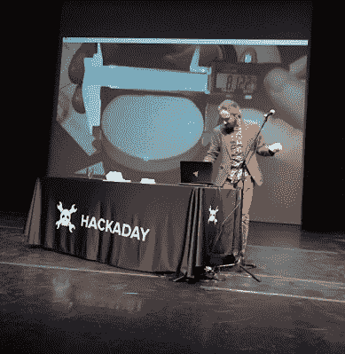](https://hackaday.com/wp-content/uploads/2018/04/eoin-beer.jpg)

Bringing beer to virtual reality is an exact science.

### 准确的位置和拿着一个虚拟的啤酒

几个 3D 传感项目参加了活动，第一个来自 UCC 科克大学的研究生[Alex Jaeger]。他的项目是[一个非常令人印象深刻的 3D 跟踪系统](https://www.youtube.com/watch?v=44rin3eplZE)，用于医疗传感器，它依赖于[一个从大型 PCB 上的线圈阵列感应不同磁场的探头](https://twitter.com/hackaday/status/982629588873416705)。令人惊讶的是，这项任务的处理来自一个平凡的部分，其核心是一个微小的 3.2。

当天晚些时候,[Eoin]向我们展示了他在虚拟现实环境中解决口渴问题的解决方案，尽管它有一个必要但略带幽默的项目，即将一品脱啤酒带入一个配有液位传感器的虚拟现实世界，但它为虚拟现实环境的真实世界传感提供了一个极好的介绍。

我们黑客员工和我们的同事也来凑热闹。索菲·克拉维茨描述了她的室内飞艇。“像一架不会把你的头摘下来的无人机”。它使用派对气球停留在空中，它的 OSH Park PCB 与电机、电子设备和电池必须遵守极其严格的重量限制，才能取得成功。然后是 TOG Hackerspace 的成员和多产的 Tindie seller [ [罗伯特·菲茨西蒙斯](https://twitter.com/partfusion) ]，他带来了他的星座观察阳伞，阳伞的内部投射了一张夜空地图，与它所指的地方对齐。

 [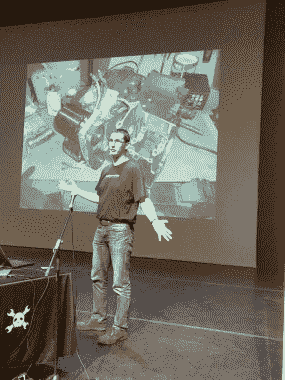](https://hackaday.com/2018/04/11/dublin-unconference-roundup-the-most-interesting-tech-topics-right-now/hacking-electric-motorbike/) Marc talks electric motorcycle conversion [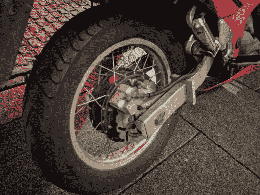](https://hackaday.com/2018/04/11/dublin-unconference-roundup-the-most-interesting-tech-topics-right-now/img_20180407_220522/) Marc rode his electric conversion to the Uncon. Here’s the hub motor!

都柏林不是世界上最拥挤的城市，但像任何一个国家的首都一样，它也有一些交通堵塞的问题。[Marc Evers]带着他的私人交通工具，一辆使用铃木 RF 框架的电动摩托车。[他的演讲特别有趣](https://www.slideshare.net/MarcAurelEvers/hackaday-unconference-dublin-2018)，因为它带我们经历了它发展的所有阶段，包括一些英勇的金属制品将 RF 的发动机油底壳从变速箱中分离出来，以防止机油进入发动机。

### 像素推进、范围黑客和魔法

 [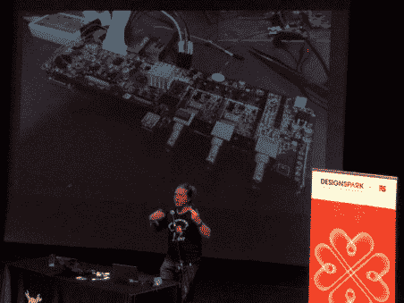](https://hackaday.com/2018/04/11/dublin-unconference-roundup-the-most-interesting-tech-topics-right-now/q3k-hacking-oscilloscopes/) q3k hacking the Zynq chip on an oscilloscope [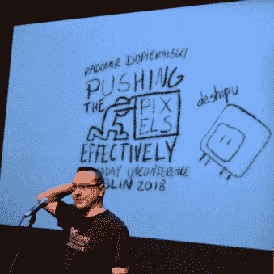](https://hackaday.com/2018/04/11/dublin-unconference-roundup-the-most-interesting-tech-topics-right-now/radomir-hand-drawn/) Radomir takes DIY to his slides too!

Hackaday.io 社区的忠实拥护者[[rado mir dopieraslki](https://hackaday.io/deshipu)]从瑞士赶来，谈论微控制器与显示器对话的最有效、最快捷的方式。我们中的许多人都开过有机发光二极管或 LCD，但有多少人在需要视频刷新率的应用中开过呢？

[ [Serge 'q3k' Bazanski](https://twitter.com/q3k) ]向我们展示了一台现代廉价数字示波器的内部，并指出，由于我们可能都知道它是一台附带 DSP 的 Linux 计算机，因此完全有可能[为它推出自己的 Linux 发行版](https://twitter.com/q3k/status/965009852719394816)来创建一台功能更强大的仪器。

[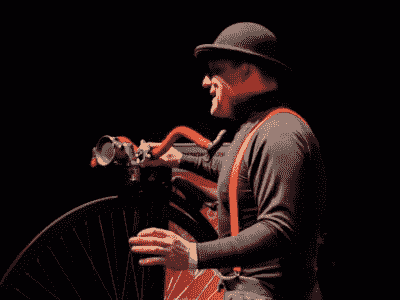](https://hackaday.com/wp-content/uploads/2018/04/img_20180407_152647.jpg) 极具娱乐性的【James two mey】[骑着一辆一文不值的自行车](https://twitter.com/DesignSparkRS/status/982626857379160064)参加了这次演讲，通过描述一台水晶收音机和一盏碳化灯，把自己限制在一个世纪前的技术上。他还很好地解释了这些舞台魔术绳索背后的技巧，这些绳索看起来无缝，但却分成多根较短的绳索。

[ [Beth Flanagan](https://www.toganlabs.com/) ]拥有公用事业行业的背景以及其他许多成就，她披露了一些关于美国公用事业公司使用的智能电表的大量不安全信息。她确实说她的研究可以追溯到几年前，公用事业公司意识到了这些问题，但表示对漏洞可能已经被堵塞缺乏信心。我们并不是建议你蜷缩在你的地窖里，带着五年的罐装豆子来看你度过末日，但是你不可能从她的演讲中离开而没有一点点的担心。

我们之前已经解决了将私人电子项目转化为商业的问题，所以听到[马克·墨菲]谈论在他的众筹成功后生产数千块电路板是很有趣的。他们*用坏了*一台 3D 打印机，生产零件。

 [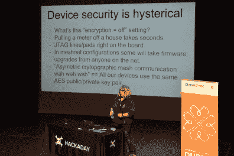](https://hackaday.com/2018/04/11/dublin-unconference-roundup-the-most-interesting-tech-topics-right-now/dsc_0770/) Beth “pidge” Flanagan talks about smart power meters and their many security pitfalls [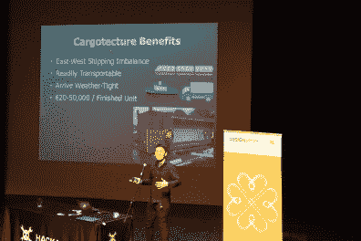](https://hackaday.com/2018/04/11/dublin-unconference-roundup-the-most-interesting-tech-topics-right-now/dsc_0784-2/) Shipping containers could be an interesting answer to a housing crisis in Ireland

未来的汽车将相互交谈，并且已经为它们将使用的类似 WiFi 的协议预留了规范和频率分配。[Bastian Bloessl]向我们介绍了 [OpenC2X](http://www.ccs-labs.org/software/openc2x/) ，这是一个软件发行版，它将一个商用家用无线路由器变成了一个强大的平台，用于试验车辆间无线网络标准 ETSI ITS-G5。

像世界上许多其他地方一样，爱尔兰正处于失控的住房危机之中。马克·加夫尼向观众展示了它，并描述了一些限制性的爱尔兰建筑法。许多读者都熟悉这样一种环境，除了非常富有或非常幸运的人，任何一种家庭都是遥不可及的。他描述的解决方案包括使用多余的货运集装箱作为模块化移动房屋的建筑模块，这种方法已经在爱尔兰岛的多个地方进行了小规模试验。

### 美好的一天

 [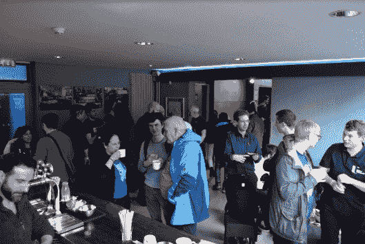](https://hackaday.com/2018/04/11/dublin-unconference-roundup-the-most-interesting-tech-topics-right-now/bar-socialising/) Coffee helped us all recharge during the long day of talks. [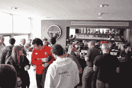](https://hackaday.com/2018/04/11/dublin-unconference-roundup-the-most-interesting-tech-topics-right-now/dsc_0642/) Much solcializing during breaks [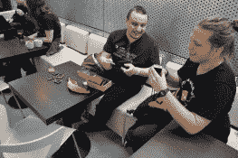](https://hackaday.com/2018/04/11/dublin-unconference-roundup-the-most-interesting-tech-topics-right-now/dsc_0632/) Radomir shows of his handheld gaming hardware to q3k [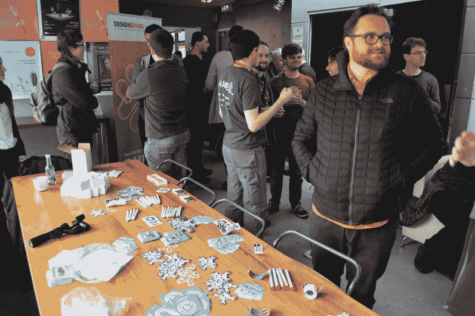](https://hackaday.com/2018/04/11/dublin-unconference-roundup-the-most-interesting-tech-topics-right-now/dsc_0635/) Stickers and there giveaways.

这是 Hackaday 第一次访问爱尔兰，特别高兴地看到爱尔兰硬件社区和其他欧洲国家都有如此好的表现。这是漫长的一天，直到最后仍然有很多人在酒吧呆到深夜。我们提供咖啡、茶、小吃和晚餐，每个到场的人都提供娱乐。从几十个讲座，到休息时演示的硬件项目，每一个环节都有一些有趣的东西。谢谢大家！

 我们非常感谢[design spark](https://www.rs-online.com/designspark/home)(RS 为您带来)成为 Hackaday Dublin Unconference 的独家赞助商。DesignSpark 团队的几名成员参加了当天的活动。谢谢大家！

项目艺术中心的工作人员确保这一天非常顺利，演讲厅有出色的 AV，每次休息时酒吧/会议区都有出色的服务。我们发现都柏林是一个举办活动的好城市，我们希望有一天能再回来举办活动！